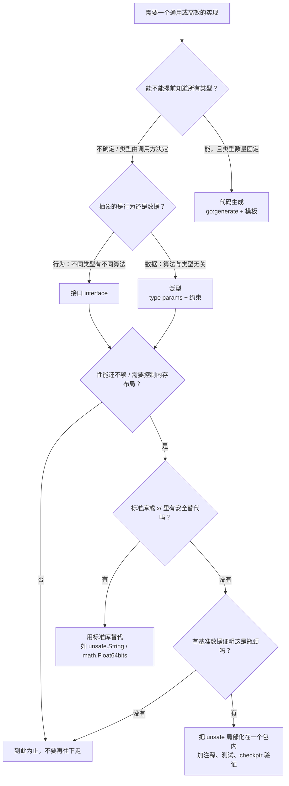

# 第 9 章 泛型、反射与 unsafe

> 本章导读：Go 1.18 引入的类型参数（泛型）改变了我们写容器与算法的习惯，而反射（reflection）与 `unsafe` 则是 Go 里仅有的两把"绕过编译期类型检查"的钥匙。本章先讲清泛型的语法、约束、类型推导与底层实现，再逐条拆解反射的三大法则，最后谨慎地介绍 `unsafe` 的六条合法转换规则与判断清单，并在结尾给出一张"接口 / 泛型 / 反射 / unsafe / 代码生成"的选型决策表。

这一章的内容比前几章更难，也更容易被误用。请记住一个总原则：**能用静态类型解决的问题，就不要留给运行期；能用编译期检查保证的正确性，就不要用 panic 来兜底。** 泛型让静态类型更灵活，反射让运行期更灵活，`unsafe` 让内存布局更灵活——灵活性递增，安全性递减。学完本章，你应该能在面对一个新需求时，立刻判断出该用哪一种工具。

---

## 9.1 泛型概述

### 9.1.1 为什么 Go 直到 1.18 才有泛型

Go 在 2009 年发布，直到 2022 年 3 月发布的 Go 1.18 才正式引入类型参数（type parameters），中间隔了十三年。这不是 Go 团队忘了这件事，而是长期的刻意推迟，原因有四条。

第一，**语言设计上的取舍**。Go 的核心卖点之一是"语法小、心智负担低、编译快"。泛型会同时污染这三项：语法变复杂、类型系统变复杂、编译期要做实例化。Rob Pike 在多次访谈中提到，团队一直没有找到既"Go 味"又足够简单的设计，直到 2020 年前后类型集（type set）方案成型。

第二，**历史上的方案都不满意**。早期有过 `contracts` 草案（用 `contract` 关键字描述约束），复杂度偏高；也有过基于接口的"广义泛型"，但性能不可接受。最终落地的设计是"类型参数 + 接口作为约束 + 类型集"，它把原本用于描述"值的行为"的接口复用为"类型的集合"，是 Go 泛型最有辨识度的一个决策。

第三，**向后兼容是硬约束**。Go 1 兼容性承诺（Go 1 compatibility promise）要求老代码永远能编译。泛型的引入不能让 `map[T]struct{}` 这种写法改变含义，也不能让 `interface{}` 的语义漂移。

第四，**替代方案在很多场景下确实够用**。Go 团队反复强调"泛型不是银弹（generics are not a silver bullet）"。标准库里大量代码用接口 + 类型断言就能写得很好；`sort.Slice`、`sync.Pool` 这类 API 至今没有改成泛型版本，因为它们本来就不需要。

### 9.1.2 没有泛型时代的三种替代方案

在 1.18 之前，想写"对多种类型通用"的代码，只有三条路。

**方案一：接口 + 反射。** 用 `interface{}`（现在叫 `any`）接收任意值，用 `reflect` 在运行期判断类型并操作。

```go
// 1.18 之前的通用求和：牺牲类型安全与性能
func SumAny(xs []any) (float64, error) {
	var total float64
	for _, x := range xs {
		switch v := x.(type) {
		case int:
			total += float64(v)
		case int64:
			total += float64(v)
		case float64:
			total += v
		default:
			return 0, fmt.Errorf("不支持的类型 %T", x)
		}
	}
	return total, nil
}
```

痛点非常明显：返回值被统一成 `float64`，精度可能丢失；支持的类型写死在 `switch` 里，新增类型要改函数；`[]int` 无法直接传入，调用方得先手工转成 `[]any`，这一次转换就要分配一整个切片；错误只能推迟到运行期才暴露。

**方案二：代码生成。** 写一个模板文件，用 `go:generate` 在编译前生成每个类型的版本。

```go
//go:generate genny -in=stack.go -out=stack_int.go gen "T=int"
```

标准库的 `sort` 包（`sort.Ints`、`sort.Float64s`、`sort.Strings`，其源码由 `gen_sort_variants.go` 生成）和历史悠久的 `sync/atomic`（为每种整数类型各写一份 `AddInt32`/`AddInt64`/…）都是这种思路的产物。痛点是工程链路变长：需要在构建流程里插入生成步骤、生成物要提交进仓库还是每次重新生成、IDE 跳转经常跳到生成文件、类型一多生成物体积爆炸。`golang.org/x/tools/cmd/stringer` 至今仍是这条路上的成功范例。

**方案三：复制粘贴。** 最快、最省事，也最不可维护。同一段逻辑出现五份副本，改一个 bug 要改五处，漏一处就是线上事故。

### 9.1.3 泛型的适用与不适用场景

泛型真正擅长的是**"算法与数据结构对类型无关，只依赖一组可枚举的操作"**的场景：容器（`Stack`、`Set`、`Queue`）、算法（`Map`、`Filter`、`Reduce`、`Min`、`Max`）、通用工具（缓存、结果类型、区间）。

它不擅长的是**"不同类型有不同行为"**的场景。比如你想写一个 `Area()` 函数，圆和矩形各有各的算法，这不是泛型问题，而是多态问题——该用接口。

一个粗略的判断口诀：**数据抽象用泛型，行为抽象用接口。** `[]T` 的排序算法与 `T` 是什么无关，这是泛型；`Shape` 的面积怎么算是每种形状自己的事，这是接口。

🔥 重点：Go 泛型是**编译期**的，在编译期做静态类型检查，运行期类型信息依然存在（不像 Java 那样擦除）。这意味着泛型代码在类型安全上与手写代码完全等价，代价只可能出现在性能上（见 9.8 节）。

---

## 9.2 类型参数

### 9.2.1 从零开始：第一个泛型函数

```go
package main

import "fmt"

// First 返回切片的第一个元素；T 是类型参数，any 是它的约束
func First[T any](xs []T) (T, bool) {
	var zero T // 泛型代码里用零值表示"没有值"，因为无法返回 nil
	if len(xs) == 0 {
		return zero, false
	}
	return xs[0], true
}

func main() {
	fmt.Println(First([]int{10, 20}))       // 隐式推导：T = int
	fmt.Println(First([]string{"go", "rs"})) // 隐式推导：T = string
	fmt.Println(First[int](nil))            // 显式指定：T = int
}
```

解读几个细节：

- `[T any]` 是**类型参数列表**（type parameter list），`T` 是类型参数名，`any` 是它的约束。
- `var zero T` 是泛型代码里的标准写法。泛型函数不知道 `T` 具体是什么，所以无法写 `nil`（`T` 可能是 `int`），只能声明一个零值变量。注意它与普通局部变量一样**必须被用到**，否则报 `declared and not used: zero`；Go 1.18 真正放宽的是**类型参数本身允许不被使用**——`func F[T any]() int { return 1 }` 完全合法，而"声明了不用的变量"依旧不行。
- 返回值用 `(T, bool)` 而不是 `T`，是 Go 里表达"可能不存在"的惯用法，比返回 `nil` 更通用。

### 9.2.2 显式与隐式类型实参

调用 `First([]int{10, 20})` 时，编译器从实参 `[]int` 反推出 `[]T` 中的 `T = int`，这叫**类型推导（type inference）**。你也可以显式写 `First[int]([]int{10, 20})`，这叫**类型实参（type argument）**。

规则是：**能推导出来的可以不写；推导不出来的必须写。** 典型场景是实参是 `nil`、无类型常量或 `nil` 接口值时：

```text
./main.go:94:19: in call to First, cannot infer T (declared at ./main.go:83:12)
```

这条报错就是上面 `First[int](nil)` 写成 `First(nil)` 的结果（行号按本节开头那份代码清单计）。看到 `cannot infer T`，第一反应就是"补上显式类型实参"。

### 9.2.3 多个类型参数与命名惯例

类型参数可以并列多个，互相独立：

```go
// Pair 是泛型结构体，A、B 是两个独立的类型参数
type Pair[A, B any] struct {
	First  A
	Second B
}

// Zip 把两个切片按下标配对，长度按短的算
func Zip[A, B any](as []A, bs []B) []Pair[A, B] {
	n := len(as)
	if len(bs) < n {
		n = len(bs)
	}
	out := make([]Pair[A, B], 0, n)
	for i := 0; i < n; i++ {
		out = append(out, Pair[A, B]{First: as[i], Second: bs[i]})
	}
	return out
}
```

命名惯例沿用了 Go 社区与其它语言的共识：

| 名称 | 惯例用途 | 示例 |
| --- | --- | --- |
| `T` | 最普通的元素类型 | `func Map[T, R any](...)` |
| `K` / `V` | map 的键与值 | `type Cache[K comparable, V any]` |
| `E` | 元素（element），强调"集合中的一项" | `type List[E any]` |
| `A` / `B` | 配对、二元操作的第二个类型 | `Zip[A, B any]` |
| `R` | 结果（result）类型 | `Map[T, R any]` |

💡 提示：类型参数名要短。编译器允许 `[ElementType any]`，但你会在类型签名里反复写它，社区惯例是单个大写字母，`T`、`K`、`V` 优先。

---

## 9.3 约束（Constraint）

约束是 Go 泛型的灵魂。它规定了一个类型参数"可以是哪些类型"，也是编译器判断"`T` 上能调用什么操作"的唯一依据。

### 9.3.1 两个预声明约束：any 与 comparable

- `any` 是 `interface{}` 的别名（Go 1.18 起），表示"任意类型"，这意味着你对 `T` 几乎不能做任何操作：不能比较、不能算术、不能取字段。
- `comparable` 是 1.18 引入的预声明约束，表示"支持 `==` 和 `!=` 的类型"。它最常用于 map 的键：`map[T]struct{}` 要求 `T` 满足 `comparable`。

```go
// Keys 返回 map 的所有键，键类型必须可比较
func Keys[K comparable, V any](m map[K]V) []K {
	out := make([]K, 0, len(m))
	for k := range m {
		out = append(out, k)
	}
	return out
}
```

⚠️ 注意一个历史变化，这里最容易被网上的旧文章带偏：`comparable` 的正式定义是"所有**严格可比较**（strictly comparable）的非接口类型"[Go 1.18]——指针、通道、数值、字符串，以及**字段全都严格可比较的结构体与数组**，从 1.18 起就满足 `comparable`。**Go 1.20 放开的不是结构体，而是"接口类型以及含接口字段的复合类型"**：现在只要一个类型"支持 `==`"就满足 `comparable`（比较时可能 panic，因为接口字段装箱后可能装的是切片之类的不可比较值）。所以 `Keys(map[any]int{...})` 在 Go 1.20+ 能编译、在 1.19 不能；而 `Keys(map[point]string{...})`（`point` 是字段都可比较的普通结构体）从 1.18 起就能编译。

### 9.3.2 接口作为约束与类型集

Go 泛型最独特的设计是：**接口被复用为约束**，此时它描述的不再是"值的行为"，而是"类型的集合"，这个集合就叫**类型集（type set）**。

```go
// Number 的类型集 = 底层类型为 int、int64、float64 的所有类型
type Number interface {
	~int | ~int64 | ~float64
}
```

`~int | ~int64 | ~float64` 就是**类型元素（type element）**：`|` 是并集（union），`~` 是近似元素（approximation）。

### 9.3.3 `~` 近似元素的含义与必要性

`~T` 表示"底层类型（underlying type）为 `T` 的所有类型"，它包含 `T` 自身，也包含所有以 `T` 为底层类型的自定义类型。

```go
package main

import "fmt"

type Number interface{ ~int | ~int64 | ~float64 }

func Sum[T Number](xs []T) T {
	var total T
	for _, x := range xs {
		total += x
	}
	return total
}

type MyInt int // 底层类型是 int

func main() {
	fmt.Println(Sum([]int{1, 2, 3}))   // 6
	fmt.Println(Sum([]MyInt{1, 2, 3})) // 6：多亏了 ~
}
```

如果约束写成 `interface{ int | int64 | float64 }`（不带 `~`），那么 `[]MyInt` 就无法传入，因为 `MyInt` 与 `int` 是**不同的类型**。写库的时候，这个差别极其关键：不带 `~` 的约束会把所有自定义类型挡在门外，几乎没人愿意用。

🔥 重点：约束里 `~` 后面必须是一个底层类型，不能是接口、不能是类型参数。`~T` 的写法叫"近似元素"，读作"底层类型为 T 的类型"。

### 9.3.4 联合元素与约束的书写限制

约束接口里允许的东西有严格的限制：**只能包含类型元素、方法，以及嵌入其它接口**。不允许出现字段、不允许出现 `const`、不允许出现函数签名之外的任何东西。

```go
// 合法：并集 + 方法
type Stringer interface {
	~string | ~[]byte
	String() string
}

// 合法：嵌入其它约束接口
type Signed interface {
	~int | ~int8 | ~int16 | ~int32 | ~int64
}

type Integer interface {
	Signed | Unsigned // 用 | 取并集（注意：这是联合元素，不是嵌入）
}

type Unsigned interface {
	~uint | ~uint8 | ~uint16 | ~uint32 | ~uint64 | ~uintptr
}
```

**约束接口中的方法有什么用？** 它不是"限制类型的行为"这么简单——它会让编译器允许你对 `T` 调用这些方法。

```go
package main

import (
	"fmt"
	"strings"
)

// Keyer 要求类型有 Key() 方法，所以泛型函数体内可以直接调用 k.Key()
type Keyer interface {
	comparable // 嵌入预声明约束
	Key() string
}

func KeyOf[K Keyer](k K) string {
	return k.Key() // 因为约束里有方法，这里合法
}

type userID string

func (u userID) Key() string { return strings.ToUpper(string(u)) }

func main() {
	fmt.Println(KeyOf(userID("tom")))
}
```

注意 `comparable` 的嵌入：它让 `Keyer` 的类型集变成"有 `Key() string` 方法且可比较的类型集合"。`comparable` 只能嵌在**约束**里，不能出现在普通接口中（`interface{ comparable; String() string }` 不能当变量类型用）；反过来，约束接口之间可以自由互相嵌入，也可以嵌入普通接口（如 `fmt.Stringer`）。

⚠️ 注意：**包含类型元素（`~T` 或 `A | B`）的接口只能用作约束，不能当作普通类型使用。** 写 `var s Stringer` 会得到编译错误 `cannot use type Stringer outside a type constraint: interface contains type constraints`。原因是在普通类型位置，接口描述的是"值的行为"，而类型集描述的是"类型的集合"，两者语义不同，Go 选择用编译错误强制区分。

⚠️ 注意：**在约束接口里写方法意味着"这些方法必须在方法集里"。** 如果 `T` 是指针类型且方法定义在值接收者上，两者都满足；如果方法定义在指针接收者上，只有 `*T` 满足约束。这与接口实现的规则完全一致，不要以为是泛型特殊规则。

### 9.3.5 内置约束包 cmp（Go 1.21+）

Go 1.21 把三件长期缺失的东西补进了标准库：内置函数 `min`/`max`/`clear`、`slices` 包、`maps` 包与 `cmp` 包。`cmp` 包里最有用的是 `cmp.Ordered`：

```go
package main

import (
	"cmp"
	"fmt"
	"slices"
)

func Clamp[T cmp.Ordered](v, lo, hi T) T {
	if v < lo {
		return lo
	}
	if v > hi {
		return hi
	}
	return v
}

func main() {
	fmt.Println(Clamp(15, 0, 10))
	fmt.Println(cmp.Compare(3, 5))   // -1
	fmt.Println(cmp.Compare("b", "a")) // 1
	fmt.Println(cmp.Less(1.5, 2.5))  // true
	// cmp.Or 返回第一个非零值，常用于填默认值
	fmt.Println(cmp.Or("", "", "fallback"))

	xs := []int{3, 1, 2}
	slices.Sort(xs) // slices.Sort 要求元素满足 cmp.Ordered
	fmt.Println(xs)
}
```

`cmp.Ordered` 的定义等价于"所有整数、浮点、字符串的近似类型并集"，注意它**不包含** `complex64`/`complex128`（复数没有 `<`）。`cmp.Or` 的典型用法是提供默认值：`port := cmp.Or(cfg.Port, defaultPort)`，比一堆 `if` 干净得多。

📌 版本提醒：如果你维护的是 Go 1.20 及更早的项目，`cmp` 包不存在，应改用 `golang.org/x/exp/constraints`。

### 9.3.6 自定义约束与 x/exp/constraints

社区常用约束库是 `golang.org/x/exp/constraints`，早期它提供了 `constraints.Ordered`、`constraints.Integer`、`constraints.Float`、`constraints.Complex`。随着 `cmp.Ordered` 与 `slices` 进入标准库，**新代码应优先用标准库**，`x/exp` 包的定位本来就是"实验性 API 的孵化器"，随时可能变更。

自定义约束时请遵循两条经验：

1. 约束尽量写宽（该加 `~` 就加 `~`），不要无谓地限制调用者。
2. 约束尽量贴近使用处。如果只有一两个函数用，就写在文件里；如果是导出的公共 API 的一部分，才提升为导出约束类型并在文档里说明。

---

## 9.4 泛型函数实战

这一节把最常用的泛型算法一次性写全。所有函数都经过编译与运行验证。

```go
package main

import (
	"cmp"
	"fmt"
)

// Number 覆盖常见数值类型，注意 ~ 让自定义数值类型也能用
type Number interface {
	~int | ~int8 | ~int16 | ~int32 | ~int64 |
		~uint | ~uint8 | ~uint16 | ~uint32 | ~uint64 |
		~float32 | ~float64
}

// Min/Max：约束用 cmp.Ordered 即可，无需自己定义
func Min[T cmp.Ordered](a, b T) T {
	if a < b {
		return a
	}
	return b
}

func Max[T cmp.Ordered](a, b T) T {
	if a > b {
		return a
	}
	return b
}

// Sum：数值约束下的累加
func Sum[T Number](xs []T) T {
	var total T
	for _, x := range xs {
		total += x
	}
	return total
}

// Map：把 []T 变成 []R
func Map[T, R any](xs []T, f func(T) R) []R {
	out := make([]R, 0, len(xs))
	for _, x := range xs {
		out = append(out, f(x))
	}
	return out
}

// Filter：保留满足条件的元素
func Filter[T any](xs []T, keep func(T) bool) []T {
	out := make([]T, 0, len(xs))
	for _, x := range xs {
		if keep(x) {
			out = append(out, x)
		}
	}
	return out
}

// Reduce：把切片折叠成单个值，初始值类型可以与元素类型不同
func Reduce[T, A any](xs []T, init A, f func(A, T) A) A {
	acc := init
	for _, x := range xs {
		acc = f(acc, x)
	}
	return acc
}

// Contains / Index：要求元素可比较
func Contains[T comparable](xs []T, target T) bool {
	for _, x := range xs {
		if x == target {
			return true
		}
	}
	return false
}

func IndexOf[T comparable](xs []T, target T) int {
	for i, x := range xs {
		if x == target {
			return i
		}
	}
	return -1
}

func main() {
	fmt.Println(Min(3, 5), Max("a", "b"), Min(1.5, 2.5))
	fmt.Println(Sum([]int{1, 2, 3}), Sum([]float64{1.5, 2.5}))
	fmt.Println(Map([]int{1, 2, 3}, func(i int) string { return fmt.Sprint(i, "!") }))
	fmt.Println(Filter([]int{1, 2, 3, 4}, func(i int) bool { return i%2 == 0 }))
	fmt.Println(Reduce([]int{1, 2, 3, 4}, 0, func(a, b int) int { return a + b }))
	fmt.Println(Reduce([]string{"a", "b"}, 0, func(n int, _ string) int { return n + 1 }))
	fmt.Println(Contains([]string{"x", "y"}, "y"), IndexOf([]int{5, 6}, 6))
}
```

输出为：

```text
3 b 1.5
6 4
[1! 2! 3!]
[2 4]
10
2
true 1
```

解读与踩坑点：

- `Reduce` 的两个类型参数顺序是 `[T, A]`（元素类型在前、累加器类型在后）。这个顺序必须和调用者脑中的直觉一致，否则每次调用都要去看签名。标准库的 `slices`/`maps` 包也有类似的顺序约定，写库时请保持一致。
- `Filter` 里我用 `make([]T, 0, len(xs))` 而不是 `xs[:0]`。后者会复用入参的底层数组，如果调用者后续还在用原切片，就可能看到被覆盖的数据。这种"省一次分配"的优化在库代码里风险大于收益——**泛型库更要注意副作用，因为调用者看不到 `T` 的类型，更难排查**。
- 注意 `Sum` 里 `var total T; total += x`：`+=` 能编译，是因为 `Number` 的所有类型都支持 `+`。但 `Mod`、`>>` 这类操作对浮点无效，所以**约束必须精确匹配你要用的操作**：用 `Number` 却写 `%` 会编译失败。

---

## 9.5 泛型类型

泛型不仅能修饰函数，也能修饰类型。泛型类型是最能被感知的泛型收益——它把"每种元素类型写一份容器"这件事彻底消灭了。

### 9.5.1 泛型结构体与泛型切片类型

```go
// 泛型切片类型：给它加方法实现"自动增长"语义的队列
type Queue[T any] []T

func (q *Queue[T]) Push(v T) { *q = append(*q, v) }

func (q *Queue[T]) Pop() (T, bool) {
	var zero T
	if len(*q) == 0 {
		return zero, false
	}
	v := (*q)[0]
	*q = (*q)[1:]
	return v, true
}
```

注意 `Queue[T]` 是**定义类型（defined type）**，它有自己的方法集，但底层类型仍是 `[]T`，因此可以像切片一样 `len`、`append`、索引。

### 9.5.2 泛型 Stack 与泛型 Set

```go
// Stack 是泛型栈，方法挂在指针接收者上以修改内部状态
type Stack[T any] struct {
	items []T
}

func (s *Stack[T]) Push(v T) { s.items = append(s.items, v) }

func (s *Stack[T]) Pop() (T, bool) {
	var zero T
	if len(s.items) == 0 {
		return zero, false
	}
	v := s.items[len(s.items)-1]
	s.items = s.items[:len(s.items)-1] // 注意：元素仍留在底层数组里，见下文
	return v, true
}

func (s *Stack[T]) Len() int { return len(s.items) }
```

⚠️ 注意 `s.items = s.items[:len(s.items)-1]` 这行留下的隐患：被弹出的元素仍然被底层数组引用，如果 `T` 是包含大对象的结构体，这块内存不会因为"弹栈"而被回收。标准做法是弹出后显式置零：

```go
func (s *Stack[T]) PopZeroed() (T, bool) {
	var zero T
	if len(s.items) == 0 {
		return zero, false
	}
	i := len(s.items) - 1
	v := s.items[i]
	s.items[i] = zero // 断开引用，帮助 GC
	s.items = s.items[:i]
	return v, true
}
```

这就是泛型代码里"零值"的第二个用途：不只是表示"没有值"，还是显式清除引用的工具。

Set 是泛型类型最划算的收益点——一个 `map[T]struct{}`，比任何 `map[string]struct{}` 的重写都值：

```go
// Set 用 map[T]struct{} 实现，struct{} 不占内存
type Set[T comparable] map[T]struct{}

func NewSet[T comparable](items ...T) Set[T] {
	s := make(Set[T], len(items))
	for _, it := range items {
		s[it] = struct{}{}
	}
	return s
}

func (s Set[T]) Add(v T)      { s[v] = struct{}{} }
func (s Set[T]) Has(v T) bool { _, ok := s[v]; return ok }
func (s Set[T]) Len() int     { return len(s) }
func (s Set[T]) Delete(v T)   { delete(s, v) }

func (s Set[T]) Items() []T {
	out := make([]T, 0, len(s))
	for k := range s {
		out = append(out, k)
	}
	return out
}
```

`Items()` 返回的顺序是随机的（map 迭代顺序不确定），如果调用者需要稳定顺序，应显式 `slices.Sort`。这一点在测试里特别容易踩：比较 `Items()` 的结果时一定要先排序，否则测试会随机失败。

### 9.5.3 泛型链表与泛型 Result/Option

```go
// Node 是泛型链表节点
type Node[T any] struct {
	Value T
	Next  *Node[T]
}

// List 是带头结点的泛型单链表
type List[T any] struct {
	head *Node[T]
	n    int
}

func (l *List[T]) Push(v T) {
	l.head = &Node[T]{Value: v, Next: l.head}
	l.n++
}

func (l *List[T]) Len() int { return l.n }

// All 返回一个迭代器，配合 Go 1.23+ 的 range-over-func 使用
func (l *List[T]) All() func(yield func(T) bool) {
	return func(yield func(T) bool) {
		for n := l.head; n != nil; n = n.Next {
			if !yield(n.Value) {
				return
			}
		}
	}
}
```

`All()` 的签名 `func(yield func(T) bool)` 就是 Go 1.23 迭代器的标准形状，因此可以直接写 `for v := range l.All()`。泛型与迭代器的组合是 Go 生态近两年最值得关注的方向：`slices` 与 `maps` 都补上了一批接受 `iter.Seq` 的函数（`slices.Sorted`、`slices.Collect`、`slices.AppendSeq`、`maps.Keys`、`maps.Collect` 等），把"数据来源"也抽象掉了。

Result/Option 是把错误处理"值化"的经典模式，在 Go 里主要价值是**链式组合**：

```go
// Result 表示"成功值或错误"
type Result[T any] struct {
	Value T
	Err   error
}

func OK[T any](v T) Result[T]       { return Result[T]{Value: v} }
func Fail[T any](e error) Result[T] { return Result[T]{Err: e} }
func (r Result[T]) IsOK() bool      { return r.Err == nil }

// Map 在成功时变换值，失败时原样传递错误
func (r Result[T]) Map(f func(T) T) Result[T] {
	if r.Err != nil {
		return r
	}
	return Result[T]{Value: f(r.Value)}
}

// UnwrapOr 成功取 Value，失败返回默认值
func (r Result[T]) UnwrapOr(def T) T {
	if r.Err != nil {
		return def
	}
	return r.Value
}
```

### 9.5.4 泛型缓存骨架

```go
// Cache 是并发安全的泛型缓存骨架
type Cache[K comparable, V any] struct {
	mu sync.RWMutex
	m  map[K]V
}

func NewCache[K comparable, V any]() *Cache[K, V] {
	return &Cache[K, V]{m: make(map[K]V)}
}

func (c *Cache[K, V]) Get(k K) (V, bool) {
	c.mu.RLock()
	defer c.mu.RUnlock()
	v, ok := c.m[k]
	return v, ok
}

func (c *Cache[K, V]) Put(k K, v V) {
	c.mu.Lock()
	defer c.mu.Unlock()
	c.m[k] = v
}

// GetOrLoad 是缓存最常用的读穿透模式
func (c *Cache[K, V]) GetOrLoad(k K, load func(K) (V, error)) (V, error) {
	if v, ok := c.Get(k); ok {
		return v, nil
	}
	v, err := load(k)
	if err != nil {
		var zero V
		return zero, err
	}
	c.Put(k, v)
	return v, nil
}
```

这个骨架有两处工程上必须注意的地方。第一，`GetOrLoad` 在并发下会**重复加载**同一个键（多个 goroutine 同时未命中），如果 `load` 很贵，需要用 `singleflight` 或每键一个 `sync.Once`。第二，泛型缓存只解决了**类型**的通用性，没解决**淘汰策略**，生产代码里通常要加上 TTL 或 LRU 逻辑。泛型让这些逻辑只写一遍，但不能替你设计它们。

---

## 9.6 泛型方法：Go 不支持，为什么

这是 Go 泛型最常被抱怨的限制之一，必须说清楚：

> **Go 的方法不能有自己独立的类型参数。**

下面两种写法，第一种非法，第二种合法：

```go
type Box[T any] struct{ v T }

// ❌ 编译错误：method must have no type parameters
// func (b Box[T]) Convert[R any]() R { ... }

// ✅ 合法：使用类型本身已有的类型参数 T
func (b Box[T]) Value() T { return b.v }

// ✅ 合法：泛型函数（没有接收者）
func Convert[T, R any](v T, f func(T) R) R { return f(v) }
```

报错原文是 `syntax error: method must have no type parameters`（注意前面的 `syntax error:` 前缀，说明它在语法分析阶段就被拒绝了，根本轮不到类型检查）。设计者给出的理由值得理解，因为它解释了 Go 泛型的一个核心约束：**类型参数必须在"引用点"被完全确定**。若允许 `func (b Box[T]) Convert[R any]() R`，那么 `Box[int]` 就不是一个完整的类型，它的方法集依赖于每次调用的 `R`，接口实现无法判定、方法集无法计算、反射里 `Type.Method(i)` 也无从表示。这与 Go "接口实现完全静态可判定"的设计直接冲突。

替代方案有三条，实际工程里足够用：

| 需求 | 替代方案 |
| --- | --- |
| 方法是泛型的，且与某个类型强相关 | 把方法改成**接收者类型的泛型参数上的方法**，即把 `R` 提升为类型的参数：`Box[T, R]` |
| 方法本质是独立算法 | 写成**泛型函数** `Convert[T, R](...)`，把接收者当第一个参数传 |
| 需要在接口上做动态分发 | 用**接口**：为具体类型实现接口，泛型只在需要时辅助 |

```go
// 把额外的类型参数提升到类型上：Box[T, R] 的两个参数都固定下来
type Mapper[T, R any] struct {
	src []T
	f   func(T) R
}

func (m Mapper[T, R]) Apply() []R {
	out := make([]R, 0, len(m.src))
	for _, x := range m.src {
		out = append(out, m.f(x))
	}
	return out
}

func NewMapper[T, R any](src []T, f func(T) R) Mapper[T, R] {
	return Mapper[T, R]{src: src, f: f}
}
```

💡 提示："把类型参数提升到类型上"是很实用的技巧。代价是每换一种 `R` 就产生一个新的实例化类型，`Mapper[int, string]` 与 `Mapper[int, bool]` 是两个不同的类型，不能互相赋值。

---

## 9.7 类型推导细节

Go 的类型推导只做一件小事：**从函数实参的类型反推类型参数**。它不做返回类型推导，也不做复杂的约束求解。理解这一点，就能预判哪些地方"推导不出来"。

### 9.7.1 能从实参推导

```go
func Map[T, R any](xs []T, f func(T) R) []R

Map([]int{1}, func(i int) string { return "x" }) // T=int, R=string 都能推
```

注意这里其实推了两次：`[]int` 给出 `T = int`，然后 `func(int) string` 给出 `R = string`。**如果后面的形参类型依赖前面推出来的类型参数，推导是按顺序进行的**（这叫"函数参数类型推导"，Go 1.21 起还增强了部分场景的推导能力）。

### 9.7.2 不能从返回值推导

```go
func Zero[T any]() T { var z T; return z }

// n := Zero()  // ❌ cannot infer T
n := Zero[int]() // ✅ 必须显式指定
```

原因很直白：Go 的赋值是"先确定右侧表达式的类型，再检查能否赋给左侧"。若允许从左侧反推右侧，就得让类型推导变成双向的约束求解，编译器复杂度与错误信息质量都会急剧恶化。Go 团队明确拒绝了这条路。

### 9.7.3 部分推导与必须显式指定的场景

```go
// Lookup 从 map 里取值，键类型为 K、值类型为 V
func Lookup[K comparable, V any](m map[K]V, k K) (V, bool) {
	v, ok := m[k]
	return v, ok
}

m := map[string]int{"a": 1}
v, ok := Lookup(m, "a")       // 全部推导：K=string, V=int
v, ok = Lookup[string, int](m, "a") // 显式指定也可以
```

必须显式指定的典型场景有四种：

1. **类型参数只出现在返回值里**：`Zero[int]()`。
2. **实参是无类型常量，无法确定具体类型**：`First[int](nil)`；或 `Min(1, 2)` 能推出 `int`，但你想得到 `float64` 就得写 `Min[float64](1, 2)`。
3. **多个实参推导出冲突的类型**：
   ```go
   // Min[T cmp.Ordered](a, b T) T
   // Min(1, "a")  → T 既要是 int 又要是 string，报错
   ```
4. **约束无法唯一确定时让你明确意图**，避免"意外推导成 `any`"。

遇到的报错关键词务必记住：

| 报错 | 含义 | 解法 |
| --- | --- | --- |
| `in call to F, cannot infer T (declared at ...)` | 无法从实参推导 | 显式写 `F[int](...)` |
| `in call to F, mismatched types untyped int and untyped string (cannot infer T)` | 多个实参推出互相冲突的类型（如 `Min(1, "a")`） | 统一实参类型，或显式指定 `Min[int](...)` |
| `string does not satisfy Number (string missing in ~int | ~float64)` | 类型不满足约束 | 检查约束（是否漏了 `~`） |
| `invalid operation: operator % not defined on a (variable of type T constrained by Number)` | 约束太宽，`T` 上没有这个运算符 | 收窄约束，或去掉不支持的操作 |
| `cannot use a (variable of type int) as string value in argument to Min[string]` | 显式类型实参与实参不匹配 | 对齐类型 |

🔥 重点：**约束写得越宽，函数体内能做的事越少；约束写得越窄，能接受的实际类型越少。** 这就是泛型设计的核心权衡。写公共 API 时，要在"能用"和"好用"之间反复调。

---

## 9.8 泛型的底层实现

### 9.8.1 GC Shape Stenciling：形状实例化

Go 泛型的编译策略常被概括成 **GC Shape Stenciling（GC 形状模板实例化）**：**不为每个具体类型都生成一份代码，而是让"形状相同"的类型共享同一份实例化代码**。这个思路来自设计文档，但**当前实现里的"形状"规则比设计文档保守得多**，弄错这一点会导致性能判断完全反过来。编译器源码（`cmd/compile/internal/noder/reader.go` 的 `shapify`）里的规则是：

- 默认情况下，一个类型实参的**形状就是它的底层类型（underlying type）**：`int` 的形状是 `int`，`int64` 的形状是 `int64`，`string` 的形状是 `string`。
- **只有一种例外**：当"用指针类型去实例化一个受基本接口（basic interface，即没有类型元素的普通接口，如 `any`）约束的类型参数"时，所有 `*T` 会统一成 `*byte`，符号名写作 `go.shape.*uint8`。

也就是说，"所有指针形状的类型共享一个形状""`int` 与 `float64` 因为都是 8 字节无指针所以共享"这类说法**在当前编译器上并不成立**。用 `go tool nm` 直接看符号名最清楚。对下面这三个调用：

```go
type Number interface {
	~int | ~int64 | ~float64
}

//go:noinline
func Sum[T Number](xs []T) T {
	var total T
	for _, x := range xs {
		total += x
	}
	return total
}

//go:noinline
func SumAny[T any](xs []T) int { return len(xs) }
```

```text
Sum([]int{1})        → main.Sum[go.shape.int]
Sum([]int64{1})      → main.Sum[go.shape.int64]
Sum([]float64{1})    → main.Sum[go.shape.float64]      ← 三份独立实例，没有合并

SumAny([]*int{...})      → main.SumAny[go.shape.*uint8]
SumAny([]*float64{...})  → main.SumAny[go.shape.*uint8] ← 只有指针被合并了
SumAny([]int{1})         → main.SumAny[go.shape.int]
SumAny([]int64{1})       → main.SumAny[go.shape.int64]  ← 标量各自独立
SumAny([]string{"x"})    → main.SumAny[go.shape.string]
```

`Sum[T Number]` 一份都没合并，是因为 `Number` 含类型元素（`~int | ...`），属于**非基本接口**，不满足上面那条例外的条件。编译器源码里还留着一句 TODO，明确写着"把指针形状的类型统一、把同尺寸同对齐的标量统一、递归塑造复合类型的元素类型"这些更激进的合并**尚未实现**。所以：**"形状"节省代码的效果有，但远没有想象中那么大；除了指针，别指望不同类型能共用机器码。**

### 9.8.2 字典传递

编译器为泛型函数生成的是**一份"形状化"的函数体**，而把每个类型实参独有的信息收进**字典（dictionary）**——一个包含类型元信息、方法表、类型大小与 GC 位图的结构体——作为**隐含的额外参数**传给这份函数体。当多个类型实参共享同一个形状时，字典就是区分"这一次到底是哪个类型"的唯一依据；即使只有一种类型实参，只要函数体需要用到 `T` 的运行时信息，这个参数照样存在。

字典带来了两个后果：

1. **调用点要多传一个隐含参数**：调用是直接调用（`go tool objdump` 里能看到 `CALL main.Sum[go.shape.int](SB)` 这种静态调用，不是"按函数指针跳"），但形状实例化的函数多收一个字典指针。真正变慢的地方在函数体内部：每次需要 `T` 的具体信息（大小、GC 位图、方法表）都要先读字典，编译器因此少了很多静态特化的机会。
2. **某些操作无法完全内联或优化**：如果 `T` 上的方法调用要通过字典里的方法表定位，那就是一次间接调用，无法内联。这也是约束里带方法的泛型函数比"只要求可比较/可排序"的泛型函数慢的原因。

只有**形状与字典都在编译期完全确定**的调用（例如整份代码里只调用过 `Sum[int]`，字典被编译成一个静态符号直接传地址），才能被优化到手写代码的水平。

### 9.8.3 与 C++ 模板、Java 泛型的对比

| 维度 | Go 泛型 | C++ 模板 | Java 泛型 |
| --- | --- | --- | --- |
| 实现方式 | GC 形状实例化 + 字典 | 每个类型实例化一份代码 | 类型擦除（erasure） |
| 代码膨胀 | 中（除指针外，每个类型实参一份实例） | 高（类型多则二进制膨胀） | 无 |
| 运行期类型信息 | 保留（可反射） | 完整保留 | 擦除为 `Object` + 桥接方法 |
| 能否 `new T[]` / 基本类型 | 天然支持基本类型 | 支持 | 不支持 `List<int>`，需装箱 |
| 编译速度 | 快（不做重度实例化） | 慢（模板元编程可到分钟级） | 快 |
| 性能 | 接近手写；类型相关操作多一次字典间接 | 与手写等价（零开销） | 装箱与强制转换有开销 |
| 表达力 | 约束（类型集）表达能力有限，无特化 | 极强（可特化、编译期计算） | 较弱，无基本类型支持 |

### 9.8.4 到底有没有性能开销

结论是：**通常很接近手写代码，但不是零开销。** 具体地：

- 如果一份代码里只有一种实例化（例如只调用过 `Sum[int]`），形状与字典都是编译期常量，性能与手写基本一致；
- 多种实例化且形状不同时，每种类型实参各自一份代码（见 9.8.1 的符号清单），每次调用额外传一个字典；只有当类型实参是指针且约束是基本接口时才会真正共享代码，此时函数体内的类型相关操作要走字典间接寻址；
- 如果泛型函数体内有对 `T` 的**方法调用**（约束里有方法），调用会经过字典里的方法表，无法内联，开销比直接调用大；
- `sort.Slice` 那种"内部用反射交换元素"的老方案，比泛型实现慢一个数量级左右——这才是泛型真正的收益所在。

⚠️ 注意：不要凭猜测做优化。判断"泛型版本是否够快"的唯一办法是写基准测试（`go test -bench`）。用"典型值"做决策很容易错，因为编译器版本升级就可能改变结论。

---

## 9.9 泛型最佳实践与反模式

**实践一：优先用泛型写容器与算法。** `Stack`、`Set`、`Queue`、`LRU`、`Map`/`Filter`/`Reduce`、`Min`/`Max`，这些是泛型的甜蜜区。它们的正确性只依赖"可比较""可排序"这类极少的操作。

**实践二：不要用泛型替代接口。** 反例：

```go
// ❌ 反模式：用泛型约束模拟"多态"
type Shape[T any] interface {
	Area() float64
}
```

`Shape[T]` 里的 `T` 根本没用到，它等价于普通接口 `interface{ Area() float64 }`，只是给每个调用点都增加了类型参数的噪声。**行为抽象用接口，数据抽象用泛型**，这是本节最该记住的一句话。

**实践三：避免过度泛化。** 如果某个函数只会用到 `string` 和 `int` 两种类型，写两个具体函数往往比一个泛型函数更好读：错误信息更清晰、IDE 跳转更直接、`godoc` 更易读。泛型的收益随"类型数量 × 代码复杂度"增长，类型只有两三个、函数只有十行，泛化得不偿失。

**实践四：学标准库 `slices`/`maps` 的思路。** 这两个包（Go 1.21+）是泛型设计的范本，值得逐条读源码：

- `slices.Index` 要求 `S ~[]E, E comparable`，用**切片类型参数**而不是直接 `[]E`，这样自定义切片类型也能用；
- `slices.SortFunc` 用比较函数而不是约束 `cmp.Ordered`，这样任何类型都能排序（只要你能定义顺序）；
- `slices.Clone`、`slices.Concat` 明确文档化了容量与别名的行为；
- 迭代器版本（`slices.Sorted`、`maps.Keys` 等）接受 `iter.Seq`，把"数据来源"也抽象掉了。

最后给一张泛型设计的自检清单：

1. 这个抽象的**收益**是"省掉几份重复代码"，还是"让调用方少写类型断言"？前者可选，后者值得。
2. 约束能否**恰好覆盖**函数体内使用的操作？多一分少一分都是问题。
3. 是否所有约束都用了 `~`？如果写的是库代码，几乎一定要加。
4. 是否**每换一个类型都要改代码**？如果是，说明抽象没抽到位。
5. 有没有更简单的选择——写两个具体函数、或者直接用接口？

---

## 9.10 反射基础

反射（reflection）是"程序在运行期检查与操作自身结构"的能力。Go 的反射由 `reflect` 包提供，它回答两个问题：**这个值是什么类型？这个值里面装了什么？**

### 9.10.1 TypeOf 与 ValueOf

```go
package main

import (
	"fmt"
	"reflect"
)

func main() {
	var x int = 42
	t := reflect.TypeOf(x)   // reflect.Type：描述"类型"
	v := reflect.ValueOf(x)  // reflect.Value：描述"值"

	fmt.Println(t, t.Kind(), t.Name()) // int int int
	fmt.Println(v, v.Kind(), v.Int())  // 42 int 42

	// Type 可以脱离任何变量独立获得，Value 必须绑定到一个具体的值
	var t2 reflect.Type = reflect.TypeOf(0)
	fmt.Println(t2 == t) // true：类型是唯一的，可比较
}
```

关键结论：

- `reflect.TypeOf` 接受 `any`，返回 `reflect.Type`。**接口**。比较两个 `reflect.Type` 时用 `==` 就够（类型在运行期是唯一的）。
- `reflect.ValueOf` 同样接受 `any`，返回 `reflect.Value`。`Value` 是**结构体**（内部就三个字段：类型指针、数据指针、标志位），用 `==` 比较不会 panic，但比的**是内部表示而不是它装的值**——同一个 `int` 两次装箱恰好会相等（小整数指向同一张静态表），而两个内容相同的切片则必然不等。要比较值本身请用 `reflect.DeepEqual`，要按 Go 的 `==` 语义比较请用 `Value.Equal`。
- `Value` 提供按 Kind 分类的取值方法：`Int()`、`Uint()`、`Float()`、`Bool()`、`String()`、`Bytes()`。**用错了会 panic**：对 `string` 调 `Int()` 直接崩。所以取值前必须先判断 `Kind()`。

### 9.10.2 Kind 与 Type 的区别

这是初学者最容易混淆的一对概念。

- **Type（类型）**：具体的、有名有姓的类型，`int`、`main.User`、`[]string`、`*User` 各不相同。
- **Kind（种类）**：底层类别的枚举，`int` 与 `type MyInt int` 的 Kind 都是 `reflect.Int`。

用一个比喻：Kind 是"物种"，Type 是"学名"。`type Celsius float64` 与 `type Fahrenheit float64` 是两个不同的 Type，却共享同一个 Kind（`Float64`）。

Kind 常量完整清单如下（`reflect.Kind` 是 `uint` 类型）：

| 常量 | 含义 | 常量 | 含义 |
| --- | --- | --- | --- |
| `Invalid` | 无效值（零值 `Value`） | `Array` | 数组 |
| `Bool` | 布尔 | `Chan` | 通道 |
| `Int` `Int8` `Int16` `Int32` `Int64` | 有符号整数 | `Func` | 函数 |
| `Uint` `Uint8` `Uint16` `Uint32` `Uint64` `Uintptr` | 无符号整数 | `Interface` | 接口 |
| `Float32` `Float64` | 浮点 | `Map` | 映射 |
| `Complex64` `Complex128` | 复数 | `Pointer` | 指针 |
| `String` | 字符串 | `Slice` | 切片 |
| `Struct` | 结构体 | `UnsafePointer` | `unsafe.Pointer` |

💡 提示：`reflect.Type.Elem()` 对 `Pointer`、`Slice`、`Array`、`Map`、`Chan` 都有效，含义是"元素类型"。对 `Map` 而言 `Key()` 取键类型、`Elem()` 取值类型。对非上述 Kind 调用 `Elem()` 会 panic。

---

## 9.11 Type 的方法

`reflect.Type` 是接口，下面按用途分组列出最常用的方法（Go 1.26 可用；带版本号的表示该方法较新，老项目要注意）。

### 9.11.1 基本信息

| 方法 | 作用 | 备注 |
| --- | --- | --- |
| `Name() string` | 类型名 | 匿名类型（如 `[]int`）返回 `""` |
| `PkgPath() string` | 包路径 | 未导出类型或预声明类型返回 `""` |
| `Kind() Kind` | 种类 | 见 9.10.2 |
| `String() string` | 类型的字符串表示 | 含包名，如 `main.User` |
| `Size() uintptr` | 该类型一个值占多少字节 | 等价于 `unsafe.Sizeof` |
| `Align() int` | 对齐要求 | 结构体首字段至少按此对齐 |
| `Comparable() bool` | 能否用 `==` 比较 | **Go 1.20 新增** |

### 9.11.2 结构体相关

| 方法 | 作用 |
| --- | --- |
| `NumField() int` | 字段数量（非结构体 panic） |
| `Field(i int) StructField` | 第 i 个字段的元信息（含 `Name`、`Type`、`Tag`、`Index`、`Anonymous`、`PkgPath`） |
| `FieldByName(name string) (StructField, bool)` | 按名字查找，**支持嵌套匿名字段的提升查找** |
| `FieldByIndex(index []int) StructField` | 按索引路径查找（处理嵌入字段用） |

### 9.11.3 方法相关

| 方法 | 作用 |
| --- | --- |
| `NumMethod() int` | 方法数量（**具体类型**只数导出方法；**接口类型**连未导出方法一起数） |
| `Method(i int) Method` | 第 i 个方法（具体类型**只包含导出方法**；接口类型含未导出方法，且此时 `Func` 字段为 nil、`Type` 是不带接收者的签名） |
| `MethodByName(name string) (Method, bool)` | 按名字找方法（具体类型同样只含导出方法） |

⚠️ 注意：对**具体类型**，`Type.Method` 只返回**导出方法**。想拿到未导出的方法，`reflect` 无能为力，只能靠 `unsafe`（不推荐）。但对**接口类型**，`NumMethod`/`Method` 是把未导出方法也算进去的，写通用代码时别把两者混为一谈。

### 9.11.4 组合类型与类型关系

| 方法 | 作用 |
| --- | --- |
| `Elem() Type` | 指针/切片/数组/map/chan 的元素类型 |
| `Key() Type` | map 的键类型 |
| `Len() int` | 数组长度 |
| `NumIn() / In(i) / NumOut() / Out(i)` | 函数签名 |
| `Implements(u Type) bool` | 是否实现了接口 `u` |
| `AssignableTo(u Type) bool` | 能否直接赋值给 `u` 类型 |
| `ConvertibleTo(u Type) bool` | 能否用类型转换变成 `u` |
| `IsVariadic() bool` | 是否变参函数 |

`Implements` / `AssignableTo` / `ConvertibleTo` 三者的差别值得专门记一下：**赋值要求类型完全相同（或接口满足）**，**转换允许底层类型兼容**（如 `int` → `MyInt`、`[]byte` → `string`）。写通用代码时判断用哪个，决定了你是 `Set` 还是 `Convert`。

### 9.11.5 构造新类型

`reflect` 还能在运行期"现场制造"类型，用于泛型序列化器、动态结构体等场景：

| 函数 | 作用 |
| --- | --- |
| `reflect.PointerTo(t)` / `reflect.PtrTo(t)` | 得到 `*t`（`PointerTo` 是 Go 1.18 起的新名字，`PtrTo` 已标记为 Deprecated） |
| `reflect.SliceOf(t)` | 得到 `[]t` |
| `reflect.ArrayOf(n, t)` | 得到 `[n]t` |
| `reflect.MapOf(k, v)` | 得到 `map[k]v` |
| `reflect.ChanOf(dir, t)` | 得到对应方向的通道类型 |
| `reflect.StructOf(fields)` | 动态创建结构体类型（**不支持方法**） |
| `reflect.FuncOf(in, out, variadic)` | 动态创建函数类型 |
| `reflect.TypeFor[T]()` | **Go 1.22 新增**，编译期拿到 `T` 的 `reflect.Type`，等价于 `reflect.TypeOf((*T)(nil)).Elem()` 但更清晰 |

`reflect.TypeFor` 值得单独说：它同时利用了泛型与反射，是"泛型帮助反射"的典型样例——类型参数在编译期已知，用来取类型元信息比运行期 `TypeOf` 直观得多，也避免了为取类型而构造一个临时值。

---

## 9.12 Value 的方法

`reflect.Value` 是结构体，方法很多。按功能分成六组。

### 9.12.1 取基本信息

`Kind()`、`Type()`、`IsValid()`、`IsNil()`、`IsZero()`、`CanSet()`、`CanAddr()`、`CanInterface()`、`IsExported()`（Go 1.17+）。语义要点：

- `IsValid()` 对零值 `Value` 返回 false；`Kind()` 返回 `Invalid`、`String()` 返回 `"<invalid Value>"`，除此之外的绝大多数操作都会 panic。**反射代码里第一个该写的判断就是它。**
- `IsNil()` 只对 `Chan`、`Func`、`Interface`、`Map`、`Pointer`、`Slice` 有效，对 `int` 调用会 panic。
- `IsZero()` 判断是否是零值，对任何 Kind 都安全。
- `CanInterface()` 为 false 时调 `Interface()` 会 panic（未导出字段就是这种情况）。
- `Comparable()`（Go 1.20+）报告这个值能不能用 `==` 比较；对接口类型会看**动态类型**。它和下面的 `Equal()` 是"想比较值又怕 panic"时的正确入口。
- `Equal(u Value) bool`（Go 1.20+）按 Go 的 `==` 语义比较两个值；**两边的类型不可比较时它自己会 panic**，报错形如 `reflect.Value.Equal: values of type []int are not comparable`，所以应先过一遍 `Comparable()`。

### 9.12.2 读值

`Bool()`、`Int()`、`Uint()`、`Float()`、`Complex()`、`String()`、`Bytes()`、`Interface()`。前七个都要求 Kind 精确匹配，最后一个返回 `any`。

### 9.12.3 导航

`Elem()`（解引用指针或取接口里的值）、`Field(i)`、`FieldByName(name)`、`Index(i)`（切片/数组/字符串）、`MapIndex(k)`、`MapKeys()`、`MapRange()`（Go 1.12+ 的迭代器形式）、`Addr()`、`Method(i)`、`MethodByName(name)`。

### 9.12.4 容量与长度

`Len()` 用于数组、切片、map、字符串、通道；`Cap()` 用于数组、切片、通道。对别的 Kind 调用会 panic。

### 9.12.5 修改值

`Set(v)`、`SetBool`、`SetInt`、`SetUint`、`SetFloat`、`SetString`、`SetBytes`、`SetMapIndex`、`SetLen`、`SetZero`（Go 1.20+）、`Convert(t)`、`Slice(i, j)`。这些方法都要求 `CanSet()` 为 true，否则 panic。

### 9.12.6 调用

`Call(in []Value) []Value`、`CallSlice(in []Value) []Value`。注意 `Call` 的参数与返回值都是 `[]Value`，且**参数必须严格匹配签名**：类型不匹配会 panic，多一个少一个也 panic。

```go
package main

import (
	"fmt"
	"reflect"
)

type Calc struct{ Base int }

func (c Calc) Add(a, b int) int { return c.Base + a + b }

func main() {
	m := reflect.ValueOf(Calc{Base: 100}).MethodByName("Add")
	args := []reflect.Value{reflect.ValueOf(1), reflect.ValueOf(2)}
	out := m.Call(args)
	fmt.Println(out[0].Int()) // 103

	// 反射调用的参数类型必须完全匹配，传 int64 会 panic
	defer func() { fmt.Println("panic:", recover() != nil) }()
	m.Call([]reflect.Value{reflect.ValueOf(int64(1)), reflect.ValueOf(2)})
}
```

解读：`Value.Call` 是"用反射调用函数"的唯一入口，也是性能最差的反射操作之一（需要构造参数切片、做类型检查、走 `reflectcall` 汇编）。⚠️ 注意上面第二个调用一定 panic——`Call` 不做隐式类型转换，`int64` 不会被自动装进 `int` 形参。

---

## 9.13 反射三大法则（Laws of Reflection）

Go 官方博客把反射的行为总结成三条法则。理解这三条，反射 90% 的困惑都会消失。

### 9.13.1 法则一：从接口值到反射对象

> Reflection goes from interface value to reflection object.

`reflect.TypeOf` 与 `reflect.ValueOf` 的参数都是 `any`。当你说 `reflect.ValueOf(x)` 时，`x` 被**装箱**进一个接口值 `(type, value)` 对，反射对象就是从这对信息里解出来的。

要记住一个关键事实：**装箱会丢失"变量"的身份，只剩下"值"**。`reflect.ValueOf(x)` 得到的是 `x` 的一份拷贝，与 `x` 本身再无关系。这就是法则三的伏笔。

```go
x := 10
v := reflect.ValueOf(x)
fmt.Println(v.Int()) // 10，是拷贝的值
x = 20
fmt.Println(v.Int()) // 仍然是 10
```

### 9.13.2 法则二：从反射对象到接口值

> Reflection goes from reflection object to interface value.

`v.Interface()` 把 `reflect.Value` 还原成一个 `any`，之后用类型断言取回具体类型。这是"反射出口"：

```go
v := reflect.ValueOf(42)
n := v.Interface().(int) // 还原为 int
fmt.Println(n + 1)
```

⚠️ 注意 `v.Interface()` 通常**伴随一次分配**（值要被装箱进接口，逃逸到堆上）。在热路径里反复调用 `Interface()` 是常见的性能事故来源，见 9.16 节。

### 9.13.3 法则三：要修改反射对象，其值必须可设置

> To modify a reflection object, the value must be settable.

`reflect.ValueOf(x)` 得到的 `Value` **不可设置（not settable）**，因为它只是 `x` 的一份拷贝。对 `reflect.ValueOf(x).SetInt(1)` 调用会 panic：

```text
panic: reflect: reflect.Value.SetInt using unaddressable value
```

正确做法是把**指针**交给反射，再用 `Elem()` 拿到指针指向的那个变量——它才是有地址的（addressable）：

```go
package main

import (
	"fmt"
	"reflect"
)

type Config struct {
	Name string
	Port int
}

func main() {
	c := Config{Name: "srv", Port: 80}

	t := reflect.TypeOf(c)
	v := reflect.ValueOf(c)

	// 法则一 + 法则二：接口值 → 反射对象 → 接口值
	fmt.Println(t.Name(), t.Kind(), v.Kind(), t.NumField(), v.NumField())

	// 法则三的反面：默认得到的 Value 不可设置
	fmt.Println(v.CanSet(), reflect.ValueOf(&c).Elem().CanSet())

	// ✅ 传指针，Elem() 解引用后才是可设置的
	pv := reflect.ValueOf(&c)
	pv.Elem().Field(0).SetString("api")
	pv.Elem().FieldByName("Port").SetInt(9090)

	fmt.Println(c.Name, c.Port)
}
```

输出：

```text
Config struct struct 2 2
false true
api 9090
```

三条法则串起来就是一句话：**接口 → 反射对象（只读）→ 想改就得先拿到地址 → 改完通过接口回到原变量。**

---

## 9.14 可设置性（Settability）

"可设置"这个性质由两个条件共同决定：

1. **有地址（CanAddr）**：这个值来自一块可寻址的内存，而不是一份临时拷贝。
2. **可导出 + 可寻址（CanSet）**：字段名是导出的（首字母大写），且地址可达。

`Value` 与地址的关系只有一条入口：**`reflect.ValueOf(&x).Elem()`**。此外，`Value.Addr()` 在可寻址时会返回指向它的指针 `Value`；而真正被用来绕过封装写未导出字段的是 `Value.UnsafeAddr()` 加 `reflect.NewAt`（9.17 节）。

把可设置性做成一张表：

| 得到 Value 的方式 | CanAddr | CanSet | 说明 |
| --- | --- | --- | --- |
| `reflect.ValueOf(x)` | false | false | 只是拷贝 |
| `reflect.ValueOf(&x).Elem()` | true | true | 标准写法 |
| `v.Field(i)`（v 来自可寻址结构体） | true | 导出字段为 true，未导出字段恒为 false | CanAddr 只问"有没有地址"，与导出性无关；未导出字段被打了只读标志，所以 CanSet 为 false |
| `v.Index(i)`（v 是切片） | true | true | 切片元素**总是**可寻址、可设置，与 v 本身是否可寻址无关 |
| `v.MapIndex(k)` | false | false | map 元素不可寻址（要改用 `SetMapIndex`） |
| `reflect.New(T)`、`reflect.MakeSlice(...)` 这两个调用返回的 `Value` 本身 | false | false | 新造值本身既不可 Addr 也不可 Set；但 `reflect.New(T).Elem()` 与 `MakeSlice(...).Index(i)` 都是 true/true |

🔥 重点：**map 的元素不可寻址**，这是 Go 在语言层面的规则（`m[k].Field = 1` 也编译不过）。反射里同样成立，想改 map 元素必须用 `SetMapIndex`：

```go
m := map[string]int{"a": 1}
mv := reflect.ValueOf(m)
// mv.MapIndex(reflect.ValueOf("a")).SetInt(9) // ❌ panic
mv.SetMapIndex(reflect.ValueOf("a"), reflect.ValueOf(9)) // ✅
fmt.Println(m)
```

---

## 9.15 反射实战

这一节给四个可以放进真实项目的完整实现。

### 9.15.1 通用结构体 → map 转换（含标签解析）

```go
package main

import (
	"fmt"
	"reflect"
	"strings"
)

type User struct {
	ID    int    `json:"id"`
	Name  string `json:"name"`
	Email string `json:"email,omitempty"`
	Age   int    // 没有标签时用字段名
}

// ToMap 把结构体转成 map[string]any，键名优先取 json 标签
func ToMap(v any) (map[string]any, error) {
	rv := reflect.ValueOf(v)
	if rv.Kind() == reflect.Pointer {
		if rv.IsNil() {
			return nil, fmt.Errorf("ToMap: 传入的是空指针")
		}
		rv = rv.Elem()
	}
	if rv.Kind() != reflect.Struct {
		return nil, fmt.Errorf("ToMap: 需要结构体，实际是 %s", rv.Kind())
	}
	rt := rv.Type()
	out := make(map[string]any, rt.NumField())
	for i := 0; i < rt.NumField(); i++ {
		ft := rt.Field(i)
		if !ft.IsExported() { // 未导出字段跳过：Interface() 会 panic
			continue
		}
		name, _, _ := strings.Cut(ft.Tag.Get("json"), ",") // 切掉 omitempty 之类的选项
		if name == "" || name == "-" {
			name = ft.Name
		}
		out[name] = rv.Field(i).Interface()
	}
	return out, nil
}

func main() {
	m, err := ToMap(&User{ID: 1, Name: "tom", Email: "t@example.com"})
	fmt.Println(m, err)
	if m2, err2 := ToMap(42); err2 != nil {
		fmt.Println("预期错误:", err2)
		_ = m2
	}
}
```

解读三个坑：第一，**必须先判 `IsExported()`**，否则对未导出字段调 `Interface()` 会 panic（真实报错是 `reflect.Value.Interface: cannot return value obtained from unexported field or method`）。第二，指针要先 `Elem()`，否则 `NumField()` 直接 panic；空指针要提前返回错误，否则 `Elem()` 得到零值 `Value`，后续操作全部 panic。第三，`Tag.Get` 返回的是标签原文，`json:"email,omitempty"` 里包含选项，必须用 `strings.Cut` 切掉逗号后的部分。

### 9.15.2 字段校验器：`validate:"required,min=3"`

这是反射最经典的用途——把校验规则写在标签里，让结构体自己描述约束。

```go
// validate 按 validate 标签校验结构体，返回全部错误（不是遇错即返）
// 注意 import 里要有 "strconv"（下面用 strconv.Atoi 解析标签里的数字）
func validate(v any) []string {
	rv := reflect.ValueOf(v)
	if rv.Kind() == reflect.Pointer {
		if rv.IsNil() {
			return []string{"传入空指针"}
		}
		rv = rv.Elem()
	}
	if rv.Kind() != reflect.Struct {
		return []string{"需要结构体"}
	}
	rt := rv.Type()
	var errs []string
	for i := 0; i < rt.NumField(); i++ {
		ft := rt.Field(i)
		tag := ft.Tag.Get("validate")
		if tag == "" {
			continue
		}
		fv := rv.Field(i)
		for _, rule := range strings.Split(tag, ",") {
			name, arg, _ := strings.Cut(rule, "=")
			switch name {
			case "required":
				if fv.IsZero() {
					errs = append(errs, ft.Name+" 不能为空")
				}
			case "min":
				n, _ := strconv.Atoi(arg) // 标签里的数字写错了会得到 0，相当于不做限制
				switch fv.Kind() {
				case reflect.String:
					if fv.Len() < n {
						errs = append(errs, ft.Name+" 长度不能小于 "+arg)
					}
				case reflect.Int, reflect.Int8, reflect.Int16, reflect.Int32, reflect.Int64:
					if fv.Int() < int64(n) {
						errs = append(errs, ft.Name+" 不能小于 "+arg)
					}
				}
			case "email":
				s, ok := fv.Interface().(string)
				if !ok || !strings.Contains(s, "@") {
					errs = append(errs, ft.Name+" 不是合法邮箱")
				}
			}
		}
	}
	return errs
}
```

设计要点：

- **收集全部错误再返回**，而不是遇到第一个错就返回。用户的表单一次提交要看到所有问题。
- 每个规则内先看 `Kind()` 再取具体值。`min` 对字符串看 `Len()`、对整数比大小，语义不同但共用同一个标签，这是反射的便利之处。
- `required` 用 `IsZero()` 判断，简洁但有争议：`0` 和 `false` 也算"空"。更严格的实现要按 Kind 分别判断，或者引入指针类型区分"未设置"与"设为 0"。
- 这个实现**不支持嵌套结构体递归**。真实项目里要递归 `Field` Kind 为 `Struct`/`Slice` 的情况，并处理 `omitempty`、`dive` 之类的规则。开源库 `go-playground/validator` 就是这条路走到极致的产物。

### 9.15.3 结构体字段浅拷贝

```go
// CopyFields 把 src 中与 dst 同名的导出字段拷过去（浅拷贝）
func CopyFields(dst, src any) error {
	dv, sv := reflect.ValueOf(dst), reflect.ValueOf(src)
	if dv.Kind() != reflect.Pointer || dv.IsNil() {
		return fmt.Errorf("dst 必须是非空指针")
	}
	dv = dv.Elem()
	if sv.Kind() == reflect.Pointer {
		if sv.IsNil() {
			return fmt.Errorf("src 不能是空指针")
		}
		sv = sv.Elem()
	}
	if dv.Kind() != reflect.Struct || sv.Kind() != reflect.Struct {
		return fmt.Errorf("需要结构体")
	}
	st := sv.Type()
	for i := 0; i < st.NumField(); i++ {
		ft := st.Field(i)
		if !ft.IsExported() {
			continue
		}
		df := dv.FieldByName(ft.Name)
		if !df.IsValid() || !df.CanSet() {
			continue
		}
		sf := sv.Field(i)
		if sf.Type().AssignableTo(df.Type()) {
			df.Set(sf)
		}
	}
	return nil
}
```

它是**浅拷贝**：切片、map、指针字段只复制引用，两个结构体会共享底层数据，改一个会影响另一个。要深拷贝得递归处理 `Slice`/`Map`/`Pointer`/`Struct`，或者干脆走"序列化成字节再反序列化"的笨办法（简单、慢，但不易错）。

### 9.15.4 通用切片包含判断与去重

```go
// ContainsAny 判断任意切片是否含某元素。用反射的代价：类型错误推迟到运行期
func ContainsAny(slice, target any) bool {
	rv := reflect.ValueOf(slice)
	if rv.Kind() != reflect.Slice && rv.Kind() != reflect.Array {
		return false
	}
	tv := reflect.ValueOf(target)
	for i := 0; i < rv.Len(); i++ {
		if rv.Index(i).Interface() == tv.Interface() {
			return true
		}
	}
	return false
}

// DedupAny 返回去重后的新切片（保持首次出现顺序）
func DedupAny(slice any) (any, error) {
	rv := reflect.ValueOf(slice)
	if rv.Kind() != reflect.Slice {
		return nil, fmt.Errorf("需要切片，实际是 %s", rv.Kind())
	}
	if !rv.Type().Elem().Comparable() { // 判断元素类型，不是切片类型
		return nil, fmt.Errorf("元素类型 %s 不可比较", rv.Type().Elem())
	}
	out := reflect.MakeSlice(rv.Type(), 0, rv.Len())
	seen := make(map[any]struct{}, rv.Len())
	for i := 0; i < rv.Len(); i++ {
		e := rv.Index(i).Interface()
		if _, ok := seen[e]; ok {
			continue
		}
		seen[e] = struct{}{}
		out = reflect.Append(out, rv.Index(i))
	}
	return out.Interface(), nil
}
```

⚠️ 注意这里最容易写错的一处：`rv.Comparable()`（判断切片类型本身）**恒为 false**，因为切片类型不可比较。这个判断必须落在**元素类型**上，即 `rv.Type().Elem().Comparable()`。写错的话，函数对所有切片都会返回"不可比较"，而错误信息看起来还挺合理，非常难发现。

还有一个隐藏的坑：`seen[e] = struct{}{}` 要求 `e` 的动态值可作 map 键。若元素类型是**接口且动态值不可比较**（比如 `any` 里装了一个切片），这一步会在**运行期 panic**。生产代码在这里要加 `recover`，或者干脆放弃反射版改用泛型版（泛型版的 `T comparable` 在编译期就排除了这种可能）。

顺带一提，上面 `ContainsAny` 里的 `rv.Index(i).Interface() == tv.Interface()` 是同一个问题的另一副面孔：两个 `any` 装的都是切片时，`==` 会直接 panic（`comparing uncomparable type []int`），而调用方完全看不出这里埋了一颗雷。**这正是"能用泛型就别用反射"的最直观理由。**

运行 `DedupAny([]int{1, 1, 2, 3, 3})` 会得到 `[1 2 3]`；传 `[][]int{{1}}` 则返回"元素类型 []int 不可比较"的错误。

### 9.15.5 用泛型替换反射

上面两个函数用泛型重写后会是这样：

```go
// 泛型版：类型安全、无反射、编译期检查
func Contains[T comparable](xs []T, target T) bool {
	for _, x := range xs {
		if x == target {
			return true
		}
	}
	return false
}

func Dedup[T comparable](xs []T) []T {
	seen := make(map[T]struct{}, len(xs))
	out := make([]T, 0, len(xs))
	for _, x := range xs {
		if _, ok := seen[x]; ok {
			continue
		}
		seen[x] = struct{}{}
		out = append(out, x)
	}
	return out
}
```

对比一下四种调用情况：

| 调用 | 反射版 | 泛型版 |
| --- | --- | --- |
| `Contains([]int{1}, 2)` | 编译通过，运行期比较 | 编译通过，编译期检查 |
| `Contains([]int{1}, "a")` | 编译通过，永远返回 false（静默错误） | **编译失败，立刻发现** |
| `Contains(42, 1)` | 编译通过，返回 false | **编译失败** |
| 返回值类型 | `any`，调用方要断言 | `[]T`，直接可用 |

**这就是"泛型优于反射"的核心论据：把运行期错误提前到编译期。** 反射版的 `Contains([]int{1}, "a")` 是最阴险的 bug 类型——不 panic、不报错，只是永远返回 false。凡是能用泛型表达的，就不应该用反射。

---

## 9.16 反射的性能与规避

### 9.16.1 量级说明

反射的成本来自四处：接口装箱、类型断言、参数与返回值的切片构造、以及阻止内联。下面是"相对快慢"的典型量级描述（**不是精确基准数据**，实际数字随硬件与编译器版本变化，请自行 `go test -bench` 验证）：

| 操作 | 相对开销（量级） |
| --- | --- |
| 直接字段访问 `s.Port` | 基准（最快） |
| 泛型函数调用（单实例化） | 与直接调用同量级 |
| 接口方法调用 | 略慢于直接调用 |
| `reflect.Value.Field(i).Int()` | 慢约一个数量级 |
| `reflect.Value.FieldByName` | 更慢（名字查找 + 反射） |
| `Value.Interface()` | 每次通常伴随一次堆分配 |
| `Value.Call` | 最慢的一类，慢两个数量级 |

结论就是常说的那句：**反射比直接调用慢一到两个数量级。** 但这不意味着"永远不要用反射"——如果反射只在服务启动时跑一次（解析配置、注册路由），省下的开发效率远超那点时间。

### 9.16.2 四条优化手段

**其一，缓存 `reflect.Type` 而不是反复 `TypeOf`。** `reflect.TypeOf` 本身要访问接口的类型元信息，在热路径里反复调用是浪费。类型是稳定不变的，可以缓存：

```go
var typeCache sync.Map // map[reflect.Type][]int

// fieldIndex 返回该结构体全部字段的索引（0..NumField-1）并缓存，
// 避免每次都重新遍历字段；如果要按名字取，可以在这张表的基础上
// 再建一层"字段名 → 索引"的映射，彻底避开 FieldByName。
func fieldIndex(t reflect.Type) []int {
	if v, ok := typeCache.Load(t); ok {
		return v.([]int)
	}
	idx := make([]int, t.NumField())
	for i := range idx {
		idx[i] = i
	}
	typeCache.Store(t, idx)
	return idx
}
```

**其二，用 `Field(i)` 而不是 `FieldByName`。** 前者是索引访问，后者要做名字查找（还要处理匿名字段的提升规则），差距明显。把字段索引预先算好存进缓存是标准做法。

**其三，少调 `Interface()`。** 能用 `Int()`、`String()` 这类具体方法就别先 `Interface()` 再断言，后者多一次装箱分配。

**其四，用泛型或代码生成替代反射。** 这是最根本的优化：

- **泛型**：适合"逻辑对类型无关"的通用算法（9.15.5 的对比）。
- **代码生成**：适合"逻辑对类型相关、但模式固定"的场景。`go:generate` 配合 `stringer`（为枚举生成 `String()`）、`mockgen`（为接口生成 mock）、`easyjson`/`ffjson`（为结构体生成 JSON 编解码）都是这条路的成熟案例。生成代码的性能与手写等价，代价是构建流程复杂一点。

```go
//go:generate stringer -type=Status
//go:generate mockgen -source=service.go -destination=mock_service.go

type Status int

const (
	StatusPending Status = iota
	StatusRunning
	StatusDone
)
```

💡 提示：`go generate` **不会**在 `go build` 时自动运行。它要求开发者或 CI 显式执行 `go generate ./...`，这一点经常被误会。

---

## 9.17 反射的危险

### 9.17.1 绕过类型安全：错误从编译期挪到运行期

反射 API 的参数大多是 `any`，编译器无法替你检查。三种典型事故：

```go
v := reflect.ValueOf("hello")
n := v.Int() // panic: reflect: call of reflect.Value.Int on string Value
```

```go
var p *int
rv := reflect.ValueOf(p)
fmt.Println(rv.IsNil()) // true，正确用法
// rv.Elem().SetInt(1)   // panic: reflect: call of reflect.Value.SetInt on zero Value
//                       // （nil 指针 Elem() 出来的是零值 Value，不是"空指针解引用"）
```

```go
m := reflect.ValueOf(map[string]int{})
m.MapKeys()[0] // panic: index out of range，空 map 没有键
```

规避办法只有一条：**每个反射操作前都判断前提条件**。`IsValid` → `Kind` → `IsNil` → `CanSet`，这四步判断要养成肌肉记忆。

### 9.17.2 未导出字段：读得到，写不了

```go
type account struct {
	name   string
	secret int
}

a := account{name: "tom", secret: 1}
f := reflect.ValueOf(&a).Elem().FieldByName("secret")
fmt.Println(f.CanSet(), f.CanInterface()) // false false
```

未导出字段的 `Value` 有两个限制：`CanSet()` 为 false（`SetInt` 会 panic），`CanInterface()` 也为 false（`Interface()` 会 panic）。这是 Go 刻意的封装保护。

### 9.17.3 unsafe + 反射修改未导出字段：可行，但强烈警告

`reflect.Value` 提供了两个"逃生口"：`UnsafeAddr()` 返回字段地址（`uintptr`），`reflect.NewAt` 用地址 + 类型造出可写的 `Value`。组合起来就能绕过封装：

```go
f := reflect.ValueOf(&a).Elem().FieldByName("secret")
writable := reflect.NewAt(f.Type(), unsafe.Pointer(f.UnsafeAddr())).Elem()
writable.SetInt(42)
```

这段代码在 Go 1.26 下确实能运行，`a.secret` 会被改成 42。但请把它看成"应急工具"而不是"技巧"：

- 它**绕过了 `unsafe` 规则的常规审查**，代码审核者很难看出这里有风险；
- 它**依赖运行时的未文档化细节**（字段偏移、可寻址性），Go 版本升级可能失效；
- 它**破坏了封装**：类型作者把字段设为未导出，就是在说"别碰它"，绕过之后任何不变式都可能被打破（比如一个被缓存过的派生字段不再同步）；
- 一旦别的 goroutine 同时在读这个字段，还会引入数据竞争。

如果确实需要修改第三方库的内部状态，优先顺序应是：找库作者加导出 API → 用库提供的 Setter/Options 模式 → 换成可控的 fork → 最后才考虑这种手法，而且必须在代码里写清楚原因与 Go 版本约束。

---

## 9.18 unsafe 包

`unsafe` 包只有四样东西：

| 名称 | 类型 | 作用 |
| --- | --- | --- |
| `unsafe.Pointer` | 类型 | 通用指针，可与任意指针类型互转 |
| `unsafe.Sizeof(x)` | 函数 | 类型 `x` 的一个值占多少字节（不含它引用的数据） |
| `unsafe.Alignof(x)` | 函数 | 类型 `x` 的对齐要求（字节） |
| `unsafe.Offsetof(f)` | 函数 | 结构体字段 `f` 相对结构体起始地址的偏移（字节） |

另外还有 Go 1.17 加入的 `unsafe.Add`、`unsafe.Slice`，Go 1.20 加入的 `unsafe.String`、`unsafe.StringData`、`unsafe.SliceData`。

三个函数的参数都是"表达式"，但**不求值**——`unsafe.Sizeof(f())` 不会调用 `f`。它们的参数必须在编译期就能确定类型，因此返回值都是常量（可以用于数组长度）。

### 9.18.1 unsafe.Pointer 与 uintptr 的关系

`unsafe.Pointer` 是真正的指针：

- 它指向的对象**被 GC 视为可达**，不会被回收；
- 它可以被赋值给 `any`，能安全地在函数间传递；
- 它**不能做算术**（`p + 1` 编译不过）。

`uintptr` 是一个**整数**类型（大小与指针相同）：

- 它不是指针，**GC 完全不知道它指向什么**，指向的对象随时可能被回收；
- 它可以做算术；
- 它的值可能在任何时刻变得没有意义。

| 维度 | `unsafe.Pointer` | `uintptr` |
| --- | --- | --- |
| 是什么 | 指针 | 整数 |
| GC 是否跟踪 | 是 | **否** |
| 能否算术 | 否 | 是 |
| 能否长期保存 | 可以（只要指向对象存活） | **不可以**，仅限同一表达式内使用 |
| 典型用途 | 类型双关、与 C 交互 | 指针偏移计算的中转值 |

🔥 重点：**`uintptr` 一旦脱离了产生它的那个表达式，就不再是一个合法的指针。** 这是 `unsafe` 里最容易写错、也最难发现的一类 bug。

## 9.19 unsafe.Pointer 的六条合法转换规则

Go 官方文档（`unsafe` 包注释）明确列出了允许的转换。除此之外的用法都是"未定义行为"，编译器不保证任何结果。

**规则一：任意类型的指针可以转换为 `unsafe.Pointer`。**
`*T` → `unsafe.Pointer`，包括 `*int`、`*MyStruct`、`**T`。

**规则二：`unsafe.Pointer` 可以转换为任意类型的指针。**
`unsafe.Pointer` → `*T`。规则一与规则二合起来就是"任意指针可以变成任意指针"，这也是"类型双关（type punning）"的基础。

**规则三：`unsafe.Pointer` 可以转换为 `uintptr`。**
注意是"可以转"，但转出来的整数**不携带指针语义**。反射里 `Value.UnsafeAddr()`、`Pointer()`、`UnsafePointer()` 返回的就是这类值。

**规则四：`uintptr` 可以转换为 `unsafe.Pointer`。**
这次转换本身合法，但转换的结果是否有意义取决于那个 `uintptr` 是否还对应一块有效内存。

**规则五：`unsafe.Pointer` 与任意类型的指针可以互转，但 `*T` 与 `uintptr` 不能直接互转。**
想把 `*T` 变成 `uintptr`，必须先转成 `unsafe.Pointer`：`uintptr(unsafe.Pointer(&x))`。多写一层不是啰嗦，而是让"我正在放弃指针语义"这件事在代码里显式化——反过来 `(*T)(unsafe.Pointer(u))` 也一样。跳过 `unsafe.Pointer` 直接写 `uintptr(&x)` 是编译错误。

**规则六：把 `unsafe.Pointer` 转为 `uintptr`、做算术、再转回 `unsafe.Pointer` 时，整个操作必须写在同一个表达式里。**
这是最容易违反的一条。比较下面两种写法：

```go
package main

import (
	"fmt"
	"unsafe"
)

type T struct {
	a int
	b int
}

func main() {
	t := T{1, 2}

	// ✅ 合法：转 uintptr、加偏移、转回指针，全在一个表达式里
	p := unsafe.Pointer(uintptr(unsafe.Pointer(&t)) + unsafe.Offsetof(t.b))
	*(*int)(p) = 99
	fmt.Println(t.b) // 99

	// ❌ 非法：u 是 uintptr，这一段中间的 GC 有可能移动/回收 t
	// u := uintptr(unsafe.Pointer(&t))
	// p2 := unsafe.Pointer(u + unsafe.Offsetof(t.b))
}
```

为什么必须写在一行？因为 Go 的 GC 是**并发、可能移动对象**的（当前的 Go 实现不移动堆对象，但语言规范不承诺这一点，向 `uintptr` 的转换本身就丢掉了"这个整数是活的指针"这一信息）。一旦 `u` 成为一个普通局部变量，编译器与运行时都无法知道它其实应该让 `t` 保持存活。把整段运算写在一个表达式里，编译器和 GC 就能识别出这是一个"指针运算"，从而保证中间时刻对象不被回收。

⚠️ 注意：把上面被注释的两行写成真的代码，**编译器不会报错**，程序可能仍然"看起来正常"。要发现这类问题，必须依赖 `go vet` 的 `unsafeptr` 检查（见 9.21 节）。

---

## 9.20 unsafe 的实际用途

### 9.20.1 零拷贝 string ↔ []byte

Go 1.20 引入了三个新函数，把过去需要手写 `unsafe.Pointer` 转换的"零拷贝"操作变成了**有名字、有文档、符合规则**的标准写法：

- `unsafe.String(ptr *byte, len IntegerType) string`：用字节指针和长度造出一个 string，**不复制**；
- `unsafe.StringData(s string) *byte`：拿到 string 底层字节的首地址，**只对非空字符串有效**；
- `unsafe.Slice(ptr *T, len IntegerType) []T` / `unsafe.SliceData(s []T) *T`：切片版本的对应函数。

```go
package main

import (
	"fmt"
	"unsafe"
)

func main() {
	b := []byte("hello")

	// []byte → string 的零拷贝视图（Go 1.20+）
	s := unsafe.String(&b[0], len(b))
	fmt.Println(s, len(s)) // hello 5

	// string → []byte 的只读视图
	text := "abcdef"
	view := unsafe.Slice(unsafe.StringData(text), len(text))
	fmt.Printf("%d %c %c\n", len(view), view[0], view[5]) // 6 a f

	// 用 unsafe.SliceData 取切片底层数组首元素指针
	xs := []int{1, 2, 3}
	fmt.Println(*(*int)(unsafe.Pointer(unsafe.SliceData(xs)))) // 1
}
```

解读与警告：

- `unsafe.String(&b[0], len(b))` 要求 `b` 非空（空切片取 `&b[0]` 会 panic），且**在 `s` 存活期间不能修改 `b`**，否则 `s` 的内容会跟着变——而 string 在 Go 里被承诺是不可变的，这会产生极难排查的 bug。
- `unsafe.Slice(unsafe.StringData(text), len(text))` 得到的切片是**只读视图**。往里写虽然不会被编译器拦下，但属于未定义行为：字符串字面量通常在只读内存段，写它可能直接引发段错误（SIGSEGV），也可能悄悄改掉一个被多处共享的字符串常量。
- **正确的用法是"读"而不是"写"**：把这两种转换用在"我需要把 string 的内容当字节序列快速扫描一遍"这类场景，比如计算哈希、查找分隔符、写 socket。需要修改时请老老实实 `[]byte(s)` 复制一份。

⚠️ 注意：`unsafe.StringData` 对空字符串的返回值是未指定的（可能与其它零长字符串共享同一个地址），因此**用之前必须判空**：`if len(text) == 0 { return }`。

### 9.20.2 结构体内存布局与字段偏移

`unsafe.Sizeof` 与 `unsafe.Offsetof` 是理解"结构体对齐填充"的最佳工具。

```go
package main

import (
	"fmt"
	"unsafe"
)

type BadLayout struct {
	A uint8  // 偏移 0
	B uint64 // 偏移 8（中间被填充 7 字节）
	C uint8  // 偏移 16
}

type GoodLayout struct {
	B uint64 // 偏移 0
	A uint8  // 偏移 8
	C uint8  // 偏移 9，尾部再填充 6 字节
}

func main() {
	fmt.Println(unsafe.Sizeof(BadLayout{}), unsafe.Sizeof(GoodLayout{})) // 24 16
	fmt.Println(unsafe.Offsetof(BadLayout{}.A), unsafe.Offsetof(BadLayout{}.B), unsafe.Offsetof(BadLayout{}.C))
	fmt.Println(unsafe.Offsetof(GoodLayout{}.A), unsafe.Offsetof(GoodLayout{}.B), unsafe.Offsetof(GoodLayout{}.C))
}
```

输出：

```text
24 16
0 8 16
8 0 9
```

**同一个结构体，仅仅调整字段顺序，就从 24 字节降到 16 字节**（在 64 位平台上）。这就是"字段按类型大小从大到小排列"这条优化建议的由来：把大字段放前面，能减少填充。

经验规则是：**结构体的对齐要求等于其最大字段的对齐要求**（这里是 `uint64` 的 8），每个字段的偏移必须是它自身对齐要求的倍数，结构体总大小必须是自身对齐要求的倍数（所以 `GoodLayout` 是 16 而不是 10）。

这在两个场景下真正重要：**海量小对象**（比如缓存里放几百万个条目，每省 8 字节就是几十 MB）与**需要与外部二进制格式或 C 结构体精确对应的内存映射**。

### 9.20.3 类型双关：读浮点位模式

类型双关指"用另一种类型来解释同一段内存"。最经典的例子是读取浮点数的 IEEE 754 位表示：

```go
package main

import (
	"fmt"
	"math"
)

func main() {
	f := 1.0
	bits := math.Float64bits(f) // 标准库做法：等价于类型双关，但显式、安全
	fmt.Printf("%#x\n", bits)   // 0x3ff0000000000000

	back := math.Float64frombits(bits)
	fmt.Println(back) // 1
}
```

**现代 Go 代码不应该自己用 `unsafe` 做这件事**——`math.Float64bits`、`math.Float64frombits`、`math.Float32bits`、`math.Float32frombits`、`encoding/binary` 已经覆盖了绝大多数双关需求，而且**不涉及 `unsafe`，不受对齐与规则限制**。只有在极少数标准库没有覆盖的位级操作里（例如自定义的位域解析），才值得考虑 `unsafe`：

```go
// 仅用于说明规则；生产代码请优先用 math.Float64bits
func floatBits(f float64) uint64 {
	return *(*uint64)(unsafe.Pointer(&f))
}
```

⚠️ 注意：这类转换依赖**源类型与目标类型大小相同**（`float64` 与 `uint64` 都是 8 字节）。大小不同会读到越界内存，是典型的崩溃来源。用之前一定用 `unsafe.Sizeof` 断言一下。

### 9.20.4 与 C 交互（cgo 初探）

`unsafe.Pointer` 是 cgo 的类型桥梁：C 侧指针在 Go 侧就是 `unsafe.Pointer`（或 `*C.char` 等具体类型）。下面是一个最小的 cgo 示例，**需要启用 cgo 且本机有 C 编译器**，编译方式与普通 Go 程序不同：

```go
package main

/*
#include <string.h>
#include <stdlib.h>

static int my_strlen(const char *s) {
    return (int)strlen(s);
}
*/
import "C"

import (
	"fmt"
	"unsafe"
)

func main() {
	s := "hello, cgo"
	cs := C.CString(s)         // Go 字符串 → C 字符串（会分配内存）
	defer C.free(unsafe.Pointer(cs)) // 必须手工释放，Go 的 GC 管不到 C 内存
	n := C.my_strlen(cs)
	fmt.Println(n) // 11
}
```

要点：

- `import "C"` 之前的注释是**序言（preamble）**，里面写 C 代码，不是普通注释；
- `C.CString` 会在 C 堆上分配内存，**必须**配对 `C.free`，否则内存泄漏；
- **Go 的 GC 不会跟踪 C 指针指向的内存**，反过来也一样：把一个 Go 指针长期存在 C 侧，对象可能被回收；
- cgo 调用有可观的固定开销（线程切换、栈切换），不要在热循环里频繁调 C。

```bash
# 该示例需要启用 cgo 且本机有 gcc/clang，go build 会自动调用 C 编译器
CGO_ENABLED=1 go build -o demo ./cmd/demo
```

📌 版本提醒：`unsafe.Pointer` 相关的"cgo 指针传递规则"（比如允许在 C 调用期间把 Go 指针传给 C，但不能让 C 保存它）由 cgo 文档规定，与本节六条规则是两套相关但不同的约束。

---

## 9.21 unsafe 的风险清单

### 9.21.1 风险逐条

**风险一：GC 不感知。** 任何只以整数形式（`uintptr`）存在的地址，GC 都不知道它指向的对象是活的。这将导致对象被回收，指针变成悬垂指针（dangling pointer）。访问悬垂指针是内存安全问题，可能导致数据错乱、甚至安全漏洞。

**风险二：悬垂指针。** 上面这条的直接后果。它的可怕之处在于**通常不会立刻崩溃**：那块内存可能还没被复用，程序"看起来正常"，直到某次 GC 或分配把它覆盖掉，才在完全无关的地方出错。

**风险三：`uintptr` 不能跨语句保存指针。** 规则六的实践含义。任何形如"先存 `uintptr`、后面再用"的代码都要重新审视：

```go
// ❌ 危险模式：u 在两次使用之间可能与真实对象脱钩
u := uintptr(unsafe.Pointer(obj))
doSomething() // 这里可能触发 GC
p := (*T)(unsafe.Pointer(u))

// ✅ 正确做法：重取一次指针
p := (*T)(unsafe.Pointer(uintptr(unsafe.Pointer(obj)) + off))
```

**风险四：版本兼容性不保证。** `unsafe` 包的文档明确写着：依赖它的代码可能在不同 Go 版本间失效。字段偏移、内存布局、甚至函数签名都可能变化。`unsafe.Pointer` 的六条规则会随版本增补（`unsafe.String` 等就是新增的），旧写法可能被标记为不推荐。

**风险五：静态检查是"尽力而为"。** 工具能抓一部分问题，不能抓全部：

- **`go vet` 的 `unsafeptr` 检查**：能发现"把 `uintptr` 转成 `unsafe.Pointer` 时经过了变量"这类明显违规，报错形如 `main.go:19:7: possible misuse of unsafe.Pointer`。它属于 `go vet` 的默认检查项，**但不在 `go test` 内置的那一小撮 vet 检查里**（`cmd/go/internal/test/test.go` 的默认列表把 `-unsafeptr` 注释掉了），所以 `go test ./...` 通过不代表没问题，必须显式跑 `go vet ./...`，或者用 `go test -vet=all ./...`。
- **`-d=checkptr` 编译标志**：在运行时插入检查，捕获"指针运算越界""对齐错误"等问题。用法是在开发与测试环境开启：

```bash
go test -gcflags=all=-d=checkptr=2 ./...
go run -gcflags=all=-d=checkptr=2 ./cmd/demo
```

- **`-race` 竞争检测**：与 `unsafe` 无关但常一起用，能发现并发访问共享内存的问题。

💡 提示：CI 里建议至少跑 `go vet ./...` 与带 `-d=checkptr=2` 的测试（后者要写成 `go test -gcflags=all=-d=checkptr=2 ./...`）。`-d=checkptr` 有性能开销，不要用在生产构建里。

### 9.21.2 "什么时候才该用 unsafe"判断清单

按顺序问自己下面七个问题。**只要有一个答"是"或"不确定"，就不要用 `unsafe`。**

1. **标准库或 `golang.org/x/...` 里有现成的安全版本吗？** 有就不用。`unsafe.String` / `unsafe.Slice` / `math.Float64bits` / `encoding/binary` 已经覆盖了大量过去必须 `unsafe` 的场景。
2. **泛型能表达吗？** 能就写泛型。泛型没有运行期风险，且性能通常够用。
3. **代码生成能解决吗？** 模式固定的类型相关工作（序列化、mock、枚举字符串）用代码生成更安全。
4. **这真的是性能瓶颈吗？** 有没有 `benchstat` 或 pprof 数据支撑？"我觉得反射/拷贝是瓶颈"不算证据。没有测量就没有优化。
5. **它是否违反了六条规则中的任何一条？** 特别检查 `uintptr` 是否跨了语句。
6. **这段代码是否只在一个极小的、有清晰边界的模块里使用？** 好的 `unsafe` 用法是**局部化**的：包在一个函数里，对外只暴露安全 API，并在注释里写清前置条件与残余风险。
7. **是否能写一个测试覆盖它的正确性？** 包括在 `-d=checkptr=2` 与 `-race` 下的测试。

如果七个问题都通过了，那就可以用，但请**在同一处写下三件事**：为什么必须用、它依赖哪些未文档化的假设、以及未来哪个 Go 版本变化可能让它失效。

---

## 9.22 接口 / 泛型 / 反射 / unsafe / 代码生成选型决策表

### 9.22.1 五维对比

| 维度 | 接口（interface） | 泛型（generics） | 反射（reflect） | unsafe | 代码生成 |
| --- | --- | --- | --- | --- | --- |
| 类型安全 | 运行期检查（断言可能失败） | **编译期检查，最强** | 几乎无检查，运行期 panic | **无任何检查** | 编译期检查（生成的是普通代码） |
| 性能 | 一次接口间接调用，方法无法内联 | 接近手写，可能有一次字典开销 | 慢一到两个数量级 | **最快**（与手写内存操作等价） | 与手写等价 |
| 可读性 | 好，是 Go 的核心抽象 | 好，但约束语法有学习成本 | 差，大量 `Kind` 分支 | **极差**，需要读者懂内存布局 | 好（读生成物），但构建链路复杂 |
| 维护成本 | 低 | 低 | 中（易踩 panic） | **高**，受版本影响 | 中高（需要维护模板与生成流程） |
| 典型场景 | 行为抽象、插件、依赖注入 | 容器、算法、缓存、集合 | 通用序列化、结构体映射、校验 | 零拷贝、内存布局、cgo、极热路径 | 序列化、mock、枚举字符串、ORM |

### 9.22.2 决策流程



把这张图翻译成一句话：**先用接口和泛型；类型集合固定就考虑代码生成；反射只在"类型完全不可预知"时使用；`unsafe` 是最后一站，必须有性能数据与充分测试作为通行证。**

反射的合理定位值得再强调一次：它不是为了性能，而是为了**处理编译期不知道的结构**。JSON 编解码、ORM 映射、配置解析、模板渲染、依赖注入容器——这些场景的共同点是"库的作者无法知道使用者的类型"。如果你的类型在编译期就是已知的，那它不是反射的正当用途。

---

## 9.23 本章小结

1. Go 直到 1.18 才引入泛型，是为了在小语法、编译速度、向后兼容之间找平衡；此前只有"接口 + 反射""代码生成""复制粘贴"三条路，各有痛点。
2. 类型参数写法为 `func F[T any](x T) T`；`any` 是 `interface{}` 的别名，`comparable` 用于要求 `==` 能力（1.18 起覆盖严格可比较的非接口类型，1.20 起 `any` 这类接口类型与含接口字段的结构体也满足它，比较时可能 panic）。
3. 约束即接口，接口在泛型语境下描述的是**类型集（type set）**；`~T` 表示底层类型为 `T` 的所有类型，写库时几乎一定要加。
4. 约束里只能包含类型元素、方法和嵌入接口；约束中的方法会让编译器允许对 `T` 调用这些方法。
5. `cmp.Ordered` / `cmp.Compare` / `cmp.Less` / `cmp.Or` 与 `slices`、`maps` 包是 Go 1.21+ 的标准泛型工具，新代码应优先于 `golang.org/x/exp/constraints`。
6. `Reduce` 这类多类型参数函数要注意参数顺序与初始值类型；`Filter` 不要复用入参底层数组，避免隐蔽副作用。
7. 泛型类型（`Stack[T]`、`Set[T comparable]`、`Result[T]`、泛型缓存）是泛型收益最大的地方；零值既表示"没有值"，也是显式断开引用的工具。
8. **Go 不支持泛型方法**（`method must have no type parameters`），替代方案是把类型参数提升到类型上、写成泛型函数、或改用接口。
9. 类型推导只从实参出发，不会从返回值推导；`cannot infer T` 的标准解法是补显式类型实参。
10. 底层实现是"形状实例化 + 字典传递"：形状规则比设计文档保守——**除"用指针实例化基本接口约束的类型参数"会把所有 `*T` 合并成 `go.shape.*uint8` 之外，其余类型的形状就是它自己的底层类型**，`int`/`int64`/`float64` 各占一份实例；性能通常接近手写代码，但不是零开销，必须用 `go tool nm` 与基准测试判断。
11. 反射的三条法则：接口值 → 反射对象、反射对象 → 接口值、要修改就得可设置（addressable）。
12. `reflect.ValueOf(x).SetInt` 必然 panic；正确写法是 `reflect.ValueOf(&x).Elem()`；未导出字段 `CanSet` 与 `CanInterface` 均为 false。
13. 反射实战的四个套路：结构体 → map（含标签）、标签驱动的字段校验、浅拷贝、任意切片去重；每处都要先判 `IsValid`/`Kind`/`IsNil`/`CanSet`。
14. 反射慢一到两个数量级，`Value.Interface()` 有分配、`Value.Call` 最慢；优化手段是缓存 `reflect.Type` 与字段索引、少用 `Interface()`、优先泛型或代码生成。
15. `unsafe.Pointer` 是受 GC 跟踪的通用指针，`uintptr` 是普通整数；六条转换规则中，最容易违反也最危险的是"`uintptr` 转回指针必须与转换写在同一表达式内"。
16. `unsafe` 的正当代价是性能与内存布局控制：零拷贝读写（`unsafe.String` / `unsafe.Slice`，Go 1.20+）、结构体填充分析、类型双关、cgo；用之前请过一遍 9.21.2 的七问清单，并用 `go vet` 与 `-d=checkptr=2` 验证。

## 9.24 练习题

### 基础题

1. **（考察点：类型参数语法与零值）** 编写泛型函数 `Last[T any](xs []T) (T, bool)`，返回切片最后一个元素；空切片时返回零值与 `false`。写出 `main` 调用它处理 `[]int` 与 `[]string` 的完整程序，并解释为什么不能返回 `nil`。
2. **（考察点：类型推导）** 下面这段代码无法编译，请指出原因并给出两种修法：
   ```go
   func Zero[T any]() T { var z T; return z }
   func main() { n := Zero(); _ = n }
   ```
   并额外说明：为什么 `Min(1, "a")` 也无法编译？
3. **（考察点：约束与 `~`）** 定义约束 `Number interface{ ~int | ~float64 }`，实现 `Avg[T Number](xs []T) float64`。分别用 `[]int`、`[]int64`、`[]MyFloat`（`type MyFloat float64`）调用，说明哪一次会因为缺少 `~` 而失败。
4. **（考察点：Kind 与 Type）** 用 `reflect.TypeOf` 打印 `int`、`type MyInt int`、`[]int`、`main.User` 四种类型的 `Name()`、`Kind()`、`String()`，并解释为什么 `[]int` 的 `Name()` 是空串。
5. **（考察点：可设置性）** 写出一个 `SetField(v any, name string, val any) error` 函数：当 `v` 不是指针、字段不存在、字段未导出或类型不匹配时返回错误，其余情况设置字段值。要求不 panic 且不依赖 `unsafe`。

### 进阶题

6. **（考察点：泛型方法限制）** 尝试给 `type Stack[T any] struct{...}` 添加方法 `func (s *Stack[T]) MapTo[R any](f func(T) R) *Stack[R]`，解释这个写法为什么编译不过，并给出两种可行替代方案（各写一段可编译代码）。
7. **（考察点：GC Shape Stenciling）** 用 `go tool nm`（配合 `go build -gcflags=-S` 看汇编）观察 `func Sum[T Number]([]T) T` 在 `Sum[int]` 与 `Sum[int64]` 两处实例化后的符号名，判断它们是否共享了同一份代码，并解释字典在这里起什么作用。再补一组 `func SumAny[T any]([]T) int`，用 `[]*int` 与 `[]*float64` 调用，看看符号名有什么不同。
8. **（考察点：反射三大法则）** 写程序演示：对同一个结构体变量，分别用 `reflect.ValueOf(x)` 与 `reflect.ValueOf(&x).Elem()` 取 `Value`，比较 `CanAddr()`、`CanSet()`、`IsZero()` 的结果，并解释每一条结果对应哪条法则。
9. **（考察点：反射性能）** 为一个 10 字段的结构体分别实现"直接赋值"与"通过反射赋值"两个函数，写 `go test -bench` 基准测试对比耗时量级，并尝试用"缓存 `reflect.Type` + `Field(i)` 索引"把反射版本提速，报告提升幅度。
10. **（考察点：unsafe 规则六）** 写一段用 `unsafe.Pointer` + `unsafe.Offsetof` 修改结构体第二个字段的代码，然后故意写成"先存 `uintptr` 变量、下一行再转回指针"的版本，用 `go vet ./...` 与 `-gcflags=all=-d=checkptr=2` 分别运行，记录两种写法的差异，并解释为什么前者合法、后者危险。

### 挑战题

11. **（考察点：综合泛型设计）** 实现一个泛型 LRU 缓存 `type LRU[K comparable, V any]`，支持 `Get`、`Put`、`Len`、`Cap`，容量满时淘汰最久未使用的键。要求：用 `container/list` 或自己写双向链表（借助泛型节点），只用一个 `map[K]*list.Element` 做索引，并在测试里验证并发安全（或明确说明它不是并发安全的）。附一段说明：为什么这里不适合用接口实现。
12. **（考察点：反射 + 标签 + 嵌套）** 把 9.15.2 的 `validate` 升级为支持嵌套的版本：当字段是结构体时递归校验，当字段是切片时对每个元素校验（可参考 `dive` 语义），并为每个错误带上完整的字段路径（如 `User.Address.City 不能为空`）。要求收集全部错误，且对未导出字段安全跳过。
13. **（考察点：泛型 vs 反射的取舍）** 设计一个"通用分页器"API，要求支持任意元素类型。请给出两个实现：一个用泛型（`Page[T]`），一个用反射（接受 `any` 切片并返回 `any`）。从调用方代码量、类型安全、错误发现时机、性能四个角度写一份对比报告，并给出你的最终选择及理由。
14. **（考察点：unsafe 风险评估）** 阅读 `unsafe` 包的官方文档注释，逐条列出六条规则。然后针对"零拷贝把 `[]byte` 转成 `string` 以提升 HTTP 响应写入性能"这一需求，写一份不少于 400 字的评审意见：说明可行的实现方式、必须遵守的前置条件、可能被误用的方式、如何用工具验证，以及你会不会批准这段代码进入生产环境。
