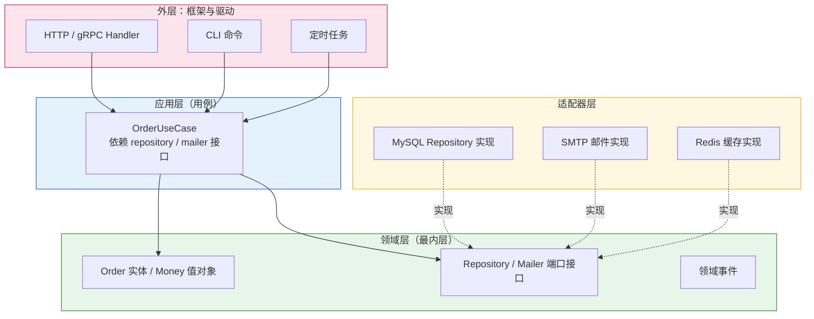
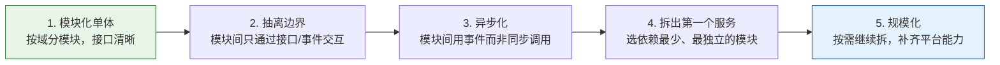
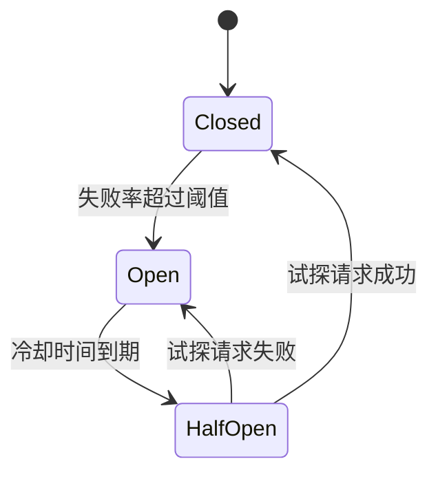
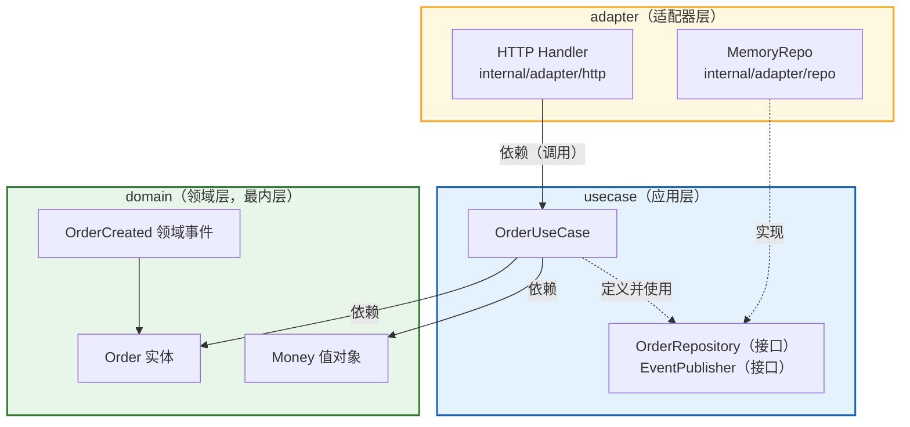

# 第 17 章 Go 设计模式与架构实践（下）

> **分册导航**：本章共 2 册，本册为第 2 册（下），含 17.5–17.10 节。
> 上一册：[上](第17章-1-Go设计模式与架构实践（上）.md) ｜ 下一册：— ｜ [返回总目录](00-前言与总目录.md)

## 17.5 Go 特有的惯用法

到这里，本章的模式清单已经讲完。但必须说清一件事：**在真实的 Go 项目里，你每天用的是"惯用法（Idiom）"而不是"模式（Pattern）"**。本节这些惯用法的出现频率远高于前面任何模式，它们才是 Go 代码之所以"看起来像 Go"的原因。

### 17.5.1 Functional Options Pattern

这是 Go 生态中最重要的 API 设计惯用法，由 Rob Pike 在 2014 年的一篇短文提出，如今几乎所有主流库（`grpc`、`zap`、`echo`、`gorm`、`k8s client-go`）都用它。

```go
package main

import (
	"errors"
	"fmt"
	"strings"
	"time"
)

// Server 是配置项很多的类型：5 个字段，其中 4 个有默认值。
type Server struct {
	addr         string
	readTimeout  time.Duration
	writeTimeout time.Duration
	maxConns     int
	logf         func(string)
}

// ServerOption 是"配置修改器"。
// 注意：它是一个函数类型，不是接口——这是与其他语言同类模式最大的差别。
type ServerOption func(*Server)

func WithReadTimeout(d time.Duration) ServerOption {
	return func(s *Server) { s.readTimeout = d }
}

func WithWriteTimeout(d time.Duration) ServerOption {
	return func(s *Server) { s.writeTimeout = d }
}

func WithMaxConns(n int) ServerOption {
	return func(s *Server) { s.maxConns = n }
}

func WithLogger(logf func(string)) ServerOption {
	return func(s *Server) { s.logf = logf }
}

// ErrInvalidOption 是哨兵错误，让调用方能用 errors.Is 判断类别。
var ErrInvalidOption = errors.New("server: 非法的选项")

// WithValidatedMaxConns 展示一个关键变体：选项的构造本身可以失败。
// 让选项构造函数返回 error，而不是让 NewServer 在运行时才发现问题。
func WithValidatedMaxConns(n int) (ServerOption, error) {
	if n <= 0 {
		return nil, fmt.Errorf("%w: maxConns 必须为正，got %d", ErrInvalidOption, n)
	}
	return func(s *Server) { s.maxConns = n }, nil
}

// NewServer 的骨架固定为四步：设默认值 -> 依次应用选项 -> 集中校验 -> 返回。
func NewServer(addr string, opts ...ServerOption) (*Server, error) {
	s := &Server{
		addr:         addr,
		readTimeout:  5 * time.Second,  // 默认值集中在一处
		writeTimeout: 10 * time.Second,
		maxConns:     100,
		logf:         func(string) {},
	}
	for _, opt := range opts {
		if opt == nil {
			return nil, fmt.Errorf("%w: 选项为 nil", ErrInvalidOption)
		}
		opt(s) // 选项就是"对 s 做一次修改"
	}
	// 跨字段校验必须在所有选项应用完之后做，否则读到的是中间状态
	if strings.TrimSpace(s.addr) == "" {
		return nil, errors.New("server: addr 不能为空")
	}
	if s.readTimeout > s.writeTimeout {
		return nil, fmt.Errorf("server: readTimeout(%v) 不应大于 writeTimeout(%v)", s.readTimeout, s.writeTimeout)
	}
	return s, nil
}

func main() {
	srv, err := NewServer(":8080",
		WithReadTimeout(3*time.Second),
		WithWriteTimeout(6*time.Second),
		WithMaxConns(50),
		WithLogger(func(m string) { fmt.Println("[srv]", m) }),
	)
	if err != nil {
		panic(err)
	}
	srv.logf(fmt.Sprintf("addr=%s read=%v write=%v maxConns=%d", srv.addr, srv.readTimeout, srv.writeTimeout, srv.maxConns))

	// 约束不满足时得到明确的错误，而不是留下一个半坏的 Server
	// 注意：必须让 readTimeout 真的超过默认的 writeTimeout（10s）才会触发，
	// 写成 WithReadTimeout(10*time.Second) 时 10s > 10s 为假，校验不会失败。
	if _, err := NewServer(":9090", WithReadTimeout(15*time.Second)); err != nil {
		fmt.Println("expected:", err)
	}

	// 校验型选项：错误在构造选项时就被发现
	if _, err := WithValidatedMaxConns(0); err != nil {
		fmt.Println("expected:", errors.Is(err, ErrInvalidOption), err)
	}
}
```

输出：

```text
[srv] addr=:8080 read=3s write=6s maxConns=50
expected: server: readTimeout(15s) 不应大于 writeTimeout(10s)
expected: true server: 非法的选项: maxConns 必须为正，got 0
```

**逐点解读**：

1. **`Server` 的字段全部小写**。Options 模式的前提是**配置结构体不导出**，外部只能通过 `WithXxx` 修改。如果字段导出，调用方会直接改字段，Options 就形同虚设。
2. **默认值只在 `NewServer` 里写一次**。这正是它相对"多参数构造函数"的核心优势：过去每个调用点都要写 `5*time.Second`，改了默认值要改 N 处。
3. 🔥 **选项是函数，所以可以做任意复杂的事**。`WithLogger` 除了赋值还能做包装、`WithRetry` 可以构造一个带退避的 transport、`WithTLS` 可以读证书文件并返回错误。这种表达力是"配置结构体 + 字段赋值"给不了的。
4. ⚠️ **不要忘记校验函数的 nil 选项**。`NewServer(":1", nil)` 会 panic 在 `opt(s)` 那一行，而报错信息毫无指向性。加上 nil 检查后错误会明确得多。
5. ⚠️ **跨字段校验必须放在循环之后**。如果校验写在循环里，第一个选项应用后就读到了中间状态，几乎必然误报。
6. **`errors.Join` 收集全部错误**：当校验项变多时（addr、timeout、maxConns、TLS 配置…），推荐把错误收进切片再 `errors.Join(errs...)`，让调用方一次看到所有问题，而不是改一个错跑一轮。

#### 关键讨论：什么时候该用 Functional Options

| 用 | 不用 |
| --- | --- |
| 可选参数 ≥ 3 个 | 参数 ≤ 2 个且都必填 |
| 参数有默认值，且默认值可能变化 | 没有默认值 |
| API 会持续增加参数（向后兼容很重要） | API 已冻结 |
| 调用方经常只改其中一两个参数 | 调用方通常全填 |
| 需要跨字段校验 | 每个参数独立校验 |

⚠️ **反模式：过度使用 Options**。见过只有两个参数的函数也写成 `NewClient(host string, opts ...Option)`，结果 90% 的调用点是 `NewClient(host)` 空变参。**这会增加 API 面积（每个可选参数要写一个导出的 `WithXxx`）却不带来任何实际收益**。判断标准很简单：**如果所有 `WithXxx` 在真实代码里从未被调用过，就应该把它们删掉，改成普通参数**。

💡 **一个容易被忽略的细节**：Functional Options 让"加参数"变成**非破坏性变更**（加一个 `WithXxx` 不会影响任何现有调用点），但让"改参数语义"变得更隐晦（调用方看到的是 `WithTimeout`，不知道它影响的是连接超时还是读取超时）。因此**选项函数的命名必须极度清晰**：`WithReadTimeout` 优于 `WithTimeout`，`WithMaxIdleConns` 优于 `WithConns`。

### 17.5.2 Option / Result 类型模拟（Go 1.18+ 泛型）

Go 没有 `Option`/`Maybe`/`Result` 内置类型。用泛型可以模拟，但**要不要这么做是个需要认真判断的问题**。

```go
package main

import "fmt"

// Opt 表示"可能有值"或"空"。零值即空，不需要额外的构造。
type Opt[T any] struct {
	value T
	ok    bool
}

// Some / None 是两个构造器，读起来接近函数式语言。
func Some[T any](v T) Opt[T] { return Opt[T]{value: v, ok: true} }
func None[T any]() Opt[T]    { return Opt[T]{} }

func (o Opt[T]) IsSome() bool { return o.ok }
func (o Opt[T]) IsNone() bool { return !o.ok }

// Get 是"显式取值的两种方式"：带 ok 的版本对应 Go 的 comma-ok 惯用法。
func (o Opt[T]) Get() (T, bool) { return o.value, o.ok }

// UnwrapOr 提供默认值，避免调用方每次都写 if。
func (o Opt[T]) UnwrapOr(def T) T {
	if !o.ok {
		return def
	}
	return o.value
}

// MapOpt 是函数式风格的转换：空值直接短路，不调用 f。
func MapOpt[T, U any](o Opt[T], f func(T) U) Opt[U] {
	if !o.ok {
		return None[U]()
	}
	return Some(f(o.value))
}

// First 是在切片里"找第一个满足条件的元素"的惯用返回。
// 对比手写版本：`(T, bool)` 或 `(T, error)` 或 `*T`（nil 表示没有）。
func First[T any](xs []T, pred func(T) bool) Opt[T] {
	for _, x := range xs {
		if pred(x) {
			return Some(x)
		}
	}
	return None[T]()
}

func main() {
	nums := []int{1, 3, 5, 8, 13}

	if v := First(nums, func(x int) bool { return x%2 == 0 }); v.IsSome() {
		fmt.Println("第一个偶数:", v.UnwrapOr(0))
	}

	// 找不到时 UnwrapOr 给出默认值，调用方不必写 if
	fmt.Println("第一个负数(默认 -1):", First(nums, func(x int) bool { return x < 0 }).UnwrapOr(-1))

	// Map 在空值上短路
	fmt.Println("空的 Map:", MapOpt(None[int](), func(x int) string { return fmt.Sprint(x) }).IsNone())
	fmt.Println("有值的 Map:", MapOpt(First(nums, func(x int) bool { return x > 4 }), func(x int) string {
		return fmt.Sprintf("找到了 %d", x)
	}).UnwrapOr("没找到"))
}
```

输出：

```text
第一个偶数: 8
第一个负数(默认 -1): -1
空的 Map: true
有值的 Map: 找到了 5
```

#### 关键判断：Go 里该不该用 Option 类型

**支持的理由**：

- **语义比 `(T, error)` 更准确**。"没找到"不是"出错"——用 `ErrNotFound` 表示"没找到"会把业务上的正常情况混进错误通道，调用方被迫区分"真错误"和"没找到"。
- **避免 `*T` 的 nil 歧义**。返回 `*T` 时，`nil` 到底表示"没有"还是"忘了赋值"？`Opt[T]` 消除了这个歧义。
- **可组合**。`MapOpt`、`UnwrapOr` 让链式处理很自然。

**反对的理由（以及为什么 Go 社区整体不流行）**：

- **Go 的零值就是天然的 None**。`var s string` 是 `""`、`var n int` 是 `0`、`var p *T` 是 `nil`。对大多数类型，"零值即空"已经够用，包一层 `Opt[T]` 只是增加噪音。
- **它让简单代码变复杂**。`if v, ok := First(...); ok` 是 1 行；`if v := First(...); v.IsSome() { v.UnwrapOr(0) }` 是 3 个方法调用。
- **泛型类型的方法集不能引入新的类型参数**。因此 `func (o Opt[T]) Map[U any](f func(T) U) Opt[U]` **无法编译**——你必须把它写成包级泛型函数 `MapOpt[T, U]`。这破坏了"链式调用"的流畅性（不能写 `opt.Map(f).UnwrapOr(0)`）。
- **JSON 序列化不友好**。`Opt[T]` 需要实现 `MarshalJSON`/`UnmarshalJSON` 才能正确区分"字段缺失"与"字段为 null"，否则会产生难以调试的序列化差异。

🔥 **务实结论**：

| 场景 | 推荐 |
| --- | --- |
| 函数内部、包内小范围使用 | 可以用 `Opt[T]`，收益大于成本 |
| 导出的公开 API | 优先用 `(T, bool)` 或 `(T, error)`——符合 Go 惯例，零学习成本 |
| 需要跨语言/跨服务序列化 | 不要用，改用显式字段（如 `HasX bool`） |
| 需要链式函数式风格 | 谨慎，Go 的方法集限制会让你失望 |

**Go 里"Option 的替代品"排序**：`(T, bool)` > `(T, error)`（配哨兵错误）> `*T`（仅在 T 本身是引用语义时才可接受）> `Opt[T]`（包内使用）。在需要"区分缺失与零值"的序列化场景（如 PATCH 请求的部分更新），**显式指针字段 + `omitempty`** 或 **三态枚举** 比 `Opt[T]` 更实用。

### 17.5.3 错误哨兵 + `errors.Is` 分类法

Go 的错误处理不是"返回码"也不是"异常"，而是**值**。既然是值，就可以分类、包装、判断。这套机制的核心是三个函数：`errors.Is`、`errors.As`、`errors.Join`（Go 1.20）。

```go
package main

import (
	"errors"
	"fmt"
	"net/http"
)

// ---------- 第一层：哨兵错误（Sentinel Error）----------
// 哨兵错误表达"发生了哪一类事"，调用方用 errors.Is 判断。
var (
	ErrNotFound     = errors.New("not found")
	ErrConflict     = errors.New("conflict")
	ErrUnauthorized = errors.New("unauthorized")
)

// ---------- 第二层：自定义错误类型 ----------
// 自定义类型携带上下文（操作名、键名、重试建议），调用方用 errors.As 取出。

// StoreErr 表示一次存储操作失败，并包装了底层原因。
type StoreErr struct {
	Op       string
	Key      string
	Retryable bool
	Base     error // 被包装的底层错误
}

// Error 只描述"这一层"的上下文，不重复底层信息。
func (e *StoreErr) Error() string {
	return fmt.Sprintf("store.%s(%q): %v", e.Op, e.Key, e.Base)
}

// Unwrap 让 errors.Is / errors.As 能继续向下钻取。
// 注意：实现了 Unwrap 的类型才能参与错误链的比较。
func (e *StoreErr) Unwrap() error { return e.Base }

// ---------- 被模拟的数据访问层 ----------

func GetUser(id string) (string, error) {
	switch id {
	case "":
		// 包装哨兵错误：外层有上下文，内层可被 errors.Is 识别
		return "", &StoreErr{Op: "getUser", Key: id, Retryable: false, Base: ErrNotFound}
	case "dup":
		return "", &StoreErr{Op: "getUser", Key: id, Retryable: true, Base: ErrConflict}
	case "boom":
		// 多个错误合并：用 errors.Join 保留全部信息
		return "", errors.Join(
			&StoreErr{Op: "getUser", Key: id, Retryable: true, Base: errors.New("连接超时")},
			errors.New("降级读取也失败"),
		)
	}
	return "user-" + id, nil
}

// ---------- 第三层：把错误分类映射成协议层语义 ----------

// HTTPStatus 是"错误 -> HTTP 状态码"的集中映射。
// 这类函数应该是整个服务里唯一做这种映射的地方。
func HTTPStatus(err error) int {
	switch {
	case err == nil:
		return http.StatusOK
	case errors.Is(err, ErrNotFound):
		return http.StatusNotFound
	case errors.Is(err, ErrConflict):
		return http.StatusConflict
	case errors.Is(err, ErrUnauthorized):
		return http.StatusUnauthorized
	default:
		return http.StatusInternalServerError
	}
}

// IsRetryable 用 errors.As 把自定义类型取出来读字段。
func IsRetryable(err error) bool {
	var se *StoreErr
	if errors.As(err, &se) { // 注意：传 &se，errors.As 需要一个指向目标类型的指针
		return se.Retryable
	}
	return false
}

func main() {
	for _, id := range []string{"a", "dup", "", "boom"} {
		v, err := GetUser(id)
		fmt.Printf("id=%-5q value=%-6q status=%d retryable=%-5v err=%v\n",
			id, v, HTTPStatus(err), IsRetryable(err), err)
	}

	// 错误链可以穿透多层包装
	_, err := GetUser("")
	fmt.Println("穿透判断 NotFound:", errors.Is(err, ErrNotFound))

	// errors.As 能取出最外层匹配的 *StoreErr
	var se *StoreErr
	if errors.As(err, &se) {
		fmt.Println("取出的 Op/Key:", se.Op, se.Key)
	}

	// errors.Join 的错误中，任一路径匹配即返回 true
	_, joined := GetUser("boom")
	fmt.Println("join 后是否含 ErrNotFound:", errors.Is(joined, ErrNotFound))
	fmt.Println("join 后是否可重试:", IsRetryable(joined))
	fmt.Println("join 的错误行数:", len(splitLines(joined.Error())))
}

// splitLines 是一个小工具，用于统计 Join 产生的多行错误。
func splitLines(s string) []string {
	var out []string
	cur := ""
	for _, r := range s {
		if r == '\n' {
			out = append(out, cur)
			cur = ""
			continue
		}
		cur += string(r)
	}
	return append(out, cur)
}
```

输出：

```text
id="a"   value="user-a" status=200 retryable=false err=<nil>
id="dup" value=""     status=409 retryable=true  err=store.getUser("dup"): conflict
id=""    value=""     status=404 retryable=false err=store.getUser(""): not found
id="boom" value=""     status=500 retryable=true  err=store.getUser("boom"): 连接超时
降级读取也失败
穿透判断 NotFound: true
取出的 Op/Key: getUser 
join 后是否含 ErrNotFound: false
join 后是否可重试: true
join 的错误行数: 2
```

**解读与坑**：

1. 🔥 **`errors.As` 的第二个参数必须是"指向目标类型的指针"**：`errors.As(err, &se)` 其中 `se` 是 `*StoreErr`，即传入 `**StoreErr`。写成 `errors.As(err, se)`（当 se 为 nil 时）会 panic 或返回 false，而写成 `errors.As(err, &se)` 是唯一正确形式。这是 Go 错误处理最常见的 API 误用。
2. **`Unwrap` 决定了错误链的深度**。上面的 `StoreErr.Unwrap` 返回 `Base`，所以 `errors.Is(err, ErrNotFound)` 能穿透。**如果你忘了实现 `Unwrap`，"包装"就变成了"埋没"**——外层错误的 `Error()` 里还能看到文字，但 `errors.Is` 已经失效。
3. **`%w` 是你最常用的包装方式**：`fmt.Errorf("checkout: %w", err)` 会创建一个实现了 `Unwrap` 的包装错误。`%v` 则只保留文字，不保留链。
4. ⚠️ **不要既用 `%w` 又用 `errors.Join` 造成重复**。`errors.Join(fmt.Errorf("a: %w", err), fmt.Errorf("b: %w", err))` 会让同一个错误在链中出现两次，日志里重复输出。
5. **哨兵错误的命名规范**：`ErrXxx`，且**必须导出**才能被外部 `errors.Is` 判断。包内的哨兵错误用 `errXxx`。社区的共识是把哨兵错误集中声明在包顶部或 `errors.go` 文件里，便于全局查阅。
6. **`errors.Is` 与 `==` 的区别**：`err == ErrNotFound` 只在"完全同一个错误值"时为真，任何包装都会让它失败。**必须用 `errors.Is`**。

💡 **一套成熟的错误分类法**（可以直接用在项目里）：

| 层次 | 形式 | 职责 | 判断方式 |
| --- | --- | --- | --- |
| 哨兵 | `var ErrNotFound = errors.New("not found")` | 表示业务语义类别 | `errors.Is` |
| 类型 | `type ValidationErr struct{ Field string }` | 携带结构化上下文 | `errors.As` |
| 包装 | `fmt.Errorf("layer: %w", err)` | 追加本层上下文 | 透传 |
| 汇总 | `errors.Join(e1, e2)` | 并行操作的多个错误 | `errors.Is` 任一匹配 |
| 边界 | `HTTPStatus(err)` | 映射到协议/展示层 | 集中一处 |

### 17.5.4 接口内嵌与最小接口

**最小接口**已经在本章反复出现（17.2.2 的 `KeyReader`、17.3.1 适配器一节里的 `Logger`）。这条原则的直接出处是 Go 标准库的 `io` 包：

```go
// 标准库 io 包的接口都只有一个方法（或很少）。
type Reader interface{ Read(p []byte) (n int, err error) }
type Writer interface{ Write(p []byte) (n int, err error) }
type Closer interface{ Close() error }
```

**接口内嵌（Embedding）** 是组合多个最小接口的标准手段：

```go
package main

import (
	"fmt"
	"io"
	"strings"
)

// ReadCloser 是内嵌组合：把两个最小接口拼成一个常用的"可读可关"能力。
type ReadCloser interface {
	io.Reader
	io.Closer
}

// nopCloser 是标准库 io.NopCloser 的等价实现。
type nopCloser struct{ io.Reader }

func (nopCloser) Close() error { return nil }

func NopCloser(r io.Reader) ReadCloser { return nopCloser{r} }

// ---------- 内嵌的实际价值：一次实现，自动满足多个接口 ----------

// limitedReader 同时满足 io.Reader 与 io.Closer（通过内嵌字段提升方法）。
type limitedReader struct {
	io.Reader // 提升 Read 方法
	remain    int
	closed    bool
}

func (l *limitedReader) Close() error { l.closed = true; return nil }

func main() {
	var rc ReadCloser = NopCloser(strings.NewReader("hello"))
	buf := make([]byte, 3)
	n, err := rc.Read(buf)
	fmt.Println("读到:", string(buf[:n]), "err:", err)
	fmt.Println("关闭:", rc.Close())

	// 内嵌 io.Reader 后，limitedReader 自动拥有 Read 方法
	lr := &limitedReader{Reader: strings.NewReader("abcdefg"), remain: 4}
	all, err := io.ReadAll(lr) // io.ReadAll 只要求 io.Reader
	if err != nil {
		panic(err)
	}
	fmt.Println("ReadAll 读到:", string(all), "长度:", len(all))
	fmt.Println("关闭:", lr.Close())

	// ---------- 最小接口的实战价值：一个函数能被多少东西复用 ----------

	// CountBytes 只依赖 io.Reader，因此可以接受：字符串、文件、网络连接、
	// gzip 解压流、限速 Reader、HTTP 响应体……任何东西。
	fmt.Println("统计:", CountBytes(strings.NewReader("0123456789")))
	fmt.Println("再来一次:", CountBytes(NopCloser(strings.NewReader("abc"))))
}

func CountBytes(r io.Reader) int {
	n, err := io.Copy(io.Discard, r)
	if err != nil {
		return -1
	}
	return int(n)
}
```

**接口内嵌与最小接口的两条硬规则**：

1. 🔥 **接口应该由使用方定义，而不是实现方导出**。这一条在 17.2.2 讲过，其工程含义是：**如果你在 `storage` 包里导出 `StorageRepository` 接口，那么 `storage` 就在强迫所有使用方依赖它的抽象**。反过来，`report` 包自己定义 `KeyReader`，就只依赖它真正需要的一个方法，任何满足它的类型都能传入（包括 `storage` 的具体类型、测试假实现、别的包的类型）。
2. ⚠️ **不要为"未来可能的变化"预先设计接口**。Go 社区有一句广为人知的忠告：**"Don't design with interfaces, discover them."** 先写具体实现，等到**第二个实现真的出现**、或者**测试需要一个替身**时，再把接口抽出来。预先抽接口的代价是：接口签名会猜错（因为你还不知道使用方真正需要什么），而且会引入不必要的间接层。

| 场景 | 建议 |
| --- | --- |
| 一个实现，且无测试替身需求 | 直接返回具体类型（`*MemoryStore`） |
| 一个实现，但测试需要替身 | 在**使用方**定义最小接口 |
| 两个以上实现 | 抽接口，放在使用方或中立的包 |
| 需要跨包解耦（插件、驱动） | 接口放在"被依赖"的包里（如 `io`、`database/sql/driver`） |

### 17.5.5 空结构体与集合惯用法、`for range` 遍历 channel

`struct{}` 是 Go 里唯一**零字节**的类型。这不是一个小细节——它带来三个常用惯用法。

```go
package main

import (
	"fmt"
	"sync"
)

// ---------- 惯用法一：集合（Set）----------
// 用 map[T]struct{} 而不是 map[T]bool。原因：struct{} 不占空间，且语义上"值无意义"。
type set[T comparable] map[T]struct{}

func NewSet[T comparable](items ...T) set[T] {
	s := make(set[T], len(items))
	for _, it := range items {
		s.Add(it)
	}
	return s
}

func (s set[T]) Add(v T)      { s[v] = struct{}{} }
func (s set[T]) Add2(v T) bool {
	if _, exists := s[v]; exists {
		return false // 已经存在
	}
	s[v] = struct{}{}
	return true // 本次新增
}
func (s set[T]) Has(v T) bool { _, ok := s[v]; return ok }
func (s set[T]) Len() int     { return len(s) }
func (s set[T]) Delete(v T)   { delete(s, v) }

// Intersect 求交集：遍历较小的集合可以减少比较次数。
func (s set[T]) Intersect(other set[T]) set[T] {
	small, big := s, other
	if len(big) < len(small) {
		small, big = big, small
	}
	out := make(set[T], len(small))
	for v := range small {
		if big.Has(v) {
			out.Add(v)
		}
	}
	return out
}

func main() {
	// 集合去重 + 幂等：Add2 的返回值表示"是否是新增"
	s := NewSet("go", "rust", "go")
	fmt.Println("集合大小:", s.Len(), "含 go:", s.Has("go"), "含 c:", s.Has("c"))
	fmt.Println("go 是新增吗:", s.Add2("go"), "| c 是新增吗:", s.Add2("c"))

	// 用集合做"去重且保持顺序"
	seen := NewSet[int]()
	var uniq []int
	for _, v := range []int{3, 1, 3, 2, 1, 5} {
		if seen.Add2(v) { // 只在新增时追加，顺序由首次出现决定
			uniq = append(uniq, v)
		}
	}
	fmt.Println("去重且保序:", uniq)

	a := NewSet(1, 2, 3, 4)
	b := NewSet(3, 4, 5)
	fmt.Println("交集大小:", a.Intersect(b).Len())

	// ---------- 惯用法二：channel 作为信号 ----------
	// 用 chan struct{} 而不是 chan bool：明确表达"只关心发生，不关心值"。
	done := make(chan struct{})
	var wg sync.WaitGroup
	wg.Add(1)
	go func() {
		defer wg.Done()
		defer close(done) // 关闭即广播——所有接收者同时解除阻塞
	}()
	wg.Wait()
	<-done
	fmt.Println("收到完成信号")

	// ---------- 惯用法三：for range 遍历 channel（带关闭检测）----------
	// 这是"生产者-消费者"的骨架：生产者关闭 channel，消费者 range 自然退出。
	ch := make(chan string, 3)
	go func() {
		defer close(ch)
		for _, m := range []string{"a", "b", "c"} {
			ch <- m
		}
	}()
	var got []string
	for m := range ch { // channel 关闭且缓冲耗尽时循环自动结束
		got = append(got, m)
	}
	fmt.Println("消费到:", got)

	// ---------- 对比：chan bool 的三大缺点 ----------
	// 1. 无法区分"false 值"与"零值"（<-ch 得到 false 时你不知道是收到还是没收到）
	// 2. 接收方只读不写，bool 值永远无意义
	// 3. 类型上无法表达"这是信号通道"的意图
	boolCh := make(chan bool, 1)
	boolCh <- false // 合法但语义混乱：这算"发生"了吗？
	fmt.Println("chan bool 收到的值:", <-boolCh)
}
```

**解读与坑**：

1. **`map[T]bool` vs `map[T]struct{}`**：两者功能相同，但 `struct{}` 明确表达"我只关心键存在"，且省下每个条目的一个 `bool`（实际内存差异远小于条目开销，所以别指望靠这个省内存——**语义清晰才是主要理由**）。
2. ⚠️ **`chan struct{}` 的关闭即广播语义**：`close(done)` 会让**所有**正在 `<-done` 上阻塞的 goroutine 同时解除阻塞。这是 Go 里唯一的"一对多通知"原语，比给每个等待者发一条消息更简洁。但要注意：**从已关闭的 channel 接收会立即返回零值**，所以你无法用它传递"第几次"信息。
3. **`for range ch` 的终止条件是"channel 已关闭且缓冲区为空"**。如果生产者忘了 `close`，消费者会永久阻塞（死锁）。因此 **close 的责任必须明确**：约定"只有发送方关闭"（17.5.7 的 `produce` 与 `merge` 都是这么做的）。
4. **`for range ch` 与 `for { select { case v, ok := <-ch: } }` 的取舍**：前者更简洁但无法同时等待其他 channel；需要 `select` 多路复用时必须用后者，并显式用 `ok` 判断关闭。

### 17.5.6 `context` 的链式传递

`context` 是 Go 里处理**取消、超时、请求域数据**的标准机制。它有三条铁律，违反任何一条都会带来长期维护问题。

```go
package main

import (
	"context"
	"errors"
	"fmt"
	"time"
)

// ---------- 铁律一：context 是函数的第一个参数，且名称为 ctx ----------
// 例外只有一个：http.Handler 的 ServeHTTP / http.HandlerFunc（由标准库签名决定）。

type RequestIDKey struct{}

func WithRequestID(ctx context.Context, id string) context.Context {
	return context.WithValue(ctx, RequestIDKey{}, id)
}

func RequestID(ctx context.Context) string {
	id, _ := ctx.Value(RequestIDKey{}).(string)
	return id
}

// ---------- 铁律二：不要存进结构体 ----------
// 反例：
//   type Service struct{ ctx context.Context }   // ❌ 生命周期错配
//   func (s *Service) Do() error                 // 无法为单次调用设置超时
// 正例：每次调用都显式传入，让"这一次调用"的超时是调用方的决定。

// Service 不持有 ctx。
type Service struct{ name string }

// Do 接收 ctx 并把它传给下游——这就是"链式传递"。
func (s *Service) Do(ctx context.Context, id string) (string, error) {
	// 为这一层设置自己的超时预算（相对上层更短，形成 deadline 金字塔）
	ctx, cancel := context.WithTimeout(ctx, 200*time.Millisecond)
	defer cancel() // 必须调用，否则泄漏 timer

	select {
	case <-time.After(50 * time.Millisecond): // 模拟下游调用
		return fmt.Sprintf("%s[%s] 处理了 %s", s.name, RequestID(ctx), id), nil
	case <-ctx.Done():
		return "", fmt.Errorf("service.Do: %w", ctx.Err()) // ErrDeadlineExceeded / ErrCanceled
	}
}

// ---------- 铁律三：Value 只放"请求域元数据"，不放业务参数 ----------
// 适合放：traceID、requestID、用户身份（认证后的 principal）、locale。
// 不适合放：数据库句柄、配置、logger 之外的业务对象。

func main() {
	// 链式传递：根 ctx -> 带 requestID -> 带超时
	root := context.Background()
	ctx := WithRequestID(root, "req-42")
	ctx, cancel := context.WithTimeout(ctx, time.Second)
	defer cancel()

	svc := &Service{name: "order"}
	out, err := svc.Do(ctx, "ORD-1")
	fmt.Println(out, err)

	// 上层提前取消：下游能立即感知，无需等它自己超时
	ctx2, cancel2 := context.WithCancel(WithRequestID(root, "req-43"))
	cancel2()
	if _, err := svc.Do(ctx2, "ORD-2"); err != nil {
		fmt.Println("expected:", err)
	}

	// 超时预算耗尽：同样是 ctx.Err() 被包装后返回
	tight, cancelTight := context.WithTimeout(WithRequestID(root, "req-44"), 10*time.Millisecond)
	defer cancelTight()
	if _, err := svc.Do(tight, "ORD-3"); err != nil {
		fmt.Println("expected:", errors.Is(err, context.DeadlineExceeded), err)
	}

	// 没有 requestID 时取到空串（Value 一定不会 panic，但可能拿到零值）
	fmt.Printf("无 requestID 时: %q\n", RequestID(root))
}
```

**三条铁律的原理**：

1. **第一个参数、名为 `ctx`**。这让"这个函数可能阻塞、可被取消"成为**签名上可见的信息**。放在参数中间会让人误以为它是普通参数。
2. **不要存进结构体**。`context` 的生命周期属于**一次调用**，而结构体的生命周期属于**一个组件**。把 ctx 存进结构体意味着：(a) 无法为单次调用设置超时；(b) 结构体被多个请求共享时，ctx 会被后一个请求覆盖，产生极难复现的取消错误。**唯一的例外**是"整个对象生命周期都由一个 ctx 控制"的场景，例如 `NewWatcher(ctx, ...)` 里的长期 watch。
3. **`Value` 只放请求域元数据**。`context.Value` 是**无类型检查的**（只能靠 `any` 存取 + 断言），因此滥用它会让数据流变得不可追踪。判断标准：**这个值是否随请求流动、且对所有中间层都是透明的？** 是 → 放 ctx（traceID、requestID、principal）；否 → 作为函数参数显式传递。

⚠️ **常见错误清单**：

| 错误 | 后果 | 正确做法 |
| --- | --- | --- |
| `ctx := context.Background()` 在库函数里 | 使用方无法取消，超时失效 | 从参数接收 `ctx` |
| 忘记 `defer cancel()` | timer/goroutine 泄漏，直到父 ctx 结束 | 每个 `WithXxx` 后立即 `defer cancel()` |
| 用 `context.TODO()` 当成"更好的 Background" | 语义模糊，没人会回来改 | 明确用 `Background` 或补上真实 ctx |
| 把 `ctx.Value` 当依赖注入容器 | 隐式依赖，测试与重构困难 | 用构造函数参数注入 |
| 在 `WithValue` 里用 `string` 作为 key | 不同包的同名 key 冲突 | 用未导出的自定义类型作 key（如 `RequestIDKey`） |
| 把 `nil` 当 ctx 传下去（`f(nil, ...)`） | 下游既无法取消，`WithCancel(nil)` 之类还会直接 panic | 用 `context.TODO()` 显式表达"暂时还没想好"，或补上真实 ctx |

💡 **`context.WithTimeout` vs `WithDeadline`**：`WithTimeout` 是"从现在起 N 秒"，`WithDeadline` 是"到某个绝对时刻"。**跨服务传递时要用 Deadline**——因为上游已经消耗了一部分预算，下游如果再从头算 N 秒，总耗时就会变成 N 的倍数（超时预算逐层放大的经典 bug）。`context` 的 deadline 在**同一进程内**会自动向下传递，正是为了支持这种"预算递减"；**跨进程则不会自动传递**（gRPC 会自动带上剩余超时，HTTP 需要你自己按剩余预算设置超时头）。

### 17.5.7 通过 channel 传递所有权

第 10 章讲过"不要通过共享内存来通信"。这条原则的工程落地就是**所有权（Ownership）转移**：数据在任一时刻只属于一个 goroutine，通过 channel 把所有权交出去，从此不再碰它。

```go
package main

import (
	"context"
	"fmt"
	"sync"
	"time"
)

// ---------- 规则一：发送方负责关闭 ----------

// produce 是唯一的发送者，所以它负责 close。
// 返回类型是 <-chan int（只读），把"只能接收"写进类型签名。
func produce(ctx context.Context, n int) <-chan int {
	ch := make(chan int)
	go func() {
		defer close(ch) // 发送方关闭：接收方的 range 会自然结束
		for i := 0; i < n; i++ {
			select {
			case ch <- i:
			case <-ctx.Done():
				return
			}
		}
	}()
	return ch
}

// ---------- 规则二：多个发送方时，需要第三方负责关闭 ----------

// merge 合并多个 channel。它自己起了转发 goroutine，
// 因此只有它知道"所有输入都结束了"，所以由 merge 关闭输出。
func merge(ctx context.Context, ins ...<-chan int) <-chan int {
	out := make(chan int)
	var wg sync.WaitGroup
	wg.Add(len(ins))
	for _, in := range ins {
		go func(c <-chan int) {
			defer wg.Done()
			for v := range c { // 输入关闭时自动退出
				select {
				case out <- v:
				case <-ctx.Done():
					return
				}
			}
		}(in)
	}
	go func() {
		wg.Wait()  // 等所有转发者退出
		close(out) // 此刻才能安全关闭
	}()
	return out
}

func main() {
	ctx, cancel := context.WithTimeout(context.Background(), 2*time.Second)
	defer cancel()

	// 合并两个生产者：总数为 3 + 4 = 7，顺序不保证（并发调度决定）
	var got []int
	for v := range merge(ctx, produce(ctx, 3), produce(ctx, 4)) {
		got = append(got, v)
	}
	fmt.Println("收到", len(got), "个值")

	// 取消上下文：生产者会通过 select 的 ctx.Done() 分支退出，不会泄漏 goroutine
	ctx2, cancel2 := context.WithCancel(context.Background())
	ch := produce(ctx2, 1_000_000) // 无限量生产者
	<-ch                           // 只取一个值
	cancel2()                      // 取消后生产者立即退出
	// 排空并确认 channel 被关闭（生产者 defer close 已执行）
	count := 0
	for range ch {
		count++
	}
	fmt.Println("取消后剩余值:", count)

	// 反例说明：为什么"接收方关闭 channel"是错的
	//   ch := make(chan int)
	//   go func(){ for v := range ch { ... } }()
	//   close(ch)   // ❌ 如果还有生产者在往 ch 发送 -> panic: send on closed channel
	fmt.Println("所有权规则：谁发送，谁关闭；有多个发送方时，由协调者关闭")
}
```

**所有权规则速查表**：

| 情况 | 谁负责 close | 常见错误 |
| --- | --- | --- |
| 一个发送方，N 个接收方 | 发送方 | 接收方 close → `send on closed channel` panic |
| N 个发送方，一个接收方 | 都不关，或用 `sync.WaitGroup` + 协调 goroutine 关 | 任一发送方 close → 其他发送方 panic |
| 只有一个接收方且要"通知发送方停止" | 接收方用 `close(done)` 发信号（此时 done 是另一条 channel） | 把"信号 channel"和"数据 channel"混用 |
| 只读遍历 | 不需要 close | 忘了 close → `for range` 永久阻塞 |

🔥 **这条规则为什么重要**：`close` 的语义是"不会再有人发送数据了"，它**只能由发送方做出**。一旦接收方 `close`，正在阻塞的发送方会立即 panic；反之，如果没人 `close`，接收方的 `for range` 会永久阻塞。**channel 泄漏和 panic 的根源几乎都在这里。**

💡 **一个容易被忽略的技巧**：从 channel 接收时把结果**转移给另一个数据结构**也算所有权转移。比如 `ch := make(chan []byte, 8)`，生产者发送切片后必须不再复用它（除非文档明确写了"接收方不得保留"）。**如果生产者会复用缓冲，就必须在发送前拷贝**——否则接收方看到的数据会被下一个发送者覆写。

### 17.5.8 用闭包做资源管理与"defer 执行器"

`defer` 是 Go 最优雅的设计之一：**它把"释放"与"申请"写在相邻的位置**，让资源对称性在代码上可见。

```go
package main

import (
	"errors"
	"fmt"
	"io"
	"os"
	"path/filepath"
	"strings"
)

// ---------- 惯用法一："申请即返回清理函数" ----------

// TempDir 返回目录与清理闭包。调用方拿到后立刻 defer，不可能忘。
func TempDir() (string, func() error, error) {
	dir, err := os.MkdirTemp("", "ch17-")
	if err != nil {
		return "", nil, err
	}
	return dir, func() error { return os.RemoveAll(dir) }, nil
}

// WithFile 把"打开 -> 使用 -> 关闭"的对称操作封装成一个函数。
// 调用方只提供 fn，绝不会忘记关闭文件。
func WithFile(path string, fn func(f *os.File) error) error {
	f, err := os.OpenFile(path, os.O_CREATE|os.O_WRONLY|os.O_TRUNC, 0o600)
	if err != nil {
		return err
	}
	// 关闭发生在唯一的这一处；即使 fn panic 也会执行
	defer f.Close()
	return fn(f)
}

// ---------- 惯用法二：defer 执行器（cleanup stack）----------

// cleanupStack 是"后进先出的清理器"，等价于手动管理的 defer 栈。
// 它的价值场景：清理项的数量在运行时才确定（defer 的数量必须编译期确定）。
type cleanupStack struct {
	funcs []func() error
	errs  []error
}

func (c *cleanupStack) Add(f func() error) { c.funcs = append(c.funcs, f) }

// Run 逆序执行全部清理，并收集错误（不因一个失败就跳过其余清理）。
func (c *cleanupStack) Run(log func(string)) error {
	for i := len(c.funcs) - 1; i >= 0; i-- {
		if err := c.funcs[i](); err != nil {
			c.errs = append(c.errs, err)
			log(fmt.Sprintf("清理项 %d 失败: %v", i, err))
		}
	}
	return errors.Join(c.errs...)
}

// SetupPipeline 演示动态清理：连接池、临时文件、监听端口按创建顺序注册，
// 按相反顺序释放——这与 defer 的语义完全一致，但数量在运行时决定。
func SetupPipeline(log func(string)) (*cleanupStack, error) {
	cs := &cleanupStack{}
	names := []string{"连接池", "临时目录", "监听端口"}
	for i, n := range names {
		name, idx := n, i
		if name == "监听端口" {
			cs.Add(func() error {
				log(fmt.Sprintf("释放 %s", name))
				return errors.New("模拟端口释放失败") // 演示"部分清理失败"
			})
			continue
		}
		cs.Add(func() error {
			log(fmt.Sprintf("释放 %s(%d)", name, idx))
			return nil
		})
	}
	return cs, nil
}

func main() {
	// 申请即 defer 清理
	dir, cleanup, err := TempDir()
	if err != nil {
		panic(err)
	}
	defer func() { _ = cleanup() }()
	fmt.Println("临时目录:", filepath.Base(dir) != "")

	// 封装对称操作
	path := filepath.Join(dir, "out.txt")
	if err := WithFile(path, func(f *os.File) error {
		_, werr := f.WriteString("hello defer")
		return werr
	}); err != nil {
		panic(err)
	}
	// 用 WithFile 无法读（只写模式），改用 os.ReadFile 演示读取
	data, err := os.ReadFile(path)
	if err != nil {
		panic(err)
	}
	fmt.Println("写回读:", string(data))

	// 动态清理栈
	cs, err := SetupPipeline(func(m string) { fmt.Println("[setup]", m) })
	if err != nil {
		panic(err)
	}
	if err := cs.Run(func(m string) { fmt.Println("[log]", m) }); err != nil {
		fmt.Println("清理有失败:", strings.Contains(err.Error(), "端口"))
	}

	// ---------- 惯用法三：用 defer 简化"关闭并检查错误" ----------
	// 只读文件用 os.ReadFile；必须用 io.Reader 时用 defer + 命名返回值捕获关闭错误。
	if err := copyFile(path, filepath.Join(dir, "copy.txt")); err != nil {
		panic(err)
	}
	fmt.Println("复制完成")
}

// copyFile 用命名返回值，在 defer 里把 Close 的错误也纳入返回。
// 这是"读操作忽略 Close 错误"与"写操作必须检查 Close 错误"的折中：
// 对文件写入，数据可能在 Close 时才真正落盘。
func copyFile(src, dst string) (err error) {
	in, err := os.Open(src)
	if err != nil {
		return err
	}
	defer in.Close() // 读操作：忽略 Close 错误是可接受的

	out, err := os.OpenFile(dst, os.O_CREATE|os.O_WRONLY|os.O_TRUNC, 0o600)
	if err != nil {
		return err
	}
	defer func() {
		// out.Close 的错误会覆盖返回值（仅当返回值为 nil 时）。
		// 注意：os.File.Close 自身是幂等的吗？不是——重复调用会返回 ErrClosed。
		if cerr := out.Close(); cerr != nil && err == nil {
			err = cerr
		}
	}()

	if _, err := io.Copy(out, in); err != nil {
		return err
	}
	return nil
}
```

**解读与坑**：

1. 🔥 **`defer` 的参数在声明时求值**：`defer f(x)` 会立刻求值 `x`，但 `f` 在函数返回时调用。因此 `defer os.Remove(path)` 里的 `path` 是当时的快照；要"延迟求值"必须用闭包 `defer func() { os.Remove(path) }()`。
2. **`defer` 有成本，但只在小函数里可见**。Go 1.14 引入了开放编码（open-coded defer），在函数内 `defer` 数量 ≤ 8 且不处于循环中时，代价从"几十纳秒"降到"几纳秒"。**在循环里 `defer` 依然是昂贵且危险的**——`for _, f := range files { defer f.Close() }` 会把所有文件句柄留到函数结束才关闭，可能耗尽文件描述符。正确做法是把循环体抽成一个函数。
3. **写入场景必须检查 `Close` 的错误**：`bufio.Writer`、`gzip.Writer`、`os.File` 写入时的错误可能在 `Close`（或 `Flush`）时才暴露。上例用命名返回值的 `defer` 是标准手法。
4. ⚠️ **`defer` + `recover` 只能捕获"同一个 goroutine"的 panic**。子 goroutine 里的 panic 无法被父 goroutine 的 `recover` 捕获，会导致整个进程退出。**每个 `go func()` 都应该自己考虑是否需要 `defer recover`**。
5. **清理函数返回错误的处理**：`cleanupStack.Run` 用 `errors.Join` 收集全部错误而不是遇到第一个错误就返回。理由与 17.3.4 的补偿逻辑一致：**清理必须尽力做完，中断清理会留下更难收拾的残局**。

### 17.5.9 依赖注入的构造函数链（NewA → NewB(a) → NewC(b)）

Go 不需要 DI 框架。**构造函数链**是最常用、最可预测的依赖注入方式：每个组件在自己的 `NewXxx` 里显式接收依赖。

```go
package main

import (
	"errors"
	"fmt"
	"strings"
)

// ---------- 每一层只依赖它直接需要的东西 ----------

// Config 是最内层：无依赖。接收 getenv 而不是直接调 os.Getenv，
// 这样测试时可以传入 map 查找函数，无需污染真实环境变量。
type Config struct {
	DSN     string
	BaseURL string
}

func NewConfig(getenv func(string) string) (*Config, error) {
	dsn := getenv("APP_DSN")
	if dsn == "" {
		return nil, errors.New("config: APP_DSN 未设置")
	}
	return &Config{
		DSN:     dsn,
		BaseURL: getenv("APP_BASE_URL"),
	}, nil
}

// DB 依赖 Config。
type DB struct{ dsn string }

func NewDB(cfg *Config) (*DB, error) {
	if cfg == nil {
		return nil, errors.New("db: config 为 nil")
	}
	return &DB{dsn: cfg.DSN}, nil
}

func (d *DB) Query(q string) (string, error) {
	if strings.TrimSpace(q) == "" {
		return "", errors.New("db: 空查询")
	}
	return "结果:" + q, nil
}

// UserRepo 依赖 DB。
type UserRepo struct{ db *DB }

func NewUserRepo(db *DB) (*UserRepo, error) {
	if db == nil {
		return nil, errors.New("repo: db 为 nil")
	}
	return &UserRepo{db: db}, nil
}

func (r *UserRepo) Find(id string) (string, error) {
	if id == "" {
		return "", errors.New("repo: id 不能为空")
	}
	return r.db.Query("SELECT * FROM users WHERE id = '" + id + "'")
}

// UserService 依赖 UserRepo。
type UserService struct{ repo *UserRepo }

func NewUserService(repo *UserRepo) (*UserService, error) {
	if repo == nil {
		return nil, errors.New("service: repo 为 nil")
	}
	return &UserService{repo: repo}, nil
}

func (s *UserService) Get(id string) (string, error) {
	u, err := s.repo.Find(id)
	if err != nil {
		return "", fmt.Errorf("service.Get(%q): %w", id, err)
	}
	return strings.ToUpper(u), nil
}

// ---------- 装配函数：把整条链在一个地方连起来 ----------

// NewApp 是唯一的"知道全部依赖关系"的地方。
// 这也叫组合根（Composition Root）：依赖的装配只发生在这里。
func NewApp(getenv func(string) string) (*UserService, error) {
	cfg, err := NewConfig(getenv)
	if err != nil {
		return nil, fmt.Errorf("装配失败: %w", err)
	}
	db, err := NewDB(cfg)
	if err != nil {
		return nil, fmt.Errorf("装配失败: %w", err)
	}
	repo, err := NewUserRepo(db)
	if err != nil {
		return nil, fmt.Errorf("装配失败: %w", err)
	}
	svc, err := NewUserService(repo)
	if err != nil {
		return nil, fmt.Errorf("装配失败: %w", err)
	}
	return svc, nil
}

func main() {
	env := map[string]string{"APP_DSN": "postgres://localhost/app", "APP_BASE_URL": "https://api.example.com"}

	svc, err := NewApp(func(k string) string { return env[k] })
	if err != nil {
		panic(err)
	}
	out, err := svc.Get("u-1")
	fmt.Println(out, err)

	// 缺少环境变量：错误在最内层产生，并逐层包装上"装配失败"的上下文
	if _, err := NewApp(func(string) string { return "" }); err != nil {
		fmt.Println("expected:", err)
	}

	// 测试友好性：不需要设置真实环境变量，也不需要数据库
	cfg, err := NewConfig(func(k string) string {
		if k == "APP_DSN" {
			return "sqlite::memory:"
		}
		return ""
	})
	if err != nil {
		panic(err)
	}
	fmt.Println("测试用配置:", cfg.DSN, "BaseURL =", cfg.BaseURL)
}
```

**输出与解读要点**：

```text
结果:SELECT * FROM users WHERE id = 'u-1' <nil>
expected: 装配失败: config: APP_DSN 未设置
测试用配置: sqlite::memory: BaseURL = 
```

1. 🔥 **`getenv func(string) string` 是本节的关键技巧**。直接调 `os.Getenv` 会让 `NewConfig` 依赖全局状态，测试时必须 `os.Setenv`（并且要记得清理，且无法并行测试）。接收一个函数则完全解耦——测试传入 map 查找即可。
2. **每个构造函数都校验自己的入参**。`NewDB(nil)` 立即返回错误，而不是等到第一次 `Query` 时 panic。这叫**快速失败（fail fast）**，它把错误定位从"运行 3 小时后"提前到"启动时"。
3. **错误逐层包装**：`装配失败: config: APP_DSN 未设置` 让你一眼看出是哪一个组件、哪一个变量出的问题。用 `%w` 而不是 `%v` 保留错误链（17.5.3）。
4. ⚠️ **不要用 `init()` 做装配**。`init` 里注册全局变量会让依赖关系不可见、无法测试、无法控制装配顺序。**所有装配都应该显式发生在 `main` 里**（或其调用的 `NewApp` 中）。
5. **接口在哪里？** 注意这个例子里**一个接口都没有**。这是有意的：只有具体依赖、没有替换需求时，接口是多余的。当 `UserRepo` 需要被替换（例如 `UserService` 的单元测试要注入假 repo）时，应该在 `UserService` 所在的位置定义最小接口 `type UserFinder interface{ Find(string) (string, error) }`，然后让 `NewUserService` 接收它（17.8 实战会这么做）。

**什么时候需要 DI 框架（如 `google/wire`、`uber/fx`）？** 当依赖图超过约 30 个组件、且大量是重复的样板装配代码时。但请先衡量：框架会引入代码生成（`wire`）或运行期反射（`fx`），让"依赖从哪来"变得不那么直白。**绝大多数服务（10~30 个组件）用构造函数链 + 一个 `NewApp` 就够，且可读性最好。**

### 17.5.10 表驱动与数据即代码

表驱动测试（Table-Driven Test）是 Go 社区的标志性写法，但它的适用范围远不止测试——**任何"多个输入对应多个输出/行为"的逻辑都可以用数据描述**。

```go
package main

import (
	"errors"
	"fmt"
	"strings"
)

// ---------- 场景一：校验规则（数据即代码）----------

type rule struct {
	field  string               // 作用于哪个字段
	check  func(v string) error // 规则本身
	reason string               // 给用户看的原因
}

// userRules 是数据。新增规则 = 加一行，不改任何控制流。
var userRules = []rule{
	{"name", func(v string) error {
		if strings.TrimSpace(v) == "" {
			return errors.New("不能为空")
		}
		return nil
	}, "姓名必填"},
	{"email", func(v string) error {
		if !strings.Contains(v, "@") {
			return errors.New("缺少 @")
		}
		return nil
	}, "邮箱格式"},
	{"age", func(v string) error {
		if v == "" {
			return errors.New("不能为空")
		}
		return nil
	}, "年龄必填"},
}

// ValidateUser 是通用执行器：一次收集全部错误，而不是遇到第一个就返回。
func ValidateUser(fields map[string]string) error {
	var errs []error
	for _, r := range userRules {
		if err := r.check(fields[r.field]); err != nil {
			errs = append(errs, fmt.Errorf("%s(%s): %w", r.field, r.reason, err))
		}
	}
	return errors.Join(errs...)
}

// ---------- 场景二：状态转移表（见 17.4.6）----------
// 转移表就是最经典的数据即代码：把控制流换成 map 查找。

// ---------- 场景三：路由/分发表 ----------

type handlerFunc func(args []string) (string, error)

// commandTable 把"命令名 -> 处理函数"写成数据。
// 新增命令只需加一行，且所有命令的签名被统一强制。
var commandTable = map[string]handlerFunc{
	"greet": func(args []string) (string, error) {
		if len(args) == 0 {
			return "", errors.New("greet: 需要一个名字")
		}
		return "你好, " + args[0], nil
	},
	"sum": func(args []string) (string, error) {
		total := 0
		for _, a := range args {
			var n int
			if _, err := fmt.Sscanf(a, "%d", &n); err != nil {
				return "", fmt.Errorf("sum: %q 不是整数", a)
			}
			total += n
		}
		return fmt.Sprint(total), nil
	},
}

// Dispatch 是通用分发器：控制流只有一处，命令的行为全在表里。
func Dispatch(line string) (string, error) {
	parts := strings.Fields(line)
	if len(parts) == 0 {
		return "", errors.New("dispatch: 空命令")
	}
	h, ok := commandTable[parts[0]]
	if !ok {
		// 未知命令：把可用命令列出来，比"unknown command"有用得多
		names := make([]string, 0, len(commandTable))
		for k := range commandTable {
			names = append(names, k)
		}
		return "", fmt.Errorf("dispatch: 未知命令 %q，可用: %s", parts[0], strings.Join(names, "/"))
	}
	return h(parts[1:])
}

// ---------- 场景四：表驱动测试（这里用普通函数演示结构）----------

type testCase struct {
	name    string
	input   string
	want    string
	wantErr bool
}

var dispatchCases = []testCase{
	{"打招呼", "greet alice", "你好, alice", false},
	{"求和", "sum 1 2 3", "6", false},
	{"求和-非法", "sum a", "", true},
	{"未知命令", "fly now", "", true},
	{"空命令", "   ", "", true},
}

// RunCases 模拟 go test 里对每个 case 调用 t.Run 的结构。
func RunCases() []string {
	var out []string
	for _, tc := range dispatchCases {
		got, err := Dispatch(tc.input)
		ok := (err != nil) == tc.wantErr && (tc.wantErr || got == tc.want)
		status := "PASS"
		if !ok {
			status = "FAIL"
		}
		out = append(out, fmt.Sprintf("%-4s %-10s got=%q err=%v", status, tc.name, got, err))
	}
	return out
}

func main() {
	// 表驱动校验
	good := map[string]string{"name": "alice", "email": "a@b.c", "age": "30"}
	fmt.Println("合法数据:", ValidateUser(good))

	bad := map[string]string{"name": "", "email": "bad", "age": ""}
	err := ValidateUser(bad)
	for _, line := range strings.Split(err.Error(), "\n") {
		fmt.Println(" -", line)
	}

	// 表驱动分发
	for _, c := range dispatchCases {
		got, err := Dispatch(c.input)
		fmt.Printf("%-12q -> %-12q err=%v\n", c.input, got, err)
	}

	// 表驱动测试
	for _, line := range RunCases() {
		fmt.Println(line)
	}
}
```

**解读与坑**：

1. 🔥 **表驱动最大的价值是"出错信息可定位"与"新增 case 零成本"**。传统写法里每加一个 case 就要复制十来行 `if` 判断；表驱动只需在切片里加一项。写测试时配合 `t.Run(tc.name, ...)` 还能得到清晰的分组输出。
2. **`errors.Join` 一次报全部错误**：用户改一次表单就能看到所有问题，而不是改一个报一个。这对校验场景是显著体验提升。
3. ⚠️ **表驱动测试的两个经典坑**：
   - **循环变量捕获**：Go 1.22 之前，`for _, tc := range cases { t.Run(tc.name, func(t *testing.T){ use(tc) }) }` 会因 `tc` 被共享而出错；Go 1.22 起循环变量每轮新建，这个坑已消失（但仍有很多旧代码带 `tc := tc` 的补丁）。**目标版本是 Go 1.26，不需要再写这行补丁。**
   - **case 顺序与依赖**：表驱动天然鼓励"每个 case 独立"。如果一个 case 依赖前一个 case 产生的状态，就应该拆成多个测试函数——顺序依赖会让失败难以定位。
4. **数据即代码的边界**：把规则写成数据的好处是可读、可增删；坏处是**数据无法携带复杂的控制流**（例如"如果字段 A 存在则跳过规则 B"）。超过这个界限时，要么给规则类型加字段（如 `onlyIf func(map[string]string) bool`），要么回到代码。**判断标准：规则表的每一行是否能用同一套执行器处理。**
5. **典型应用清单**：状态转移表、路由分发表、校验规则表、重试策略表（错误类型 → 是否重试 + 退避参数）、限流阈值表、方言/平台差异表（Windows/Linux 路径规则）、测试用例表。

### 17.5.11 `go:generate` 代码生成惯用法

Go 社区对"元编程"的态度很明确：**用代码生成，而不是运行期反射**。`//go:generate` 指令（注意：`//` 与 `go:generate` 之间不能有空格）把"如何生成代码"写进源码，配合 `go generate ./...` 一键执行。

```go
// 这是一个完整的"定义类型 + 生成 String()"的示例。
// 保存为 status.go，然后在同目录执行：
//   go generate ./...
// 它会生成 status_string.go，其中包含 Status 的 String() 方法。
package main

import "fmt"

//go:generate stringer -type=Status

// Status 是需要生成 String() 方法的枚举类型。
type Status int

const (
	StatusPending Status = iota
	StatusPaid
	StatusShipped
	StatusDone
)

func main() {
	// 生成 status_string.go 之后，fmt 会自动调用 String()，
	// 输出 "pending" / "paid" / ... 而不是 "0" / "1" / ...
	fmt.Println(StatusPending, StatusPaid, StatusShipped, StatusDone)
}
```

命令行与输出：

```bash
go install golang.org/x/tools/cmd/stringer@latest
go generate ./...
```

第一条命令安装 `stringer`（Go 1.24 起也可以用 `go get -tool` 把工具版本记录进 `go.mod`）；第二条命令扫描包内所有 `//go:generate` 指令并执行。

执行后会在同目录生成 `status_string.go`，内容大致如下：

```text
func (i Status) String() string {
	switch i {
	case StatusPending:
		return "pending"
	case StatusPaid:
		return "paid"
	...
	}
	return "Status(" + strconv.FormatInt(int64(i), 10) + ")"
}
```

常用生成工具一览：

| 工具 | 生成什么 | 典型指令 |
| --- | --- | --- |
| `stringer` | 枚举的 `String()` 方法 | `//go:generate stringer -type=Status` |
| `enumer` | 枚举的 `String()` + `Parse` + `Values` + `MarshalJSON/Text` | `//go:generate enumer -type=Status -json -text` |
| `mockgen`（gomock） | 接口的 mock 实现 | `//go:generate mockgen -source=svc.go -destination=mock_svc.go` |
| `moq` | 接口的 mock 实现（更轻量） | `//go:generate moq -out mock_svc.go . Service` |
| `counterfeiter` | 接口的假实现 + 调用记录 | `//go:generate counterfeiter -o fake_svc.go . Service` |
| `protoc` / `buf` | Protocol Buffers 的 Go 代码 | `//go:generate protoc --go_out=. user.proto` |
| `sqlc` | 从 SQL 生成类型安全的数据库访问代码 | `//go:generate sqlc generate` |
| `wire` | 依赖注入的装配代码 | `//go:generate wire` |
| `go-enum` | 枚举（另一种风格） | `//go:generate go-enum -f=status.go` |

**`go:generate` 的四条实践规范**：

1. **生成的文件在文件头写明"不要手动修改"**。标准做法是在指令里加 `-linecomment` 之外的头部注释，或直接用工具的默认头（`// Code generated by stringer -type=Status; DO NOT EDIT.`）。Go 工具链识别 `Code generated ... DO NOT EDIT` 的正则后，会在 `gofmt`、`govet` 等环节跳过这些文件。
2. 🔥 **生成的文件必须提交到版本库**（除非项目有明确约定）。理由：`go build` 不应该依赖"开发者是否记得跑 `go generate`"。如果生成文件不入库，CI 必须执行 `go generate ./... && git diff --exit-code` 来保证生成物与源码同步——这是一种常见的 CI 守卫写法。
3. **工具版本要固定**。Go 1.24 引入了 `go get -tool` 与 `go tool`，可以把工具依赖写进 `go.mod`（`tool` 指令），使版本可复现。旧做法是在 `tools.go` 里用空白导入 + `//go:build tools` 约束。
4. ⚠️ **`//go:generate` 与 `// go:generate` 不同**。前者是有效的指令；后者只是注释。这个空格差异导致的"指令不执行"是极常见的低级故障。

**为什么"代码生成优于运行期反射"**：

| 维度 | 代码生成 | 运行期反射 |
| --- | --- | --- |
| 性能 | 与手写代码相同 | 慢一到两个数量级 |
| 类型安全 | 编译期检查 | 运行期才失败 |
| 可调试 | 生成的是普通 Go 代码，可断点 | 调用栈晦涩 |
| 构建复杂度 | 需要一步 generate | 零额外步骤 |
| 适合 | 枚举、mock、序列化、SQL 访问、DI | 通用库（如 `encoding/json` 本身）、配置解码 |

🔥 **核心判断**：**当你需要"对每个类型/字段做某件事"时，反射是最后手段**。`encoding/json` 用反射是合理的，因为它的输入类型在编译期未知；但你的业务代码里"为 5 个枚举生成 `String()`"完全可以用 `stringer` 解决，没必要在运行期做类型检查。

## 17.6 架构模式

前面五节讲的是"代码怎么组织"，本节讲的是"系统怎么切分"。这一层决策的代价更高：**模式选错了可以局部重构，架构选错了往往意味着推倒重来**。因此本节不只讲"怎么做"，更强调"什么时候不该做"。

### 17.6.1 分层架构（Layered）在 Go 中的形态

分层架构是最朴素的架构：把代码按"职责层级"横向切开，每层只能调用下层。经典四层是**表现层（Presentation）→ 应用层（Application）→ 领域层（Domain）→ 基础设施层（Infrastructure）**。

Go 项目里最常见的分层目录形态：

```text
myapp/
├── cmd/
│   └── api/
│       └── main.go          # 组装：读配置、建连接、装配依赖、启动 HTTP
├── internal/
│   ├── handler/             # 表现层：HTTP/gRPC 的请求解析与响应构造
│   │   ├── order_handler.go
│   │   └── order_handler_test.go
│   ├── service/             # 应用层：用例编排、事务边界
│   │   └── order_service.go
│   ├── domain/              # 领域层：实体、值对象、领域规则、领域事件
│   │   ├── order.go
│   │   └── order_test.go
│   └── repository/          # 基础设施层：数据库、缓存、外部 API
│       ├── order_mysql.go
│       └── order_memory.go
├── pkg/                     # 可被外部引用的公共库（谨慎使用，见下）
├── migrations/
├── go.mod
└── Makefile
```

**分层架构的依赖规则**：

| 规则 | 说明 |
| --- | --- |
| 上层可依赖下层 | `handler` → `service` → `domain` |
| 下层不可依赖上层 | `domain` 绝不 `import handler` |
| 同层之间尽量不互相依赖 | `handler` 不直接 `import repository` |
| 跨层调用必须"逐层下降" | `handler` 不能跳过 `service` 直接改数据库 |
| 基础设施层通过接口被上层反向依赖 | 见 17.6.2 依赖倒置 |

**怎么在工程上强制这条规则？** Go 编译器已经帮你做了一半：**循环导入（import cycle）会导致编译失败**。所以"下层依赖上层"如果形成环，编译期就会被拦住。但"下层依赖上层"如果没有形成环（例如 `handler` ← `domain` 单向依赖），编译器不会报错。这时需要额外工具：

```bash
go list -deps ./internal/domain | findstr /R "internal/handler internal/repository internal/service"
```

在 CI 里把上面这条命令的**非空输出**当作失败信号即可；也可以使用社区工具 `github.com/fe3dback/go-arch-lint`（安装后执行 `go-arch-lint check`），它支持用一个 YAML 文件声明允许的依赖方向。

⚠️ **分层架构最大的问题是"贫血模型"**：业务逻辑被写进 `service` 层，`domain` 层退化成只有字段和 getter/setter 的"数据袋"。这样做的直接后果是**业务规则散落在多个 service 方法里，无法被单元测试隔离，改一处忘一处**。判断信号：**如果你的 `domain` 包里 90% 的代码是结构体定义，那业务逻辑就跑错地方了。**

另一个常见问题是**层数膨胀**：`handler` → `service` → `usecase` → `manager` → `dao` → `repository`，六层跳转只为了查一条数据。**每一层都应该是"必要的职责边界"，而不是"听起来更专业的名字"**。我的经验值是：**中小型服务（< 30 个用例）用三层（handler / service+domain 合一 / repository）就足够；逻辑复杂到需要独立领域层时再加。**

### 17.6.2 整洁架构 / 洋葱架构

整洁架构（Clean Architecture，Robert C. Martin）与洋葱架构（Onion Architecture，Jeffrey Palermo）表达的是**同一个核心思想**：

> **依赖方向必须由外向内。内层（领域）不知道外层的存在；外层的技术细节通过接口被内层"反向"使用。**



**实线代表编译期依赖（`import`），虚线代表"实现关系"（在装配时注入）。** 关键在于：`RepoImpl` 虽然物理上在外层，但它 `import` 的是领域层的 `Port` 接口（内层），而领域层**完全不知道** `RepoImpl` 存在。这就是**依赖倒置原则（Dependency Inversion Principle）** 的落地形态。

**这解决了什么问题？** 传统分层架构里，`service` 直接 `import mysql` 包，于是：

- 数据库的表结构变化会穿透到业务逻辑；
- 单元测试必须启动 MySQL（或者引入复杂的 mock 框架）；
- 想换成内存实现或加一层缓存，必须改业务代码。

把接口定义在**内层**（领域/应用层）之后，上述问题全部消失：领域层只依赖"能保存订单"这个抽象，具体是 MySQL、PostgreSQL 还是内存，由最外层的 `main` 决定。

⚠️ **依赖倒置的常见误用：把接口定义在实现包里**。

```go
// ❌ 错误：接口与实现放在一起（在 repository 包里）
package repository

type OrderRepo interface { // 这个接口"属于"repository 包
	Save(ctx context.Context, o domain.Order) error
}

type MySQLRepo struct{ /* ... */ }
func (r *MySQLRepo) Save(ctx context.Context, o domain.Order) error { /* ... */ }

// 结果：应用层 import repository 才能用 OrderRepo，
// 于是"应用层依赖基础设施层"——依赖方向反了。
```

```go
// ✅ 正确：接口定义在应用层（使用方），实现放在基础设施层
// 下面是两个独立文件（分属两个包），为便于对比放在同一代码块中展示。

// ---------- usecase/order.go ----------
package usecase

type OrderRepo interface { // 这个接口"属于"usecase 包，即使用方
	Save(ctx context.Context, o domain.Order) error
}

// ---------- repository/mysql.go ----------
// repository 包实现它，但 usecase 包完全不 import repository。
package repository

type MySQLRepo struct{ /* ... */ }
func (r *MySQLRepo) Save(ctx context.Context, o domain.Order) error { /* ... */ }
```

**Go 的隐式接口让这件事变得优雅**：`MySQLRepo` 不需要写 `implements OrderRepo`，它只是碰巧有 `Save` 方法。装配时 `usecase.NewOrderUseCase(repository.NewMySQLRepo(db))` 直接编译通过。**这就是"接口属于使用方"这条原则在架构层面的价值。**

**优缺点与"过度分层"的警告**：

| 优点 | 代价 |
| --- | --- |
| 领域逻辑可独立测试，测试毫秒级 | 代码量与间接层显著增加 |
| 替换基础设施（换数据库、换消息队列）只改装配 | 新人上手需要理解"为什么不能直接 import" |
| 业务规则集中，便于审计与合规 | 简单 CRUD 会被包装成 6 个文件 |
| 领域模型可以长期演进而不被框架绑架 | 需要团队纪律，否则会被一次"临时图快"打破 |

⚠️ **"过度分层"的典型症状**（出现任意两条就该简化）：

1. **接口的实现永远只有一个**，且没有测试替身需求。
2. **每一层都在做纯转发**：`handler` 调 `service`，`service` 调 `usecase`，`usecase` 调 `manager`，每层都只有一个方法、一行代码。
3. **领域层为空**，所有逻辑在 `service` 里。
4. **一个"查询订单"的接口**要穿过 5 个文件才能读完。
5. **为了分层而分层**：CRUD 也走完整的端口/适配器。

🔥 **务实建议**：**先写一个朴素的、按职责分目录的三层结构；当某个领域变得复杂（多状态、多规则、多变体）时，再为它建立独立的领域层与端口。** 整洁架构不是"应该"的状态，而是"当领域复杂度足够高时能降低总成本"的手段。对一个只有增删改查的管理后台，直接 `handler → repository` 是更经济的选择。

### 17.6.3 六边形架构（端口与适配器）

六边形架构（Hexagonal Architecture，Alistair Cockburn）与整洁架构同源，但概念更锐利：**端口（Port）就是接口，适配器（Adapter）就是实现**。

- **入站端口（Driving Port）**：外部世界如何驱动我们的应用。例如"创建订单"这个用例。实现者通常是 HTTP handler、gRPC service、CLI 命令、消息消费者。
- **出站端口（Driven Port）**：应用如何驱动外部世界。例如"保存订单""发送邮件"。实现者通常是数据库仓储、HTTP 客户端、SMTP、缓存。
- **适配器**：把技术细节翻译成端口调用，或把端口结果翻译回技术细节。

```go
package main

import (
	"context"
	"errors"
	"fmt"
	"strings"
	"sync"
)

// ================= 领域层：不 import 任何框架，不知道 HTTP/CLI/DB 的存在 =================

// Order 是领域实体。
type Order struct {
	ID    string
	Total int // 单位：分
}

// OrderRepo 是【出站端口】：领域层声明"我需要能保存订单"，
// 但它完全不知道这个能力由 MySQL 还是内存提供。
type OrderRepo interface {
	Save(ctx context.Context, o Order) error
	Get(ctx context.Context, id string) (Order, error)
}

// ErrNotFound 是领域层的哨兵错误，供所有适配器统一识别。
var ErrNotFound = errors.New("order: 未找到")

// OrderService 是领域服务（应用服务的简化形态），持有出站端口。
type OrderService struct{ repo OrderRepo }

func NewOrderService(repo OrderRepo) *OrderService { return &OrderService{repo: repo} }

// Create 是【入站端口】的具体实现：两个适配器都会调用它。
// 所有领域规则（非空、金额为正、不能重复）都在这里，与协议无关。
func (s *OrderService) Create(ctx context.Context, id string, total int) (Order, error) {
	id = strings.TrimSpace(id)
	if id == "" {
		return Order{}, errors.New("order: id 不能为空")
	}
	if total <= 0 {
		return Order{}, errors.New("order: 金额必须为正")
	}
	o := Order{ID: id, Total: total}
	if err := s.repo.Save(ctx, o); err != nil {
		return Order{}, fmt.Errorf("order.Create: %w", err)
	}
	return o, nil
}

// ================= 适配器一：CLI =================

// RunCLI 把命令行参数翻译成领域调用，把领域结果翻译成人类可读文本。
func RunCLI(ctx context.Context, svc *OrderService, args []string) (string, error) {
	if len(args) < 2 {
		return "", errors.New("usage: create <id> <total>")
	}
	var total int
	if _, err := fmt.Sscanf(args[1], "%d", &total); err != nil {
		return "", fmt.Errorf("cli: total 必须是整数: %w", err)
	}
	o, err := svc.Create(ctx, args[0], total)
	if err != nil {
		return "", err
	}
	return fmt.Sprintf("已创建订单 %s，金额 %d 分", o.ID, o.Total), nil
}

// ================= 适配器二：HTTP =================

// HTTPHandler 把 HTTP 请求翻译成领域调用（真实项目里可直接作为 http.HandlerFunc）。
type HTTPHandler struct{ svc *OrderService }

func NewHTTPHandler(svc *OrderService) *HTTPHandler { return &HTTPHandler{svc: svc} }

// HandleCreate 返回（状态码, 响应体）。用返回值而不是直接写 http.ResponseWriter，
// 是为了让这段示例不依赖 net/http —— 换成本地测试也更方便。
func (h *HTTPHandler) HandleCreate(id, totalStr string) (int, string) {
	var total int
	if _, err := fmt.Sscanf(totalStr, "%d", &total); err != nil {
		return 400, "invalid total" // 协议层错误：400
	}
	o, err := h.svc.Create(context.Background(), id, total)
	if err != nil {
		// 协议层错误映射：领域错误 -> HTTP 状态码
		if errors.Is(err, ErrNotFound) {
			return 404, err.Error()
		}
		return 500, err.Error()
	}
	return 201, fmt.Sprintf(`{"id":%q,"total":%d}`, o.ID, o.Total)
}

// ================= 适配器三：内存仓储（出站端口的实现）=================

type MemoryRepo struct {
	mu   sync.RWMutex
	data map[string]Order
}

func NewMemoryRepo() *MemoryRepo { return &MemoryRepo{data: make(map[string]Order)} }

func (r *MemoryRepo) Save(ctx context.Context, o Order) error {
	r.mu.Lock()
	defer r.mu.Unlock()
	if _, exists := r.data[o.ID]; exists {
		return fmt.Errorf("repo: 订单 %s 已存在", o.ID)
	}
	r.data[o.ID] = o
	return nil
}

func (r *MemoryRepo) Get(ctx context.Context, id string) (Order, error) {
	r.mu.RLock()
	defer r.mu.RUnlock()
	o, ok := r.data[id]
	if !ok {
		return Order{}, ErrNotFound
	}
	return o, nil
}

// ================= main：装配（唯一的"接线处"）=================

func main() {
	ctx := context.Background()

	// 同一个领域服务，注入同一份仓储，对接两个不同的适配器
	repo := NewMemoryRepo()
	svc := NewOrderService(repo)

	out, err := RunCLI(ctx, svc, []string{"ORD-CLI", "1200"})
	fmt.Println("CLI 适配器:", out, err)

	h := NewHTTPHandler(svc)
	code, body := h.HandleCreate("ORD-HTTP", "3400")
	fmt.Println("HTTP 适配器:", code, body)

	// 🔥 关键验证：领域规则对两个适配器一致生效，无需重复实现
	if _, err := RunCLI(ctx, svc, []string{"ORD-BAD", "0"}); err != nil {
		fmt.Println("CLI 拒绝非法金额:", err)
	}
	code, body = h.HandleCreate("ORD-BAD", "0")
	fmt.Println("HTTP 拒绝非法金额:", code, body)

	// 重复 ID：领域规则由仓储保证，两个适配器都得到同样的错误
	code, body = h.HandleCreate("ORD-CLI", "100")
	fmt.Println("HTTP 重复 ID:", code, body)
}
```

输出：

```text
CLI 适配器: 已创建订单 ORD-CLI，金额 1200 分 <nil>
HTTP 适配器: 201 {"id":"ORD-HTTP","total":3400}
CLI 拒绝非法金额: order: 金额必须为正
HTTP 拒绝非法金额: 500 order: 金额必须为正
HTTP 重复 ID: 500 order.Create: repo: 订单 ORD-CLI 已存在
```

**这个例子要说明的三件事**：

1. 🔥 **领域规则只写一遍**。"金额必须为正"写在 `OrderService.Create` 里，CLI 和 HTTP 都自动获得。如果规则写在 handler 里，你就得写两遍——而两遍必然会在某次需求变更后不同步。
2. **适配器只负责"翻译"**：HTTP 适配器把 `totalStr` 解析成 `int`、把错误映射成状态码、把实体序列化成 JSON；CLI 适配器把参数解析成字符串切片、把结果格式化成中文句子。**适配器里不应该出现业务判断**（除了"参数格式是否合法"这类纯协议校验）。
3. ⚠️ **上例暴露了一个真实设计缺陷**：非法金额返回了 500，但实际上应该是 400。原因是领域错误没有分类——`errors.New("order: 金额必须为正")` 无法与"未知错误"区分。正确做法是定义**领域错误分类**：

```go
// 修正方案：领域层导出可分类的错误哨兵
var (
	ErrNotFound  = errors.New("order: 未找到")
	ErrValidation = errors.New("order: 参数非法") // 新增
)

// 领域层用 %w 包装，保留分类信息
func (s *OrderService) Create(ctx context.Context, id string, total int) (Order, error) {
	if total <= 0 {
		return Order{}, fmt.Errorf("%w: 金额必须为正 (got %d)", ErrValidation, total)
	}
	// ...
}

// 适配器层统一映射（这段映射只写一次）
func statusFor(err error) int {
	switch {
	case err == nil:
		return 200
	case errors.Is(err, ErrValidation):
		return 400 // 客户端问题
	case errors.Is(err, ErrNotFound):
		return 404
	default:
		return 500 // 服务端问题
	}
}
```

**"错误分类"是六边形架构能否真正落地的试金石**。很多团队的端口/适配器结构只做了一半：接口抽出来了，但错误还是一串裸 `errors.New`，于是每个适配器都得靠字符串匹配猜状态码。**在写第一个适配器之前，先把领域错误分类设计好。**

### 17.6.4 CQRS：命令与查询分离

CQRS（Command Query Responsibility Segregation）的核心主张只有一句话：**写操作（命令）与读操作（查询）使用不同的模型**。

**最轻量的形态（推荐先从这个开始）**：不引入两套数据库，只是**在代码层面把读写分开**：

- `XxxCommands`（写）返回 `error` 或 `(ID, error)`，不返回实体；
- `XxxQueries`（读）返回专门的 DTO 或投影，不返回领域实体；
- 读模型可以带冗余字段（`order_status_label`、`user_name`），供 UI 直接展示。

**重量级形态**：读写分离到不同的存储（写：PostgreSQL；读：Elasticsearch / Redis / 只读副本），通过事件同步。

```go
package main

import (
	"context"
	"errors"
	"fmt"
	"slices"
	"strings"
	"sync"
)

// ================= 事件与事件总线 =================

// Event 是领域事件。用 string 类型的事件名 + 通用 payload，
// 便于跨服务/跨语言传输；内部事件也可以改成强类型的接口。
type Event struct {
	Type string
	Data map[string]string
}

// EventBus 是简单的事件总线：同步分发，订阅者按注册顺序执行。
type EventBus struct {
	mu   sync.RWMutex
	subs map[string][]func(Event)
}

func NewEventBus() *EventBus { return &EventBus{subs: make(map[string][]func(Event))} }

func (b *EventBus) Subscribe(topic string, h func(Event)) {
	b.mu.Lock()
	defer b.mu.Unlock()
	b.subs[topic] = append(b.subs[topic], h)
}

// Publish 先复制订阅者切片再释放锁，避免"订阅者在回调里再订阅"造成死锁。
func (b *EventBus) Publish(ctx context.Context, e Event) {
	b.mu.RLock()
	hs := append(make([]func(Event), 0, len(b.subs[e.Type])), b.subs[e.Type]...)
	b.mu.RUnlock()
	for _, h := range hs {
		h(e) // 生产实现应在这里加 recover，防止一个订阅者 panic 影响全局
	}
}

// ================= 写模型（Command）=================

type Order struct {
	ID    string
	Total int
}

type CreateOrderCommand struct {
	ID    string
	Total int
}

// OrderWriter 处理命令：校验、落库、发事件。
type OrderWriter struct {
	mu   sync.Mutex
	data map[string]Order
	bus  *EventBus
}

func NewOrderWriter(bus *EventBus) *OrderWriter {
	return &OrderWriter{data: make(map[string]Order), bus: bus}
}

func (w *OrderWriter) Handle(ctx context.Context, cmd CreateOrderCommand) error {
	if cmd.ID == "" || cmd.Total <= 0 {
		return errors.New("command: 参数非法")
	}
	w.mu.Lock()
	if _, exists := w.data[cmd.ID]; exists {
		w.mu.Unlock()
		return fmt.Errorf("command: 订单 %s 已存在", cmd.ID)
	}
	w.data[cmd.ID] = Order{ID: cmd.ID, Total: cmd.Total}
	w.mu.Unlock()

	// 只有写模型成功后，才发布事件——读模型由此被驱动更新
	w.bus.Publish(ctx, Event{Type: "order.created", Data: map[string]string{
		"id": cmd.ID, "total": fmt.Sprint(cmd.Total),
	}})
	return nil
}

// ================= 读模型（Query）：独立的投影，只读、可冗余 =================

// OrderView 是面向展示的投影：字段为 UI 而设计，不是领域实体的拷贝。
type OrderView struct {
	ID        string
	Total     int
	TotalYuan string // 冗余：预先格式化，读时零计算
	Label     string // 冗余：状态的中文标签，避免读时 join
}

// OrderReader 通过订阅事件维护自己的视图。
type OrderReader struct {
	mu    sync.RWMutex
	views map[string]OrderView
}

func NewOrderReader(bus *EventBus) *OrderReader {
	r := &OrderReader{views: make(map[string]OrderView)}
	bus.Subscribe("order.created", func(e Event) {
		var total int
		_, _ = fmt.Sscanf(e.Data["total"], "%d", &total)
		r.mu.Lock()
		r.views[e.Data["id"]] = OrderView{
			ID:        e.Data["id"],
			Total:     total,
			TotalYuan: fmt.Sprintf("¥%.2f", float64(total)/100),
			Label:     "已创建",
		}
		r.mu.Unlock()
	})
	return r
}

func (r *OrderReader) List() []OrderView {
	r.mu.RLock()
	defer r.mu.RUnlock()
	out := make([]OrderView, 0, len(r.views))
	for _, v := range r.views {
		out = append(out, v)
	}
	// ⚠️ map 的遍历顺序是随机的。对外承诺"稳定的列表顺序"就必须显式排序，
	// 否则同一份数据每次运行的输出都可能不同（测试会变成 flaky 测试）。
	slices.SortFunc(out, func(a, b OrderView) int {
		return strings.Compare(a.ID, b.ID)
	})
	return out
}

func (r *OrderReader) Get(id string) (OrderView, bool) {
	r.mu.RLock()
	defer r.mu.RUnlock()
	v, ok := r.views[id]
	return v, ok
}

func main() {
	ctx := context.Background()
	bus := NewEventBus()
	writer := NewOrderWriter(bus)
	reader := NewOrderReader(bus)

	// 命令：只关心"成功还是失败"
	for _, cmd := range []CreateOrderCommand{
		{ID: "ORD-1", Total: 1200},
		{ID: "ORD-2", Total: 3400},
		{ID: "ORD-1", Total: 999}, // 重复，会被拒绝
	} {
		if err := writer.Handle(ctx, cmd); err != nil {
			fmt.Println("命令失败:", err)
		}
	}

	// 查询：直接拿展示就绪的视图，无需再 join 或格式化
	for _, v := range reader.List() {
		fmt.Printf("视图: id=%s 金额=%s 状态=%s (原始 %d 分)\n", v.ID, v.TotalYuan, v.Label, v.Total)
	}

	// 读模型的最终一致性：命令成功后立刻可见（同步事件），
	// 如果是异步消息队列，这里会有短暂的"读不到"窗口。
	v, ok := reader.Get("ORD-1")
	fmt.Println("按 ID 查询:", v.Label, ok)
	if _, ok := reader.Get("NOPE"); !ok {
		fmt.Println("不存在的订单: ok =", ok)
	}
}
```

输出：

```text
命令失败: command: 订单 ORD-1 已存在
视图: id=ORD-1 金额=¥12.00 状态=已创建 (原始 1200 分)
视图: id=ORD-2 金额=¥34.00 状态=已创建 (原始 3400 分)
按 ID 查询: 已创建 true
不存在的订单: ok = false
```

**CQRS 的取舍**：

| 维度 | 收益 | 代价 |
| --- | --- | --- |
| 读性能 | 读模型可针对性冗余、加索引、上缓存/搜索引擎 | 需要同步机制，写后读可能不一致 |
| 写性能 | 写模型只需保证一致性，可以极简 | 事件发布与写库的原子性问题（见下） |
| 模型清晰 | 读写各自的模型贴合各自需求，不会被"一个模型服务两边"扭曲 | 模型翻倍，团队需要理解两套语义 |
| 演进能力 | 可以为读模型加派生物（报表、看板）而不影响写路径 | 事件版本管理、重放、幂等都要设计 |

⚠️ **CQRS 的三个真实陷阱**：

1. **"写库成功但事件发布失败"**。上例是内存实现，两者天然在同一个进程里；换成数据库 + 消息队列后，`db.Commit()` 成功而 `mq.Publish()` 失败会让读模型永久落后。标准解法是 **Transactional Outbox（事务性发件箱）**：把事件写入与业务数据同一个数据库事务里的一张 `outbox` 表，再由一个独立的投递器读取该表并发送到消息队列（`at-least-once` 投递 + 消费者幂等）。
2. **最终一致性必须暴露给用户**。用户"下单后立刻查订单却查不到"是体验灾难。做法：命令接口返回 `201 + Location` 与 `202 + 待处理`，或让前端在读模型上做短轮询，或对"写后立即读"的关键路径走写模型直查。
3. **不要为 CRUD 上 CQRS**。管理后台的列表页用 `SELECT` 就够了。**CQRS 的收益来自"读写负载与模型需求显著不同"**（如电商订单：写要强一致，读要复杂聚合与全文搜索）。没有这个前提，CQRS 就是无意义的工作量翻倍。

### 17.6.5 事件驱动架构

事件驱动架构（Event-Driven Architecture, EDA）把"事情已经发生"作为一等公民：**生产者发布事实，消费者各取所需，双方互不认识**。它是 17.4.2 观察者模式与 17.6.4 事件总线的工程化放大版。

**事件的三种语义（必须明确选一种并写进文档）**：

| 语义 | 含义 | 投递保证 | 适合 |
| --- | --- | --- | --- |
| 事件通知（Event Notification） | "订单创建了"，只带 ID | at-most-once 可接受 | 缓存失效、触发异步任务 |
| 事件携带状态转移（Event-Carried State Transfer） | 带上足够字段，消费者无需回查 | at-least-once | 读模型投影、跨服务同步 |
| 事件溯源（Event Sourcing） | 事件序列就是唯一事实源，状态由重放得出 | 必须持久化、有序 | 审计要求高、需要时间旅行 |

**用 channel 还是消息队列？**

| 维度 | Go channel | Kafka / NATS / RabbitMQ |
| --- | --- | --- |
| 范围 | 单进程 | 跨进程、跨主机 |
| 持久化 | 无（进程退出即丢失） | 有（可配置保留期） |
| 投递语义 | 进程内单次投递：一个值只会被**一个**接收者取走，但没有确认与重投，进程崩溃或消费者未处理完即丢失（可靠性上等价于 at-most-once） | 取决于配置（at-least-once 最常见） |
| 重启恢复 | 不可能 | 从 offset 继续 |
| 背压 | 仅当发送端选择阻塞时才有（缓冲满则阻塞）；改用 `select + default` 丢弃就没有了 | 需显式配置（消费速率、prefetch） |
| 吞吐 | 单机数十万～数百万 msg/s 量级 | 视集群规模，单分区数万～数十万 msg/s |
| 运维成本 | 零 | 高（集群、监控、升级、容量规划） |
| 适合 | 单进程内的模块解耦、异步任务 | 跨服务集成、需要重放/审计/削峰 |

```go
package main

import (
	"context"
	"errors"
	"fmt"
	"sync"
	"time"
)

// ================= 单体内部：channel 版事件总线（带背压与重试）=================

type Event struct {
	ID      string
	Type    string
	Payload string
}

// Handler 处理事件；返回 error 表示需要重试。
type Handler func(ctx context.Context, e Event) error

// Bus 是带持久化语义的进程内总线（这里用内存队列模拟）。
type Bus struct {
	mu       sync.RWMutex
	handlers map[string][]Handler
	queue    chan Event
	dlq      []Event // 死信：重试耗尽后落这里，供人工介入
	attempts int
	wg       sync.WaitGroup
}

func NewBus(buf, maxAttempts int) *Bus {
	return &Bus{
		handlers: make(map[string][]Handler),
		queue:    make(chan Event, buf),
		attempts: maxAttempts,
	}
}

func (b *Bus) Subscribe(topic string, h Handler) {
	b.mu.Lock()
	defer b.mu.Unlock()
	b.handlers[topic] = append(b.handlers[topic], h)
}

func (b *Bus) Publish(e Event) error {
	select {
	case b.queue <- e: // 有缓冲空间
		return nil
	default:
		// 队列满了：这是关键的架构决策点。
		// 选择"拒绝并让调用方处理"比"无限阻塞"或"静默丢弃"都好。
		return errors.New("bus: 队列已满，请稍后重试")
	}
}

// Start 启动消费循环。ctx 取消时优雅退出。
func (b *Bus) Start(ctx context.Context, workers int) {
	for i := 0; i < workers; i++ {
		b.wg.Add(1)
		go func() {
			defer b.wg.Done()
			for {
				select {
				case <-ctx.Done():
					return
				case e, ok := <-b.queue:
					if !ok {
						return
					}
					b.dispatch(ctx, e)
				}
			}
		}()
	}
}

// dispatch 实现带指数退避的重试。
func (b *Bus) dispatch(ctx context.Context, e Event) {
	b.mu.RLock()
	hs := append(make([]Handler, 0, len(b.handlers[e.Type])), b.handlers[e.Type]...)
	b.mu.RUnlock()

	for _, h := range hs {
		var err error
		backoff := 10 * time.Millisecond
		for attempt := 1; attempt <= b.attempts; attempt++ {
			if err = h(ctx, e); err == nil {
				break
			}
			if attempt == b.attempts {
				break
			}
			select { // 退避等待，同时尊重取消
			case <-time.After(backoff):
			case <-ctx.Done():
				return
			}
			backoff *= 2 // 指数退避
		}
		if err != nil {
			b.mu.Lock()
			b.dlq = append(b.dlq, e) // 重试耗尽 -> 死信队列
			b.mu.Unlock()
		}
	}
}

func (b *Bus) Drain(ctx context.Context) { b.wg.Wait() }

func (b *Bus) DeadLetters() []Event {
	b.mu.RLock()
	defer b.mu.RUnlock()
	return append([]Event(nil), b.dlq...)
}

func main() {
	ctx, cancel := context.WithTimeout(context.Background(), 2*time.Second)
	defer cancel()

	bus := NewBus(16, 3)

	// 订阅者 1：成功的处理器
	bus.Subscribe("order.created", func(ctx context.Context, e Event) error {
		fmt.Println("  [投影] 收到:", e.ID, e.Payload)
		return nil
	})
	// 订阅者 2：永久失败的处理器（演示死信）
	bus.Subscribe("order.created", func(ctx context.Context, e Event) error {
		return errors.New("下游服务不可用")
	})

	bus.Start(ctx, 2)

	for i := 1; i <= 3; i++ {
		e := Event{ID: fmt.Sprintf("E-%d", i), Type: "order.created", Payload: "ORD-" + fmt.Sprint(i)}
		if err := bus.Publish(e); err != nil {
			fmt.Println("发布失败:", err)
		}
	}

	// 等待队列消费完（用 Drain 而不是 sleep，避免测试不稳定）
	time.Sleep(200 * time.Millisecond)
	bus.Drain(ctx)
	fmt.Println("死信数量:", len(bus.DeadLetters()), "（重试 3 次后仍失败）")
}
```

**解读与坑**：

1. 🔥 **"队列满了怎么办"是事件驱动架构最重要的决策**，没有之一。三个选项各有代价：**阻塞**（生产者被拖慢，可能级联雪崩）、**丢弃**（丢数据，必须配合告警）、**拒绝并让调用方决定**（上例的选择，最常见的正确解）。**绝不能不做选择就写 `ch <- e`**——那等于默认选了"无限阻塞"。
2. **`Drain` 而不是 `sleep`**。测试与优雅退出都必须用"等待完成"而不是"睡一会儿"。`time.Sleep` 在 CI 上必然偶发失败。
3. **死信队列（DLQ）是必备的**，不是可选优化。没有 DLQ 的系统在遇到"永久失败的消息"时会陷入无限重试或静默丢弃，两种情况都会让你在半夜排查。
4. **幂等性是异步消息的前提**。`at-least-once` 投递意味着同一条消息可能被处理多次。幂等的三种实现：**天然幂等**（`SET status = 'paid'` 而非 `SET count = count + 1`）、**去重表**（用消息 ID 唯一索引）、**乐观锁/版本号**（CAS 更新）。
5. **最终一致性要有观测手段**。生产系统必须能回答"这条消息最终被处理了吗、延迟多少、积压多少"。没有这些指标，EDA 就是黑盒。
6. **事件是 API，需要版本管理**。`order.created` 的 payload 结构变更会破坏所有订阅者。做法：事件名带版本（`order.created.v2`）或字段只增不改不删。

| 消息中间件 | 定位 | 适合场景 |
| --- | --- | --- |
| **Kafka** | 分布式日志，可重放、高吞吐、分区有序 | 事件溯源、流处理、大数据管道、需要重放审计 |
| **NATS / NATS JetStream** | 极轻量、低延迟；JetStream 提供持久化 | 微服务间低延迟通信、IoT、云原生轻量集成 |
| **RabbitMQ** | 传统 AMQP 代理，路由灵活（exchange/queue/binding） | 复杂路由需求、任务队列、需要优先级与延迟队列 |

### 17.6.6 微服务 vs 模块化单体

这是本章最有价值的判断之一：**大多数团队应该在很长一段时间里选择模块化单体（Modular Monolith）**。

**模块化单体的 Go 形态**：一个进程、一个二进制、一个部署单元，但**内部按业务域严格划分模块**，模块之间只能通过显式定义的接口交互。

```text
myapp/
├── cmd/api/main.go
├── internal/
│   ├── order/                   # 订单模块：自包含
│   │   ├── service.go           # 导出的模块 API（唯一入口）
│   │   ├── domain.go            # 模块私有
│   │   ├── repo.go              # 模块私有
│   │   └── api.go               # 供其他模块使用的接口定义
│   ├── inventory/               # 库存模块：自包含
│   │   ├── service.go
│   │   └── ...
│   └── payment/
└── go.mod
```

**模块化单体的纪律（关键）**：

1. **每个模块只有一个导出入口**（`Service` 结构体），其余类型全部不导出。
2. **模块之间禁止直接访问对方的数据库表**。要拿数据就调对方的 `Service` 或订阅对方的事件。
3. **模块之间禁止循环依赖**（Go 编译器会拦住），出现环说明模块边界划错了。
4. **用工具检查边界**：`go-arch-lint` 或自写脚本。

**为什么模块化单体通常优于微服务？**

| 维度 | 模块化单体 | 微服务 |
| --- | --- | --- |
| 事务 | 一个数据库事务，强一致，简单 | 分布式事务（Saga/TCC），复杂且易错 |
| 调用 | 直接函数调用，纳秒级 | 网络调用，毫秒级，会失败 |
| 调试 | 一次断点看完整流程 | 需要链路追踪、日志聚合、跨服务复现 |
| 部署 | 一个二进制 | N 个服务的版本兼容矩阵 |
| 重构 | 移动代码即可 | 接口兼容性成为硬约束 |
| 团队扩展 | 需要代码评审纪律 | 团队可独立发布（主要收益） |
| 故障域 | 一个模块 bug 可能拖垮全进程 | 隔离性好（若做对了限流与超时） |
| 技术异构 | 统一技术栈 | 每个服务可选语言/存储 |
| 起步成本 | 低 | 高（服务发现、配置中心、网关、追踪、CI/CD 矩阵） |

🔥 **什么时候该拆微服务**：

| 信号 | 说明 |
| --- | --- |
| **团队规模超过"两个披萨"** | 多个团队改同一个代码库，合并冲突与发布排队成为瓶颈 |
| **模块有独立的伸缩需求** | 支付要 100 副本、报表要 2 副本，混在一起浪费资源 |
| **需要独立的技术栈** | 推荐引擎用 Python、交易用 Go，且必须分开部署 |
| **合规/隔离要求** | 支付数据必须独立部署、独立审计 |
| **单体发布周期太长** | 一次发布要跑 40 分钟全量测试，且频繁被其他模块的 bug 阻塞 |
| **故障隔离是硬需求** | 一个模块的 OOM 不能影响核心交易 |

⚠️ **拆分的真实代价（必须提前算清）**：

1. **分布式事务**。原本一个 `BEGIN...COMMIT` 的事，现在要 Saga 编排 + 补偿 + 幂等。**这是最大的成本，也是最容易被低估的。**
2. **运维复杂度**。N 个服务的部署、配置、日志、监控、告警、容量规划。通常需要专职的平台/SRE 支持。
3. **链路追踪成为必需品**。没有它，一个跨 5 个服务的报错几乎无法定位。
4. **本地开发变难**。跑全链路需要起 N 个服务或用 mock/contract testing。
5. **一致性窗口**。跨服务的数据不再是"立刻一致"，前端与业务方都要接受这个现实。

**从单体演进到微服务的路径（务实版）**：



**第 1、2 步在单体里就能完成，成本接近于零。** 它们做完之后，第 4 步只是"把某个模块的代码搬到另一个进程，把函数调用换成 HTTP/gRPC/消息"——因为边界已经清晰，改动是机械的。**反之，如果模块边界是一团浆糊就急着拆服务，你只会得到一个分布式的大泥球（Distributed Big Ball of Mud）**，它的维护成本比单体高一个数量级。

💡 **一个折中方案：模块化单体 + 独立部署的少量服务**。绝大多数业务逻辑留在单体里，只把"确实需要独立伸缩或独立技术栈"的部分（如推荐、视频转码、风控）拆出去。这是很多成功系统（如 Shopify、Basecamp 的实践方向）的真实形态。

### 17.6.7 服务间通信

一旦跨越进程边界，"调用会失败"就成了常态而非异常。本节给出四条必须遵守的工程规则。

#### 同步（HTTP/gRPC）vs 异步（消息队列）

| 维度 | 同步（HTTP/gRPC） | 异步（消息队列） |
| --- | --- | --- |
| 耦合 | 调用方需要知道被调方地址与接口 | 只需知道事件类型 |
| 响应 | 立即拿到结果，适合查询 | 无法立即拿结果，适合命令与通知 |
| 可用性 | 被调方挂掉则调用失败（需重试/熔断） | 被调方挂掉时消息堆积，恢复后继续 |
| 削峰 | 无（请求直接打到下游） | 有（队列作为缓冲） |
| 一致性 | 调用方立即拿到结果（注意：这不等于跨服务的强一致，仍需事务或补偿） | 最终一致 |
| 调试 | 简单（一个请求一个响应） | 复杂（需要追踪消息流转） |
| 适合 | 查询、需要立即结果的写、强一致场景 | 长任务、通知、跨域同步、削峰 |

**选型规则**：**需要立即结果 → 同步；只是"通知某件事发生了" → 异步；两者都需要 → 同步写 + 异步副作用**（例如下单接口同步返回订单号，然后异步发短信、更新读模型、通知风控）。这正是 17.6.4 的 CQRS 与 17.6.5 的 EDA 的共同形态。

#### 幂等性设计

**`at-least-once` 投递意味着你必须假设任何操作都会被重复执行。** 四种实现：

```go
package main

import (
	"errors"
	"fmt"
	"sync"
)

// ---------- 方式一：天然幂等（最优）----------
// "设置为某值"天然幂等；"累加"不幂等。
type Account struct {
	Balance int
	Status  string
}

// SetStatus 天然幂等：调用 100 次结果相同。
func (a *Account) SetStatus(s string) { a.Status = s }

// AddBalance 不幂等：重复执行会重复加钱。需要配合去重。
func (a *Account) AddBalance(n int) { a.Balance += n }

// ---------- 方式二：幂等键 + 去重表 ----------
type Ledger struct {
	mu         sync.Mutex
	seen       map[string]string // idempotencyKey -> 上次的结果
	seenAmount map[string]int    // idempotencyKey -> 上次的请求金额
	amount     int
}

func NewLedger() *Ledger {
	return &Ledger{seen: make(map[string]string), seenAmount: make(map[string]int)}
}

var ErrConflictInFlight = errors.New("ledger: 同一幂等键正在处理中")

// Charge 用幂等键保证"同一笔支付只扣一次"。
func (l *Ledger) Charge(key string, amount int) (string, error) {
	l.mu.Lock()
	defer l.mu.Unlock()

	if result, ok := l.seen[key]; ok {
		// ⚠️ 幂等键相同但请求体不同：这是调用方的 bug（或重放攻击），必须报冲突，
		// 绝不能把上一次的结果当成这一次的结果返回。
		if l.seenAmount[key] != amount {
			return "", fmt.Errorf("%w: key=%s", ErrConflictInFlight, key)
		}
		return result, nil // 重复请求：直接返回上次结果，不再扣款
	}
	// 真实实现：在同一个数据库事务里 insert 幂等键 + 更新余额，
	// 靠唯一索引在并发下天然去重。
	l.amount += amount
	l.seenAmount[key] = amount
	result := fmt.Sprintf("TX-%s-%d", key, l.amount)
	l.seen[key] = result
	return result, nil
}

func (l *Ledger) Amount() int { return l.amount }

// ---------- 方式三：乐观锁 / 版本号 ----------
type Doc struct {
	Version int
	Body    string
}

var ErrStaleVersion = errors.New("doc: 版本已过期")

// Update 用 CAS 语义更新：版本不匹配则拒绝。
func (d *Doc) Update(expectedVersion int, body string) error {
	if d.Version != expectedVersion {
		return fmt.Errorf("%w: want %d got %d", ErrStaleVersion, expectedVersion, d.Version)
	}
	d.Version++
	d.Body = body
	return nil
}

// ---------- 方式四：状态机守卫 ----------
// 只在"合法前置状态"下执行，重复调用第二次会因状态不符而被拒绝。
type Order struct{ State string }

var ErrInvalidState = errors.New("order: 状态不允许该操作")

func (o *Order) Ship() error {
	if o.State != "paid" { // 已经是 shipped 时第二次调用会被拒绝
		return fmt.Errorf("%w: 当前 %s", ErrInvalidState, o.State)
	}
	o.State = "shipped"
	return nil
}

func main() {
	acc := &Account{}
	acc.SetStatus("active")
	acc.SetStatus("active") // 重复无害
	fmt.Println("状态:", acc.Status)

	l := NewLedger()
	r1, _ := l.Charge("key-1", 100)
	r2, _ := l.Charge("key-1", 100) // 重复请求
	r3, _ := l.Charge("key-2", 50)
	fmt.Println("r1 == r2:", r1 == r2, "| 总扣款:", l.Amount(), "| r3:", r3)

	d := &Doc{Version: 1, Body: "v1"}
	fmt.Println("正常更新:", d.Update(1, "v2"))
	fmt.Println("用过期版本更新:", d.Update(1, "v3"))

	o := &Order{State: "paid"}
	fmt.Println("第一次发货:", o.Ship())
	fmt.Println("重复发货:", o.Ship()) // 状态机挡住重复
}
```

输出：

```text
状态: active
r1 == r2: true | 总扣款: 150 | r3: TX-key-2-150
正常更新: <nil>
用过期版本更新: doc: 版本已过期: want 1 got 2
第一次发货: <nil>
重复发货: order: 状态不允许该操作: 当前 shipped
```

🔥 **注意 `r1 == r2` 与"总扣款 150"**：`key-1` 被调用两次，但只扣了一次 100；`key-2` 扣了 50，总计 150。这就是幂等键的价值。**注意 `r3` 的金额是 150 而不是 50**——因为这里的模拟实现把余额拼进了结果字符串，真实实现应返回"本笔交易的独立 ID"，不要复用可变余额。

💡 **幂等键从哪来？** 三种来源：**客户端生成**（最可靠，如移动端生成 UUID 并在重试时复用）、**业务唯一键**（`orderID + operationType`）、**消息 ID**（消息队列提供，消费者用它去重）。**永远不要用"请求时间戳 + 随机数"作为幂等键**——重试时它会变，等于没有幂等。

#### 重试与退避

```go
package main

import (
	"context"
	"errors"
	"fmt"
	"math/rand"
	"time"
)

// Retryable 用于标记"这个错误值得重试"。
type Retryable interface{ Retryable() bool }

type temporaryErr struct{ msg string }

func (e *temporaryErr) Error() string   { return e.msg }
func (e *temporaryErr) Retryable() bool { return true }

var ErrPermanent = errors.New("permanent failure")

// IsRetryable 判断错误是否应重试。
// 关键原则：只有"可能是瞬时问题"的错误才重试。
func IsRetryable(err error) bool {
	if err == nil {
		return false
	}
	if errors.Is(err, context.Canceled) || errors.Is(err, context.DeadlineExceeded) {
		return false // 调用方已放弃，重试无意义
	}
	var r Retryable
	if errors.As(err, &r) {
		return r.Retryable()
	}
	return false // 默认不重试：避免对永久性错误做无用功
}

// RetryConfig 用配置结构体表达重试策略（也可用 17.5.1 的 Functional Options）。
type RetryConfig struct {
	MaxAttempts int
	BaseDelay   time.Duration
	MaxDelay    time.Duration
	Jitter      bool
}

// Retry 执行带指数退避 + 抖动的重试。
func Retry(ctx context.Context, cfg RetryConfig, fn func(ctx context.Context) error) error {
	var lastErr error
	delay := cfg.BaseDelay
	for attempt := 1; attempt <= cfg.MaxAttempts; attempt++ {
		if err := fn(ctx); err != nil {
			lastErr = err
			if !IsRetryable(err) {
				return fmt.Errorf("第 %d 次尝试遇到不可重试错误: %w", attempt, err)
			}
		} else {
			return nil
		}
		if attempt == cfg.MaxAttempts {
			break
		}
		wait := delay
		if cfg.Jitter {
			// 全抖动（full jitter）：在 [0, delay) 内均匀取值。
			// 不要在 delay 上"再加一点随机"——那样所有客户端仍可能同时最早重试，
			// 挡不住重试风暴（破坏力最大的就是"同时"）。
			wait = time.Duration(rand.Int63n(int64(delay)))
		}
		select {
		case <-time.After(wait):
		case <-ctx.Done():
			return fmt.Errorf("重试被取消: %w", ctx.Err())
		}
		delay *= 2 // 指数退避
		if delay > cfg.MaxDelay {
			delay = cfg.MaxDelay
		}
	}
	return fmt.Errorf("重试 %d 次后仍失败: %w", cfg.MaxAttempts, lastErr)
}

func main() {
	cfg := RetryConfig{MaxAttempts: 4, BaseDelay: 5 * time.Millisecond, MaxDelay: 50 * time.Millisecond, Jitter: true}

	// 前两次失败，第三次成功
	n := 0
	err := Retry(context.Background(), cfg, func(ctx context.Context) error {
		n++
		if n < 3 {
			return &temporaryErr{msg: fmt.Sprintf("网络抖动 #%d", n)}
		}
		return nil
	})
	fmt.Println("瞬时故障重试结果: err =", err, "尝试次数 =", n)

	// 永久错误：立即失败，不做无谓重试
	m := 0
	err = Retry(context.Background(), cfg, func(ctx context.Context) error {
		m++
		return ErrPermanent
	})
	fmt.Println("永久错误: err =", err, "尝试次数 =", m)

	// 上下文取消：停止重试
	ctx, cancel := context.WithTimeout(context.Background(), 8*time.Millisecond)
	defer cancel()
	k := 0
	err = Retry(ctx, cfg, func(ctx context.Context) error {
		k++
		return &temporaryErr{msg: "一直失败"}
	})
	fmt.Println("超时中断: err =", err, "尝试次数 =", k)
}
```

**四条重试铁律**：

1. 🔥 **只重试可重试的错误**。`400 Bad Request`、`404`、校验失败重试一万次也不会成功，反而放大下游压力。**默认不重试、显式标记可重试**比反过来安全得多。
2. 🔥 **必须加抖动（Jitter）**。所有客户端同时失败后在同一时刻重试（`1s, 2s, 4s...` 的确定性退避）会造成"重试风暴"，把刚恢复的下游再次打垮。抖动是把等待时间随机化。**"全抖动"（random between 0 and delay）比"半抖动"更安全。**
3. **必须有最大次数与最大延迟上限**。无限重试等于无限放大故障。
4. **重试要有预算**。上游给你的 deadline 只有 500ms，就不要重试 3 次每次最多等 1s。重试的总时间必须在上游预算内，`context` 的 deadline 是唯一可靠的仲裁者。

#### 熔断（`sony/gobreaker` 简介）

重试是"更努力地试"，熔断是"暂时别试了"。当某个下游连续失败时，继续请求只会：**(1) 浪费自己的 goroutine 与连接；(2) 给已经过载的下游加压，让它更慢恢复**。熔断器在检测到高失败率后**快速失败（fail fast）**，给下游恢复的时间。

熔断器有三个状态：



- **Closed（关闭）**：正常放行所有请求，同时统计成功率。
- **Open（打开）**：直接返回错误，不向下游发出任何请求。
- **HalfOpen（半开）**：放行少量试探请求；成功则回到 Closed，失败则退回 Open。

`sony/gobreaker` 的典型用法（**以下代码需要 `go get github.com/sony/gobreaker` 才能编译**）：

```go
// 需要依赖：go get github.com/sony/gobreaker
import "github.com/sony/gobreaker/v2"

// 为"调用支付服务"配一个熔断器。
var payBreaker = gobreaker.NewCircuitBreaker[PayResponse](gobreaker.Settings{
	Name:        "payment-service",
	MaxRequests: 3,                // HalfOpen 状态下允许的试探请求数
	Interval:    30 * time.Second, // Closed 状态下统计窗口的滚动周期
	Timeout:     10 * time.Second, // Open 状态的冷却时长，到期后进入 HalfOpen
	ReadyToTrip: func(counts gobreaker.Counts) bool {
		// 至少 10 次请求且失败率超过 50% 才打开，避免请求量少时误判
		return counts.Requests >= 10 &&
			float64(counts.TotalFailures)/float64(counts.Requests) > 0.5
	},
	OnStateChange: func(name string, from, to gobreaker.State) {
		log.Printf("熔断器 %s: %v -> %v", name, from, to) // 状态变化必须可观测
	},
})

// 通过 Execute 调用下游：成功返回结果，熔断打开时立即返回 gobreaker.ErrOpenState。
func ChargeUser(ctx context.Context, req PayRequest) (PayResponse, error) {
	resp, err := payBreaker.Execute(func() (PayResponse, error) {
		return callPaymentService(ctx, req)
	})
	if err != nil {
		if errors.Is(err, gobreaker.ErrOpenState) {
			// 熔断中：走降级逻辑（如返回缓存结果、排队稍后处理）
			return PayResponse{}, fmt.Errorf("支付服务暂时不可用，请稍后重试: %w", err)
		}
		return PayResponse{}, err
	}
	return resp, nil
}
```

**熔断的四个实践要点**：

1. **按"依赖"而不是按"服务"配置熔断器**。调用支付和调用用户中心的失败模式不同，阈值应该分别设。
2. **`ReadyToTrip` 必须同时看请求量**。只判断失败率，会在"3 次请求失败 2 次 = 66%"时误触发。上例的 `Requests >= 10` 就是防这个。
3. **`OnStateChange` 必须打点告警**。熔断打开是一个需要人知道的重大事件，不能只写日志。
4. **熔断 + 超时 + 重试必须一起设计**。顺序是：**超时（单次尝试上限）→ 重试（有限次数 + 退避）→ 熔断（保护下游）→ 降级（返回可接受的替代结果）**。缺任何一环都会失衡：没有超时的重试会挂死线程，没有熔断的重试会打垮下游，没有降级的熔断会让用户看到错误页。

### 17.6.8 DDD 在 Go 中的轻量落地

领域驱动设计（Domain-Driven Design, DDD）在 Go 社区有一个务实的共识：**战术模式（Tactical Patterns）可以用，战略模式（Strategic Patterns）要慎用**。我们只讲能直接提升代码质量的部分。

#### 实体（Entity）：有身份、可变化

**实体的相等性由 ID 决定，不是由字段值决定。**

```go
package main

import (
	"errors"
	"fmt"
	"strings"
	"time"
)

// OrderID 是强类型的 ID：避免把"用户 ID"误传成"订单 ID"。
type OrderID string

// Order 是实体：有两个相同的订单内容，但只要 ID 不同就是两个不同实体。
type Order struct {
	id      OrderID
	items   []OrderItem
	status  string
	events  []DomainEvent
	version int // 乐观锁版本
}

func NewOrder(id OrderID, items []OrderItem) (*Order, error) {
	if strings.TrimSpace(string(id)) == "" {
		return nil, errors.New("order: id 不能为空")
	}
	if len(items) == 0 {
		return nil, errors.New("order: 至少需要一个商品")
	}
	o := &Order{id: id, status: "created"}
	for _, it := range items {
		if err := o.addItem(it); err != nil {
			return nil, err
		}
	}
	// 构造函数里记录领域事件：这是"创建订单"这个事实
	o.record(OrderCreated{OrderID: id, Total: o.Total()})
	return o, nil
}

func (o *Order) ID() OrderID { return o.id }

// Equals 用 ID 比较两个订单是否是同一个实体。
func (o *Order) Equals(other *Order) bool {
	return other != nil && o.id == other.id
}

func (o *Order) addItem(it OrderItem) error {
	if it.Quantity <= 0 {
		return fmt.Errorf("order: 商品 %s 的数量必须为正", it.SKU)
	}
	o.items = append(o.items, it)
	return nil
}

// sumMoney 用第一个元素初始化累加器——不能直接用 Money 的零值，
// 因为零值的 currency 是空串，会在跨币种检查时 panic。
func sumMoney(items []OrderItem) Money {
	if len(items) == 0 {
		return Money{}
	}
	sum := Money{currency: items[0].Price.currency} // 用同币种的"0"
	for _, it := range items {
		sum = sum.Add(it.Subtotal())
	}
	return sum
}

// Total 返回订单总额（值对象 Money 的求和）。
func (o *Order) Total() Money { return sumMoney(o.items) }

// events 是待发布的领域事件队列。
func (o *Order) record(e DomainEvent) { o.events = append(o.events, e) }

// Events 取走事件（取走后清空，保证只发布一次）。
func (o *Order) Events() []DomainEvent {
	evs := o.events
	o.events = nil
	return evs
}

// Pay 是领域行为：它封装了"能否支付"的规则。
func (o *Order) Pay(paid Money) error {
	if o.status != "created" {
		return fmt.Errorf("order: 状态 %s 不允许支付", o.status)
	}
	if !paid.Equals(o.Total()) {
		return fmt.Errorf("order: 支付金额 %s 与订单金额 %s 不一致", paid, o.Total())
	}
	o.status = "paid"
	o.record(OrderPaid{OrderID: o.id, Amount: paid})
	return nil
}

func (o *Order) Status() string { return o.status }

// ---------- 值对象（Value Object）----------

// Money 是值对象：不可变、无身份、以金额相等判定。
// 用 int 存"分"而不是 float64 存"元"——浮点数不能精确表示 0.1。
type Money struct {
	cents    int64
	currency string
}

func NewMoney(cents int64, currency string) (Money, error) {
	if cents < 0 {
		return Money{}, errors.New("money: 金额不能为负")
	}
	if currency == "" {
		return Money{}, errors.New("money: 币种不能为空")
	}
	return Money{cents: cents, currency: currency}, nil
}

func MustMoney(cents int64, currency string) Money {
	m, err := NewMoney(cents, currency)
	if err != nil {
		panic(err)
	}
	return m
}

// Add 返回新值而不是修改自己——这就是"不可变"。
func (m Money) Add(other Money) Money {
	if m.currency != other.currency {
		panic(fmt.Sprintf("money: 币种不一致 %s vs %s", m.currency, other.currency))
	}
	return Money{cents: m.cents + other.cents, currency: m.currency}
}

func (m Money) Mul(n int) Money { return Money{cents: m.cents * int64(n), currency: m.currency} }

func (m Money) Equals(other Money) bool {
	return m.cents == other.cents && m.currency == other.currency
}

func (m Money) Cents() int64  { return m.cents }
func (m Money) String() string {
	return fmt.Sprintf("%s%.2f", m.currency, float64(m.cents)/100)
}

// ---------- 订单项（也是值对象）----------

type OrderItem struct {
	SKU      string
	Quantity int
	Price    Money
}

func (it OrderItem) Subtotal() Money { return it.Price.Mul(it.Quantity) }

// ---------- 领域事件 ----------

type DomainEvent interface {
	EventName() string
	OccurredAt() time.Time
}

type OrderCreated struct {
	OrderID OrderID
	Total   Money
	at      time.Time
}

func (e OrderCreated) EventName() string   { return "order.created" }
func (e OrderCreated) OccurredAt() time.Time { if e.at.IsZero() { return time.Now() }; return e.at }

type OrderPaid struct {
	OrderID OrderID
	Amount  Money
	at      time.Time
}

func (e OrderPaid) EventName() string   { return "order.paid" }
func (e OrderPaid) OccurredAt() time.Time { if e.at.IsZero() { return time.Now() }; return e.at }

func main() {
	price := MustMoney(12900, "¥")
	items := []OrderItem{{SKU: "A-1", Quantity: 2, Price: price}}

	o, err := NewOrder("ORD-1", items)
	if err != nil {
		panic(err)
	}
	fmt.Println("订单:", o.ID(), "总额:", o.Total(), "状态:", o.Status())

	// 值对象相等性：金额相同即相等
	other := MustMoney(25800, "¥")
	fmt.Println("金额一致:", o.Total().Equals(other))

	// 错误示范：金额不对无法支付
	if err := o.Pay(MustMoney(100, "¥")); err != nil {
		fmt.Println("expected:", err)
	}

	// 正确支付
	if err := o.Pay(other); err != nil {
		panic(err)
	}
	fmt.Println("支付后状态:", o.Status())

	// 重复支付被状态规则挡住
	if err := o.Pay(other); err != nil {
		fmt.Println("expected:", err)
	}

	// 领域事件：取走后队列清空
	for _, e := range o.Events() {
		fmt.Println("领域事件:", e.EventName())
	}
	fmt.Println("再次取事件（应为空）:", len(o.Events()))

	// 实体的相等性由 ID 决定
	o2, _ := NewOrder("ORD-1", items)
	fmt.Println("同 ID 实体相等:", o.Equals(o2), "（即使内容不同）")
	o3, _ := NewOrder("ORD-2", items)
	fmt.Println("不同 ID 实体相等:", o.Equals(o3))
}
```

输出：

```text
订单: ORD-1 总额: ¥258.00 状态: created
金额一致: true
expected: order: 支付金额 ¥1.00 与订单金额 ¥258.00 不一致
支付后状态: paid
expected: order: 状态 paid 不允许支付
领域事件: order.created
领域事件: order.paid
再次取事件（应为空）: 0
同 ID 实体相等: true （即使内容不同）
不同 ID 实体相等: false
```

**轻量 DDD 的七条落地建议**：
1. 🔥 **用 int 存金额（分），不要用 float64**。`float64` 无法精确表示 `0.1`，累加会产生 `0.30000000000000004` 这类误差。金额、数量、汇率都应使用整数或 `decimal` 库。
2. **值对象用不可变 API**。`Money.Add` 返回新值，`Mul` 返回新值。这使得值对象天然并发安全，也避免了"某个方法悄悄改了共享的金额"。
3. **把领域规则放进实体方法，而不是 service**。`o.Pay(amount)` 而不是 `service.PayOrder(o, amount)`。前者保证"不管谁调用，规则都生效"；后者给了每个调用点绕过规则的机会。
4. 🔥 **值对象的零值必须是"可用"的**。上例的 `Money{}` 有空的 `currency`，如果直接用它做累加初值，`Add` 里的币种校验会 panic。这是一类极易踩的坑：**自定义值对象时，要么让零值有意义（如 `cents=0, currency=""` 表示"未指定"并允许与任何币种相加），要么提供一个显式的零值构造器**。上面的 `sumMoney` 选择了后者——用第一个元素的币种构造零值。
5. **领域事件在实体内部记录，由应用层发布**。`o.Events()` 取走事件后即清空，保证同一实体的事件不会被**重复**发布。⚠️ 但这只做到 **at-most-once**：如果紧接着的 `Publish` 失败，事件已经出队，就会永久丢失。要真正不丢，需要事务性发件箱 + 消费者幂等（见 17.6.4）。
6. **仓储（Repository）的接口定义在领域层，实现在基础设施层**。仓储只应处理聚合根，不应为每个表配一个仓储。
7. ⚠️ **不要强行引入 DDD 的全部概念**。如果你的业务就是增删改查（内容管理、配置管理、后台管理），**没有聚合、没有领域事件、没有不变量**，那么硬套 DDD 只会得到一堆"只有 getter/setter 的 Entity"和"纯转发的 Repository"。**DDD 的价值来自业务复杂度，不是来自架构偏好。**

**聚合根（Aggregate Root）的实用判断**：**一致性边界在哪里，聚合就在哪里。** 订单项必须在同一个事务里与订单一起修改（否则订单总额会错），所以 `OrderItem` 属于 `Order` 聚合，不单独开仓储；而"给订单发通知"可以晚一点做，所以 `Notification` 不是聚合的一部分。

## 17.7 架构决策的权衡方法

前面六节给了你一堆可选项。真正难的不是"知道有哪些选项"，而是**在具体情境下选出代价最小的那个，并且让团队知道为什么这么选**。本节给两件工具：ADR 与选型评估表。

### 17.7.1 如何写一份 ADR（Architecture Decision Record）

ADR 是一份**短小、不可变、编号**的文档，记录"我们做了一个什么架构决策，为什么，代价是什么"。它由 Michael Nygard 在 2011 年提出，如今是许多工程团队的标配。

**为什么需要它？** 因为架构决策的**理由**会在半年内彻底丢失。新的工程师看到 `internal/order` 里为什么不能直接 import `internal/inventory`，会觉得这是历史包袱；于是"顺手"打破它，系统在两年后变成泥球。**ADR 的价值就是让"当时的约束"可被追溯**——当约束消失时，你也可以理直气壮地推翻旧决策。

**ADR 的最小模板（Nygard 版，中文适配）**：

```markdown
# ADR-0007：订单与库存模块之间使用领域事件通信，而非同步调用

- 状态：已接受（Accepted）
- 日期：2026-03-14
- 决策者：订单域 @alice、库存域 @bob、架构组 @carol
- 相关 ADR：ADR-0003（模块化单体的模块边界）、ADR-0011（事件总线的选型）

**背景（Context）**

下单时需要扣减库存。目前订单模块直接 import 库存模块的 Service 并同步调用
`inventory.Reserve(ctx, sku, qty)`。问题：

1. 库存服务偶发抖动（P99 约 800ms）会直接拖慢下单接口（当前 P99 已从 120ms 升至 430ms）。
2. 库存扣减失败时下单整体回滚，用户体验差（明明有货，只是因为超时报错）。
3. 两个模块的发布窗口被耦合：库存模块改动必须等订单模块一起验证。

约束：本季度内不能引入新的中间件产品（已有 Kafka 集群可复用）。

**决策（Decision）**

订单模块在创建订单后**发布 `order.created` 事件**（事务性发件箱，与订单写入同一数据库事务），
库存模块**订阅该事件**并异步扣减库存。

- 扣减成功：库存模块发布 `inventory.reserved`。
- 扣减失败（无货）：库存模块发布 `inventory.rejected`，订单模块监听后把订单置为 `cancelled` 并通知用户。
- 采用 at-least-once 投递，库存模块以 `orderID` 为幂等键去重。

**后果（Consequences）**

正面：

- 下单接口不再依赖库存模块的响应时间，P99 预计回到 150ms 量级。
- 两个模块的发布解耦。
- 事件可被后续的读模型、风控、报表复用。

负面：

- 下单成功到库存确认之间存在秒级窗口，前端必须展示"处理中"状态。
- 引入了"订单已创建但库存扣减失败"的补偿路径，需要新增状态（`pending_inventory`）与告警。
- 团队需要掌握发件箱模式的实现与排查方法。

中立：

- 事件成为跨模块 API，需要版本管理约定（事件名带版本或字段只增不改）。

**被否决的方案**

| 方案 | 否决原因 |
| --- | --- |
| 保持同步调用，给库存加缓存 | 只是推迟问题，缓存失效时仍会拖慢下单 |
| 订单模块直连库存库表 | 破坏模块边界，且无法承载"预留/释放"语义 |
| 引入 Saga 编排器（Temporal） | 对当前仅 2 步的流程过重，运维与学习成本高 |

**何时需要重新审视**

- 事件延迟 P99 超过 3 秒（用户可感知）。
- 补偿路径（订单取消）占比超过下单量的 1%。
- 若未来需要"下单即锁定库存"的强一致语义，本决策需要推翻。
```

**ADR 的六条写作纪律**：

1. 🔥 **写"为什么"，不写"是什么"**。代码已经表达了是什么；ADR 的独特价值在于记录**当时的约束、候选方案、否决理由**。一份只写"我们用了 Kafka"的 ADR 是没有价值的。
2. **必须写"被否决的方案"**。这是最有信息量的部分——它防止半年后有人提议同样的方案，也说明了当时的权衡边界。
3. **必须写"后果"，包括负面的**。只列优点的 ADR 是宣传材料，不是决策记录。**明确写下"我们接受了这个缺点"**，将来出现这个缺点时就不会被误认为是 bug。
4. **必须写"何时需要重新审视"**。这给了决策一个**过期条件**，让架构演进有据可依（也避免了"这决策三年没动过所以肯定过时了"的猜测）。
5. **不可变，只能被取代**。决策变了就新写一份 `ADR-00XX` 并把旧的那份状态改为 `已被 ADR-00XX 取代`。**不要编辑历史决策**，否则无法复盘。
6. **短**。一页到两页最佳（上面那份已经偏长了）。放在 `docs/adr/` 里，用 `0001-xxx.md` 编号，随代码一起走 PR 评审。

**ADR 的三种状态**：`提议中（Proposed）` → `已接受（Accepted）` → `已废弃（Deprecated）` / `已被取代（Superseded）`。再加一个 `已拒绝（Rejected）` 用于记录"讨论过但决定不做"的决策——**这类记录同样有价值**。

💡 **什么时候该写 ADR？** 判断标准是**"这个决策如果被推翻，会需要几天以上的返工"**。典型触发点：引入新的外部依赖（数据库、消息队列、缓存、框架）、模块边界划分、通信方式（同步/异步）、数据一致性策略、鉴权方案、部署形态（单体/多服务）。**相反，命名规范、目录结构、日志格式这类低成本可逆决策不需要 ADR**——它们写进团队规范文档即可。

### 17.7.2 技术选型的评估维度表

技术选型最容易犯的错误是**只看"功能是否满足"**。真实项目里，决定成败的往往是"这个团队能不能在三个月后维护它"。

**六个评估维度（建议权重按项目调整）**：

| 维度 | 关键问题 | 权重建议（业务服务） | 权重建议（基础设施） |
| --- | --- | --- | --- |
| **复杂度** | 上手需要多久？有多少概念要学？引入后系统的整体复杂度增加多少？ | 25% | 15% |
| **团队熟悉度** | 团队里有几个人用过？能不能读懂源码定位问题？ | 25% | 15% |
| **社区活跃度** | 最近 6 个月有提交吗？issue 响应快吗？主要维护者是否单一？ | 15% | 20% |
| **性能** | 是否满足当前的性能目标（带上 3~5 倍余量）？**不要为不存在的规模优化** | 10% | 25% |
| **可维护性** | 有测试吗？文档质量？升级路径清晰吗？breaking change 频率？ | 15% | 15% |
| **迁移成本** | 引入后如何退出？数据能否导出？接口是否标准？锁定程度如何？ | 10% | 10% |

**每个维度的具体评估要点**：

1. **复杂度**：数一数"要理解多少新概念才能用起来"。`net/http` 是 0 个新概念；`grpc` 是 3 个（protobuf、codegen、streaming）；`k8s operator` 是十几个。**复杂度的代价不是一次性的学习成本，而是长期的理解成本与排障成本。**
2. **团队熟悉度**：一个"团队人人会用的平庸方案"几乎总是优于"只有一个人精通的优雅方案"。**Bus factor 是真实风险**：如果那个人离职了，系统还能维护吗？
3. **社区活跃度**：具体看四项——**最近提交时间**（> 6 个月没动要警惕）、**维护者数量**（单一维护者的风险高）、**issue 关闭率**、**是否有商业支持或大公司背书**。注意区分"GitHub star 多"和"实际在用的人多"：有些库 star 很高但生产使用案例很少。
4. **性能**：先明确目标（"P99 < 100ms，峰值 2000 QPS"），再留 3~5 倍余量。**绝大多数业务的瓶颈是数据库和 N+1 查询，不是 JSON 序列化库的选择。** 为"未来可能的百万 QPS"选一个复杂方案，是最常见的过度工程。
5. **可维护性**：看有没有测试、文档是否过时、是否有明确的语义化版本与升级指南、breaking change 的频率。**Go 生态的特别检查项**：是否遵守 Go 的兼容性承诺、是否用 `internal/`、`go.mod` 的依赖树有多深（传递依赖是供应链风险的主要来源）。
6. **迁移成本**：**"引入容易退出难"是最大的技术债来源**。评估时问三个问题：数据能不能导出成通用格式？接口是不是标准协议（如 SQL、S3 API、OpenTelemetry）？替换它需要改多少处代码（用接口包的方案替换成本低）？

**一个填好的评估表示例**（为"Go 服务的数据库访问方案"选型）：

| 维度（权重） | `database/sql` + 手写 SQL | `sqlc`（生成代码） | 全功能 ORM（如 GORM） |
| --- | --- | --- | --- |
| 复杂度（25%） | 5：标准库，零新概念 | 3：需理解 codegen 流程与 SQL 方言 | 2：概念多（钩子、关联、预加载、Session） |
| 团队熟悉度（25%） | 5：人人会 | 3：需学习 | 4：多数人用过 |
| 社区活跃度（15%） | 5：Go 官方维护 | 4：活跃 | 4：活跃但历史包袱多 |
| 性能（10%） | 5：最直接 | 5：与手写等价 | 3：隐式查询、N+1 风险 |
| 可维护性（15%） | 2：SQL 与结构体映射手写，易错 | 4：类型安全，SQL 可评审 | 3：隐式行为难排查 |
| 迁移成本（10%） | 5：无锁定 | 4：SQL 可复用 | 2：与框架深度绑定 |
| **加权总分** | **4.55** | **3.60** | **3.05** |

**上表的用法不是"选分最高的"**，而是**让讨论聚焦在分歧点**：如果团队里 80% 是新同学、需要快速产出，ORM 的"熟悉度 + 开发速度"优势可能压倒其他维度；如果这是一个要跑 5 年的核心交易系统，`sqlc` 的类型安全与零锁定的价值会更高。**评估表的作用是让"权重分配"这件事被显式讨论，而不是让某个人凭直觉拍板。**

⚠️ **选型中的三个常见偏差**：

- **新奇偏好（Shiny Object Syndrome）**：因为某个技术很新、很酷、简历上好看而选它。**修正方法：要求提案者给出"用现有技术实现同样需求的方案与代价"**——如果现有方案的代价只是"多写 200 行代码"，那就多写 200 行。
- **沉没成本**：因为已经投入了三个月而继续维护一个不合适的方案。**修正方法：每次评估都问"如果今天从零开始，我还会选它吗？"**
- **简历驱动 / 权威驱动**：因为"某大厂这么干"而照搬。**大厂的约束条件（上万研发、多年积累、专职平台团队）与你不同，他们的最优解对你是过度工程。**

### 17.7.3 YAGNI 与演进式设计

YAGNI（You Aren't Gonna Need It，"你不会需要它"）是极限编程的原则：**不要为假设的未来需求写代码**。它与演进式设计（Evolutionary Design）是同一枚硬币的两面——**因为不确定未来，所以让改变的成本尽可能低，而不是猜测未来并提前实现它**。

**YAGNI 的具体操作**：

1. **不要为"可能的变化"抽象**。只有一个实现的接口、只被一个地方调用的泛型、只能配一个值的配置项，都是负债。
2. **不要预建目录结构**。先有代码再建目录，而不是先建一个 20 个空目录的"标准架构"。空目录会诱导你把代码塞进错误的地方。
3. **不要提前优化**。先用最直白的实现跑通，用 `pprof`/`benchstat` 找到真实瓶颈再优化。**性能问题的直觉通常错得离谱。**
4. **不要为未确定的需求设计数据库表**。多留几个空字段、预留几个状态枚举，会在需求明确后变成误导。

**但 YAGNI 不是"什么都不设计"**。区分"可逆决策"与"不可逆决策"：

| 决策类型 | 例子 | 处理方式 |
| --- | --- | --- |
| **可逆**（改起来 1 天以内） | 函数签名、内部目录、日志格式、变量命名 | 直接选最简单的，果断改 |
| **半可逆**（改起来 1 周） | 模块边界、接口设计、HTTP 路径规划 | 花几小时想清楚，但不要过度设计 |
| **不可逆 / 高成本**（改起来 1 个月以上） | 数据库选型与表结构、对外 API 契约、数据格式、鉴权模型 | **必须认真设计，写 ADR** |

🔥 **核心洞察**：**"为未来设计"的正确姿势不是"提前实现功能"，而是"降低改变的代价"**。具体做法：

1. **把不稳定的东西隔离在少数的边界后**。数据库访问集中在 repository 层，换库只改这一层（这是端口与适配器结构最大的实际收益）。
2. **让接口窄**。窄接口的替换成本天然低；宽接口一旦被 50 个调用点依赖，就再也改不动了。
3. **让数据格式标准**。用 JSON/CSV/标准 SQL 而不是私有格式，退出成本立刻下降。
4. **测试覆盖核心行为**。有测试的重构是安全的，没测试的重构是赌博——**测试是"降低改变代价"的最主要手段**。
5. **保持部署与回滚简单**。能一键回滚的团队敢做更激进的演进；不能回滚的团队会保守到停滞。

💡 **一个实用的判定话术**：当有人要求"提前设计以便将来扩展"时，问一句——**"如果那一天真的到来，用现在的设计改造需要多久？"** 如果答案是"两天"，那现在就不要做；如果答案是"两个月"，那就现在做。**"多写 200 行代码"与"重写核心模型"是两个数量级的代价，只有后者值得提前投资。**

## 17.8 实战：用整洁架构实现"订单创建"用例

本节把前面所有内容串起来：**领域层（实体 + 值对象 + 领域事件）→ 应用层（用例编排，依赖接口）→ 适配器层（HTTP handler + 内存仓储）→ main 装配**。

### 17.8.1 依赖方向图



**读图要点**：实线箭头是**编译期依赖（`import`）**，虚线是**实现关系（运行期绑定）**。关键结论：

- `domain` 不 `import` 任何其他层——它甚至不知道 `usecase` 存在。
- `usecase` `import` `domain`，并**自己声明**它需要的外部能力（`OrderRepository`、`EventPublisher`）。
- `adapter` `import` `domain`（转换 DTO 时需要）与 `usecase`（调用用例时需要），并**实现** `usecase` 声明的接口。
- 依赖箭头**全部指向内层或横向**，没有一条从内层指向外层。

### 17.8.2 领域层（domain）

💡 **阅读说明**：17.8.2 至 17.8.5 的四段代码**共同构成一个完整的可运行程序**（每一段都以 `package main` 与 `import` 开头，便于单独阅读；拼接成一个文件时只需保留一份 `package main`，并把四段 `import` 合并成一块）。把四段依次拼接到同一个 `main.go` 里，执行 `go run main.go` 即可得到 17.8.6 的输出。

```go
package main

import (
	"errors"
	"fmt"
	"time"
)

// ================= domain：实体、值对象、领域事件 =================
// 这一层不 import 任何框架、任何数据库、任何 HTTP 库。

// OrderID 是强类型 ID，避免把别的 ID 误传进来。
type OrderID string

// product 是商品目录的一个快照（本示例简化，只关心价格）。
// 真实实现会是一个独立的领域服务或防腐层接口。
type product struct {
	SKU   string
	Price Money
}

// Money 是值对象：不可变、无身份、以金额相等判定。
// 用 int64 存"分"，绝不用 float64 存"元"。
type Money struct {
	cents    int64
	currency string
}

func NewMoney(cents int64, currency string) (Money, error) {
	if cents < 0 {
		return Money{}, errors.New("money: 金额不能为负")
	}
	if currency == "" {
		return Money{}, errors.New("money: 币种不能为空")
	}
	return Money{cents: cents, currency: currency}, nil
}

func MustMoney(cents int64, currency string) Money {
	m, err := NewMoney(cents, currency)
	if err != nil {
		panic(err) // 只用于"编译期常量"场景
	}
	return m
}

// zeroLike 返回与 m 同币种的零值，用于安全的累加初值。
func (m Money) zeroLike() Money { return Money{currency: m.currency} }

// Add 返回新值——值对象不可变。
func (m Money) Add(other Money) Money {
	if m.currency != other.currency {
		panic(fmt.Sprintf("money: 币种不一致 %s vs %s", m.currency, other.currency))
	}
	return Money{cents: m.cents + other.cents, currency: m.currency}
}

func (m Money) Mul(n int) Money {
	return Money{cents: m.cents * int64(n), currency: m.currency}
}

func (m Money) Equals(other Money) bool {
	return m.cents == other.cents && m.currency == other.currency
}

func (m Money) Cents() int64 { return m.cents }

func (m Money) String() string {
	return fmt.Sprintf("%s%.2f", m.currency, float64(m.cents)/100)
}

// OrderItem 是订单项，也是值对象（无独立身份，随订单一起变化）。
type OrderItem struct {
	SKU      string
	Quantity int
	Price    Money
}

func (it OrderItem) Subtotal() Money { return it.Price.Mul(it.Quantity) }

// Order 是聚合根（实体）。
type Order struct {
	id      OrderID
	userID  string
	items   []OrderItem
	status  OrderStatus
	events  []DomainEvent
	created time.Time
}

// OrderStatus 是状态枚举。
type OrderStatus string

const (
	StatusCreated   OrderStatus = "created"
	StatusPaid      OrderStatus = "paid"
	StatusCancelled OrderStatus = "cancelled"
)

// 领域错误：分类清晰，便于适配器映射。
var (
	ErrEmptyOrder      = errors.New("order: 订单不能为空")
	ErrInvalidQuantity = errors.New("order: 商品数量必须为正")
	ErrInvalidUser     = errors.New("order: 用户 ID 不能为空")
	ErrInvalidState    = errors.New("order: 当前状态不允许该操作")
)

// NewOrder 是唯一的构造入口，所有不变量在这里建立。
func NewOrder(id OrderID, userID string, items []OrderItem, now time.Time) (*Order, error) {
	if id == "" {
		return nil, errors.New("order: id 不能为空")
	}
	if userID == "" {
		return nil, ErrInvalidUser
	}
	if len(items) == 0 {
		return nil, ErrEmptyOrder
	}
	o := &Order{id: id, userID: userID, status: StatusCreated, created: now}
	for _, it := range items {
		if it.Quantity <= 0 {
			return nil, fmt.Errorf("%w: SKU=%s got %d", ErrInvalidQuantity, it.SKU, it.Quantity)
		}
		o.items = append(o.items, it)
	}
	// 领域事件在实体内部记录，由应用层负责发布
	o.record(OrderCreated{OrderID: id, UserID: userID, Total: o.Total(), At: now})
	return o, nil
}

func (o *Order) ID() OrderID        { return o.id }
func (o *Order) UserID() string     { return o.userID }
func (o *Order) Status() OrderStatus { return o.status }
func (o *Order) Items() []OrderItem { return append([]OrderItem(nil), o.items...) }

// Total 计算总额。累加初值用第一项的币种，避免零值币种为空导致 panic。
func (o *Order) Total() Money {
	if len(o.items) == 0 {
		return Money{}
	}
	sum := o.items[0].Price.zeroLike()
	for _, it := range o.items {
		sum = sum.Add(it.Subtotal())
	}
	return sum
}

// Pay 是领域行为：封装"能否支付"的完整规则。
func (o *Order) Pay(amount Money, now time.Time) error {
	if o.status != StatusCreated {
		return fmt.Errorf("%w: %s", ErrInvalidState, o.status)
	}
	if !amount.Equals(o.Total()) {
		return fmt.Errorf("order: 支付金额 %s 与订单金额 %s 不一致", amount, o.Total())
	}
	o.status = StatusPaid
	o.record(OrderPaid{OrderID: o.id, Amount: amount, At: now})
	return nil
}

// Cancel 是领域行为：已支付的订单不允许直接取消（需先退款）。
func (o *Order) Cancel(reason string, now time.Time) error {
	if o.status == StatusPaid {
		return fmt.Errorf("%w: 已支付订单需先退款", ErrInvalidState)
	}
	if o.status == StatusCancelled {
		return fmt.Errorf("%w: 订单已取消", ErrInvalidState)
	}
	o.status = StatusCancelled
	o.record(OrderCancelled{OrderID: o.id, Reason: reason, At: now})
	return nil
}

func (o *Order) record(e DomainEvent) { o.events = append(o.events, e) }

// Events 取走待发布的事件并清空队列（保证恰好发布一次）。
func (o *Order) Events() []DomainEvent {
	evs := o.events
	o.events = nil
	return evs
}

// ================= 领域事件 =================

type DomainEvent interface {
	EventName() string
	OccurredAt() time.Time
}

type OrderCreated struct {
	OrderID OrderID
	UserID  string
	Total   Money
	At      time.Time
}

func (e OrderCreated) EventName() string     { return "order.created" }
func (e OrderCreated) OccurredAt() time.Time { return e.At }

type OrderPaid struct {
	OrderID OrderID
	Amount  Money
	At      time.Time
}

func (e OrderPaid) EventName() string     { return "order.paid" }
func (e OrderPaid) OccurredAt() time.Time { return e.At }

type OrderCancelled struct {
	OrderID OrderID
	Reason  string
	At      time.Time
}

func (e OrderCancelled) EventName() string     { return "order.cancelled" }
func (e OrderCancelled) OccurredAt() time.Time { return e.At }
```

**领域层解读**：

1. **所有字段不导出**，外部只能通过 `NewOrder` 构造、通过方法读取与修改。这保证了"不变量无法被绕过"——没有 `o.status = "paid"` 这种后门。
2. **`Events()` 取走并清空**。这实现了"领域事件恰好发布一次"：应用层拿到事件后，实体里不再保留，重复调用不会重复发布。
3. **`Pay` 与 `Cancel` 是行为，不是 setter**。它们封装了规则（金额必须匹配、已支付不能直接取消），并在成功时记录事件。
4. **`now time.Time` 作为参数传入**，而不是在领域层调 `time.Now()`。这让测试可以注入固定时间，避免"依赖真实时钟"导致的偶发失败。**这是可测试领域模型的关键技巧。**
5. **错误是分类哨兵 + `%w` 包装**，让适配器能映射成正确的 HTTP 状态码（17.6.3 强调过这一点）。

### 17.8.3 应用层（usecase）

```go
package main

import (
	"context"
	"errors"
	"fmt"
	"time"
)

// ================= usecase：用例编排，依赖【自己声明的接口】 =================

// OrderRepository 是【出站端口】，由 usecase 层定义。
// 实现放在 adapter 层（见下）。注意：接口"属于使用方"。
type OrderRepository interface {
	Save(ctx context.Context, o *Order) error
	ByID(ctx context.Context, id OrderID) (*Order, error)
}

// EventPublisher 是【出站端口】：发布领域事件。
type EventPublisher interface {
	Publish(ctx context.Context, events ...DomainEvent) error
}

// Clock 是本项目对时间的最小抽象：让用例在测试中可控。
type Clock func() time.Time

// CreateOrderInput 是【入站端口】的输入契约（DTO）。
// 它与 HTTP 请求体解耦，也与领域实体解耦。
type CreateOrderInput struct {
	OrderID OrderID
	UserID  string
	Lines   []OrderLineInput
}

// OrderLineInput 是单个订单行。
type OrderLineInput struct {
	SKU      string
	Quantity int
	Price    Money
}

// CreateOrderOutput 是用例的输出。只暴露调用方需要的字段，
// 不直接返回领域实体（避免外部依赖实体的内部结构）。
type CreateOrderOutput struct {
	OrderID   OrderID
	Status    OrderStatus
	TotalCent int64
	TotalText string
}

// OrderUseCase 是应用服务：编排流程，不包含业务规则。
type OrderUseCase struct {
	repo   OrderRepository
	events EventPublisher
	now    Clock
}

// NewOrderUseCase 接收依赖（构造函数链，见 17.5.9）。
func NewOrderUseCase(repo OrderRepository, events EventPublisher, now Clock) (*OrderUseCase, error) {
	if repo == nil {
		return nil, errors.New("usecase: repo 不能为 nil")
	}
	if events == nil {
		return nil, errors.New("usecase: events 不能为 nil")
	}
	if now == nil {
		now = time.Now // 默认实现，方便调用方省略
	}
	return &OrderUseCase{repo: repo, events: events, now: now}, nil
}

// CreateOrder 是用例：编排"构造实体 -> 持久化 -> 发布事件"三步。
// 注意它没有任何业务规则判断——规则都在 domain.NewOrder 与实体方法里。
func (uc *OrderUseCase) CreateOrder(ctx context.Context, in CreateOrderInput) (CreateOrderOutput, error) {
	// 1. 把 DTO 翻译成领域值对象
	items := make([]OrderItem, 0, len(in.Lines))
	for _, l := range in.Lines {
		items = append(items, OrderItem{SKU: l.SKU, Quantity: l.Quantity, Price: l.Price})
	}

	// 2. 构造聚合根（所有不变量在这里被校验）
	order, err := NewOrder(in.OrderID, in.UserID, items, uc.now())
	if err != nil {
		return CreateOrderOutput{}, err // 领域错误直接向上传递
	}

	// 3. 持久化。真实实现会在这里开启事务。
	if err := uc.repo.Save(ctx, order); err != nil {
		return CreateOrderOutput{}, fmt.Errorf("usecase.CreateOrder: 保存失败: %w", err)
	}

	// 4. 发布领域事件。取走即清空：保证不重复发布（at-most-once）；
	//    若 Publish 失败则事件丢失，要做到不丢必须靠事务性发件箱。
	if err := uc.events.Publish(ctx, order.Events()...); err != nil {
		// 生产实现应使用事务性发件箱（17.6.4），这里返回错误让调用方感知
		return CreateOrderOutput{}, fmt.Errorf("usecase.CreateOrder: 发布事件失败: %w", err)
	}

	// 5. 返回输出 DTO
	total := order.Total()
	return CreateOrderOutput{
		OrderID:   order.ID(),
		Status:    order.Status(),
		TotalCent: total.Cents(),
		TotalText: total.String(),
	}, nil
}

// GetOrder 是查询用例：直接返回 DTO，不返回实体。
func (uc *OrderUseCase) GetOrder(ctx context.Context, id OrderID) (CreateOrderOutput, error) {
	o, err := uc.repo.ByID(ctx, id)
	if err != nil {
		return CreateOrderOutput{}, err
	}
	total := o.Total()
	return CreateOrderOutput{
		OrderID:   o.ID(),
		Status:    o.Status(),
		TotalCent: total.Cents(),
		TotalText: total.String(),
	}, nil
}
```

**应用层解读**：

1. 🔥 **`OrderRepository` 与 `EventPublisher` 定义在 `usecase` 包内**，而不是 `repository`/`events` 包里。这是依赖倒置能够成立的关键（17.6.2）。实现它们的 `MemoryRepo` 与 `EventBus` 完全不需要被 `usecase` 知道。
2. **用例只做编排，不做规则判断**。`CreateOrder` 里没有一行"金额必须为正"——它全在 `NewOrder` 里。**"用例层是否包含业务规则"是判断分层是否做对的最快标准。**
3. **`Clock` 抽象让时间可控**。测试里传 `func() time.Time { return fixed }` 即可让断言稳定。这比 `time.Now()` 硬编码在领域层要好得多。
4. **输入与输出都是 DTO**，不是领域实体。好处：HTTP 层的字段变化不会污染领域；用例的返回可以裁剪掉内部字段（如 `events`、`created`）。
5. **`GetOrder` 返回 DTO**：查询用例不需要返回实体，因为调用方不会修改它。**返回实体意味着调用方可能绕过用例直接调 `Pay`，破坏"所有状态变更都经过用例"的约定。**

### 17.8.4 适配器层（adapter）

```go
package main

import (
	"context"
	"encoding/json"
	"errors"
	"fmt"
	"strings"
	"sync"
)

// ================= adapter：HTTP handler 与内存仓储 =================

// ---------- 出站适配器：内存仓储 ----------

// ErrOrderNotFound 是适配器层的错误，注意它与领域错误的关系。
var ErrOrderNotFound = errors.New("repo: 订单未找到")

// MemoryRepo 实现 usecase.OrderRepository。
// 注意：它不需要写 "implements"，Go 的隐式接口自动满足。
type MemoryRepo struct {
	mu    sync.RWMutex
	store map[OrderID]*Order
}

func NewMemoryRepo() *MemoryRepo { return &MemoryRepo{store: make(map[OrderID]*Order)} }

func (r *MemoryRepo) Save(ctx context.Context, o *Order) error {
	r.mu.Lock()
	defer r.mu.Unlock()
	if _, exists := r.store[o.ID()]; exists {
		return fmt.Errorf("repo: 订单 %s 已存在", o.ID())
	}
	r.store[o.ID()] = o
	return nil
}

func (r *MemoryRepo) ByID(ctx context.Context, id OrderID) (*Order, error) {
	r.mu.RLock()
	defer r.mu.RUnlock()
	o, ok := r.store[id]
	if !ok {
		return nil, fmt.Errorf("%w: %s", ErrOrderNotFound, id)
	}
	return o, nil
}

// ---------- 出站适配器：事件发布器 ----------

// LogPublisher 把领域事件打到日志/切片里（真实实现会发到 Kafka/NATS）。
type LogPublisher struct {
	mu     sync.Mutex
	seen   []string
	failed bool // 可注入的故障，用于测试错误路径
}

func NewLogPublisher() *LogPublisher { return &LogPublisher{} }

func (p *LogPublisher) Publish(ctx context.Context, events ...DomainEvent) error {
	p.mu.Lock()
	defer p.mu.Unlock()
	if p.failed {
		return errors.New("publisher: 下游不可用")
	}
	for _, e := range events {
		p.seen = append(p.seen, e.EventName())
	}
	return nil
}

func (p *LogPublisher) Seen() []string {
	p.mu.Lock()
	defer p.mu.Unlock()
	return append([]string(nil), p.seen...)
}

// ---------- 入站适配器：HTTP ----------

// createOrderRequest 是 HTTP 层的请求体（与用例 DTO 解耦）。
type createOrderRequest struct {
	OrderID string `json:"order_id"`
	UserID  string `json:"user_id"`
	Lines   []struct {
		SKU      string `json:"sku"`
		Quantity int    `json:"quantity"`
		Cents    int64  `json:"cents"`
	} `json:"lines"`
}

type createOrderResponse struct {
	OrderID string `json:"order_id"`
	Status  string `json:"status"`
	Total   string `json:"total"`
}

// HTTPHandler 是入站适配器：只做"翻译"，不做业务判断。
type HTTPHandler struct{ uc *OrderUseCase }

func NewHTTPHandler(uc *OrderUseCase) *HTTPHandler { return &HTTPHandler{uc: uc} }

// HandleCreateOrder 的签名刻意与 net/http 解耦（用一个最小接口 + []byte），
// 这样示例无需启动服务器即可测试；真实项目可直接写成 http.HandlerFunc。
func (h *HTTPHandler) HandleCreateOrder(ctx context.Context, body []byte) (int, []byte) {
	var req createOrderRequest
	if err := json.Unmarshal(body, &req); err != nil {
		return 400, errJSON("malformed json: " + err.Error())
	}

	lines := make([]OrderLineInput, 0, len(req.Lines))
	for _, l := range req.Lines {
		m, err := NewMoney(l.Cents, "¥")
		if err != nil {
			return 400, errJSON(err.Error()) // 协议层校验：金额格式非法
		}
		lines = append(lines, OrderLineInput{SKU: l.SKU, Quantity: l.Quantity, Price: m})
	}

	out, err := h.uc.CreateOrder(ctx, CreateOrderInput{
		OrderID: OrderID(req.OrderID),
		UserID:  req.UserID,
		Lines:   lines,
	})
	if err != nil {
		// 唯一的"领域错误 -> HTTP 状态码"映射点
		return statusFor(err), errJSON(err.Error())
	}
	resp, _ := json.Marshal(createOrderResponse{
		OrderID: string(out.OrderID),
		Status:  string(out.Status),
		Total:   out.TotalText,
	})
	return 201, resp
}

// HandleGetOrder 是查询适配器。
func (h *HTTPHandler) HandleGetOrder(ctx context.Context, id string) (int, []byte) {
	out, err := h.uc.GetOrder(ctx, OrderID(id))
	if err != nil {
		return statusFor(err), errJSON(err.Error())
	}
	resp, _ := json.Marshal(createOrderResponse{
		OrderID: string(out.OrderID),
		Status:  string(out.Status),
		Total:   out.TotalText,
	})
	return 200, resp
}

// statusFor 是错误分类映射：领域错误 -> 协议语义。
func statusFor(err error) int {
	switch {
	case err == nil:
		return 200
	case errors.Is(err, ErrOrderNotFound):
		return 404
	case errors.Is(err, ErrEmptyOrder),
		errors.Is(err, ErrInvalidQuantity),
		errors.Is(err, ErrInvalidUser),
		errors.Is(err, ErrInvalidState):
		return 422 // 语义上"能理解但无法处理"，比 400 更准确
	default:
		return 500
	}
}

func errJSON(msg string) []byte {
	b, _ := json.Marshal(map[string]string{"error": msg})
	return b
}

// ---------- 另一个入站适配器：CLI（证明"同一用例，多种入口"）----------

// RunCLI 把命令行参数翻译成同一套用例调用。
func RunCLI(ctx context.Context, uc *OrderUseCase, args []string) (string, error) {
	if len(args) < 3 {
		return "", errors.New("usage: create <orderID> <userID> <sku:qty:cents>...")
	}
	var lines []OrderLineInput
	for _, spec := range args[2:] {
		parts := strings.Split(spec, ":")
		if len(parts) != 3 {
			return "", fmt.Errorf("cli: 商品规格格式应为 sku:qty:cents，got %q", spec)
		}
		var qty int
		var cents int64
		if _, err := fmt.Sscanf(parts[1], "%d", &qty); err != nil {
			return "", fmt.Errorf("cli: qty 非法: %w", err)
		}
		if _, err := fmt.Sscanf(parts[2], "%d", &cents); err != nil {
			return "", fmt.Errorf("cli: cents 非法: %w", err)
		}
		m, err := NewMoney(cents, "¥")
		if err != nil {
			return "", err
		}
		lines = append(lines, OrderLineInput{SKU: parts[0], Quantity: qty, Price: m})
	}

	out, err := uc.CreateOrder(ctx, CreateOrderInput{
		OrderID: OrderID(args[0]),
		UserID:  args[1],
		Lines:   lines,
	})
	if err != nil {
		return "", err
	}
	return fmt.Sprintf("已创建 %s，状态 %s，总额 %s", out.OrderID, out.Status, out.TotalText), nil
}
```

### 17.8.5 装配（main）

```go
package main

import (
	"context"
	"encoding/json"
	"fmt"
	"time"
)

// ================= main：唯一的装配点（Composition Root）=================

func main() {
	ctx := context.Background()
	fixedTime := time.Date(2026, 3, 14, 10, 0, 0, 0, time.UTC)

	// ---- 1. 构造适配器（具体实现）----
	repo := NewMemoryRepo()
	publisher := NewLogPublisher()

	// ---- 2. 构造用例，注入依赖（这里决定"端口"由谁实现）----
	uc, err := NewOrderUseCase(repo, publisher, func() time.Time { return fixedTime })
	if err != nil {
		panic(err)
	}

	// ---- 3. 构造入站适配器 ----
	httpH := NewHTTPHandler(uc)

	// ---- 走 HTTP 适配器 ----
	body := []byte(`{
		"order_id": "ORD-1001",
		"user_id": "u-1",
		"lines": [
			{"sku": "A-1", "quantity": 2, "cents": 12900},
			{"sku": "B-2", "quantity": 1, "cents": 5900}
		]
	}`)
	code, resp := httpH.HandleCreateOrder(ctx, body)
	fmt.Println("POST /orders ->", code, string(resp))

	// ---- 走 CLI 适配器：同一个用例，不同入口 ----
	out, err := RunCLI(ctx, uc, []string{"ORD-1002", "u-2", "C-3:3:1000"})
	fmt.Println("CLI ->", out, err)

	// ---- 查询 ----
	code, resp = httpH.HandleGetOrder(ctx, "ORD-1001")
	fmt.Println("GET /orders/ORD-1001 ->", code, string(resp))

	// ---- 错误路径 1：订单不存在 -> 404 ----
	code, resp = httpH.HandleGetOrder(ctx, "NOPE")
	fmt.Println("GET /orders/NOPE ->", code, string(resp))

	// ---- 错误路径 2：空订单 -> 422（领域规则）----
	bad := []byte(`{"order_id":"ORD-BAD","user_id":"u-1","lines":[]}`)
	code, resp = httpH.HandleCreateOrder(ctx, bad)
	fmt.Println("POST 空订单 ->", code, string(resp))

	// ---- 错误路径 3：数量为负 -> 422 ----
	badQty := []byte(`{"order_id":"ORD-BAD2","user_id":"u-1","lines":[{"sku":"A-1","quantity":-1,"cents":100}]}`)
	code, resp = httpH.HandleCreateOrder(ctx, badQty)
	fmt.Println("POST 负数 ->", code, string(resp))

	// ---- 错误路径 4：重复订单号 -> 500（仓储冲突）----
	code, resp = httpH.HandleCreateOrder(ctx, body)
	fmt.Println("POST 重复 ->", code, string(resp))

	// ---- 错误路径 5：JSON 格式错误 -> 400（协议层）----
	code, resp = httpH.HandleCreateOrder(ctx, []byte(`{not json`))
	fmt.Println("POST 坏 JSON ->", code, string(resp))

	// ---- 领域事件已被发布 ----
	fmt.Println("已发布事件:", publisher.Seen())

	// ---- 领域行为：支付与状态约束 ----
	stored, err := repo.ByID(ctx, "ORD-1001")
	if err != nil {
		panic(err)
	}
	total := stored.Total()
	fmt.Println("订单总额:", total, "状态:", stored.Status())

	if err := stored.Pay(total, fixedTime); err != nil {
		panic(err)
	}
	fmt.Println("支付后状态:", stored.Status())
	fmt.Println("支付后待发布事件:", eventNames(stored.Events()))

	// 重复支付被领域规则拒绝
	if err := stored.Pay(total, fixedTime); err != nil {
		fmt.Println("重复支付 ->", err)
	}

	// 已支付订单不能直接取消
	if err := stored.Cancel("用户反悔", fixedTime); err != nil {
		fmt.Println("取消已支付订单 ->", err)
	}

	// ---- 错误路径 6：事件发布失败是 500，且不吞掉错误 ----
	badPublisher := NewLogPublisher()
	badPublisher.failed = true
	uc2, err := NewOrderUseCase(NewMemoryRepo(), badPublisher, func() time.Time { return fixedTime })
	if err != nil {
		panic(err)
	}
	h2 := NewHTTPHandler(uc2)
	code, resp = h2.HandleCreateOrder(ctx, body)
	fmt.Println("POST 事件发布失败 ->", code, string(resp))

	// 用 json 包做一次显式校验：确保响应体是合法 JSON
	var check map[string]any
	fmt.Println("响应是合法 JSON:", json.Unmarshal([]byte(`{"ok":true}`), &check) == nil)
}

func eventNames(evs []DomainEvent) []string {
	out := make([]string, 0, len(evs))
	for _, e := range evs {
		out = append(out, e.EventName())
	}
	return out
}
```

### 17.8.6 完整运行结果

```text
POST /orders -> 201 {"order_id":"ORD-1001","status":"created","total":"¥317.00"}
CLI -> 已创建 ORD-1002，状态 created，总额 ¥30.00 <nil>
GET /orders/ORD-1001 -> 200 {"order_id":"ORD-1001","status":"created","total":"¥317.00"}
GET /orders/NOPE -> 404 {"error":"repo: 订单未找到: NOPE"}
POST 空订单 -> 422 {"error":"order: 订单不能为空"}
POST 负数 -> 422 {"error":"order: 商品数量必须为正: SKU=A-1 got -1"}
POST 重复 -> 500 {"error":"usecase.CreateOrder: 保存失败: repo: 订单 ORD-1001 已存在"}
POST 坏 JSON -> 400 {"error":"malformed json: invalid character 'n' looking for beginning of object key string"}
已发布事件: [order.created order.created]
订单总额: ¥317.00 状态: created
支付后状态: paid
支付后待发布事件: [order.paid]
重复支付 -> order: 当前状态不允许该操作: paid
取消已支付订单 -> order: 当前状态不允许该操作: 已支付订单需先退款
POST 事件发布失败 -> 500 {"error":"usecase.CreateOrder: 发布事件失败: publisher: 下游不可用"}
响应是合法 JSON: true
```

⚠️ **注意"坏 JSON"的错误文本**：`invalid character 'n' ...` 是 `encoding/json` 的错误信息，**它的具体措辞可能随 Go 版本变化**。因此 HTTP 测试里**不要断言错误文本**——只断言状态码是 400，以及响应体是合法 JSON。这是本节最后要强调的测试原则：**断言行为，不断言实现细节。**

### 17.8.7 每一层的测试策略

这是整洁架构最实际的价值兑现点：**不同层有不同的测试手段，且越靠内层的测试越快、越稳定、越有价值。**

| 层 | 测试类型 | 用什么替身 | 测什么 | 不测什么 |
| --- | --- | --- | --- | --- |
| **domain** | 纯单元测试（无 mock） | 无（直接用真实对象） | 不变量、状态转移、金额计算、事件记录 | 数据库、HTTP、时间（用注入的 `now`） |
| **usecase** | 单元测试（用假实现） | 手写 `fakeRepo` / `fakePublisher` | 编排顺序、错误传播、事件发布次数 | 仓储的 SQL、HTTP 状态码 |
| **adapter（出站）** | 集成测试 | 真实数据库（或 testcontainers / sqlite） | SQL 正确性、并发安全、唯一约束 | 业务规则（已在 domain 测过） |
| **adapter（入站）** | HTTP 层测试 | `httptest` + 假 usecase（或真 usecase + 假 repo） | 请求解析、状态码映射、JSON 结构、错误格式 | 业务规则 |
| **端到端** | 少量 E2E | 真实依赖（可选的 docker-compose） | 关键路径连通、"装配是否正确" | 分支细节（成本高，覆盖少） |

**测试金字塔在本项目中的具体落地**：

```text
        /\
       /E2E\          2~5 个：登录 -> 下单 -> 查询 -> 支付
      /------\
     /  HTTP  \       每个端点 3~8 个：状态码、JSON 结构、错误映射
    /----------\
   /   usecase   \    每个用例 5~15 个：编排、错误路径、事件次数
  /----------------\
 /      domain       \ 每个实体 20~50 个：不变量、状态机、边界值（最快最密）
/--------------------\
```

**每一层的关键测试点（附具体断言思路）**：

1. **domain 层**：
   - 表驱动测所有不变量：空 ID、空 items、`Quantity <= 0`、负金额、空币种。
   - 测状态转移的**非法路径**（比合法路径更重要）：已支付再支付、已取消再取消、已支付直接取消。
   - 测金额计算：跨币种必须 panic、大数量不溢出、`2 × ¥129.00 = ¥258.00`。
   - 测事件：`NewOrder` 后有 1 个 `order.created`；`Events()` 调用后再次调用返回空；`Pay` 后新增 `order.paid`。
   - **测试里绝不使用 `time.Now()`**，一律传入固定时间。
2. **usecase 层**：
   - 用**手写假实现**（`fakeRepo`、`fakePublisher`），不要引入 mock 框架生成器（除非接口很大）。
   - 断言 **`repo.Save` 恰好被调用一次**，且传入的订单内容正确。
   - 断言 **`publisher.Publish` 收到的正是 `order.created`**，且 `order.Events()` 已被清空。
   - 测**错误传播**：仓储返回错误时，用例返回的错误必须能被 `errors.Is(err, ErrOrderNotFound)` 识别（验证 `%w` 包装正确）。
   - 测**发布失败**：publisher 失败时用例必须返回错误，而不是静默成功。
   - 测**时钟注入**：断言 `NewOrder` 收到的 `created` 等于注入的时间。
3. **adapter（出站，内存/DB 仓储）**：
   - 测 `Save` 的**唯一约束**：重复 ID 必须报错。
   - 测 `ByID` 不存在时返回可被 `errors.Is` 识别的错误。
   - **并发测试**：`-race` 下并发 `Save`/`ByID`。这是内存实现最容易出错的地方（忘记加锁在单测里看不出来）。
4. **adapter（入站，HTTP）**：
   - 表驱动覆盖**状态码映射表**：每个领域错误 → 期望状态码（上例的 400/404/422/500 四类）。
   - 测**请求解析边界**：坏 JSON、缺字段、多余字段、超大数字。
   - 测**响应 JSON 结构**（用 `json.Unmarshal` 到结构体比对，而不是比对字符串——字符串比对会因为字段顺序变化而失败）。
   - 用 `httptest.NewRecorder()` 验证 `Content-Type` 等头部。
5. **E2E**：
   - 只覆盖关键业务路径，数量控制在个位数。
   - **最重要的是验证"装配正确"**——即 `main`（或 `NewApp`）里注入的依赖是否真的连通。这类 bug 单元测试永远发现不了。

💡 **三个反复出现的测试反模式**：

| 反模式 | 后果 | 正确做法 |
| --- | --- | --- |
| 在 domain 测试里起数据库 | 测试慢、脆弱、CI 不稳定 | domain 测试只依赖内存对象 |
| 过度使用 mock 框架 | 测试与实现细节耦合，重构就挂 | 优先手写小假实现；接口小时甚至用闭包 |
| 断言日志文本 / 私有方法 | 改文案就挂，测不到行为 | 断言可观测的返回值与状态；用接口暴露可观测点 |

🔥 **最后一条经验**：**如果 domain 层的测试需要 mock 任何东西，说明领域模型依赖了外部世界——那就违反了整洁架构。** domain 层唯一允许的"外部输入"是通过参数传入的时间、随机源等纯值。这条自检非常有效：它能在 5 分钟内告诉你分层是否真的落地了。

## 17.9 本章小结

1. **设计模式是语言的补丁**。GoF 的 23 种模式诞生于"没有一等函数、没有隐式接口"的语言环境；Go 的函数是一等公民、接口隐式实现、内嵌替代继承，因此策略、命令、模板方法、观察者、迭代器等模式在 Go 中被压缩成了"传一个函数""一个 channel""一个接口"。**当你把一个模式写成多层继承体系时，几乎肯定是写错了。**
2. **反模式的破坏力大于缺模式的破坏力**。只有一种实现的接口、只被一处调用的抽象、预建的空目录、名字里带 `Factory`/`Builder` 的公开 API，都是负债。**先写重复，第三次出现时再抽象（Rule of Three）。**
3. **创建型模式在 Go 中被大幅简化**：单例优先用包级变量（运行时保证只初始化一次），其次才是 `sync.Once`；工厂的实质是"返回接口还是返回结构体"的选择题；抽象工厂在 Go 中的最佳范例是 `database/sql` 的驱动注册；建造者适合"构建过程需要被建模"的场景，否则首选 Functional Options。原型模式的坑则全在**引用类型**：结构体赋值是浅拷贝，切片/map/指针仍共享底层数据，手写 `Clone` 是最可靠的方案（`slices.Clone` + `maps.Clone` 已覆盖大半），反射版受"未导出字段不可写"和"循环引用栈溢出"限制，只适合非热路径。
4. **结构型模式在 Go 中表现为"接口包装"**：适配器 = 接口翻译（`http.HandlerFunc` 只有三行）、装饰器 = 同类型进出（HTTP 中间件）、代理 = 控制访问（缓存/保护/熔断）、外观 = 编排入口、桥接 = 两个独立演化维度、组合 = 树形递归、享元 = 共享内部状态（`sync.Pool` 是对象池，不等于享元）。
5. **装饰器的顺序即语义**。`Recovery` 必须在最外层，`Auth` 的位置决定被拒绝的请求是否打日志；包装 `http.ResponseWriter` 会静默丢失 `Flusher`/`Hijacker`/`io.ReaderFrom` 等可选接口。
6. **行为型模式中被消解得最多**：策略用函数类型；观察者用回调列表（同步）或 channel（异步，**发送端阻塞时**才有背压）；模板方法用钩子函数参数——**用内嵌模拟覆写一定失效，因为 Go 的方法调用是静态绑定的**。而在 Go 中"不实用"的那几个也要认清：**访问者模式**的根因是缺少方法重载，替代方案是类型 switch（元素种类少）或"把操作放回元素接口"（需要编译期强制覆盖）；**解释器**应改用 lexer/parser/AST 结构或现成库；**中介者**换个名字继续用（hub/bus/broker）；**备忘录**用值拷贝 + `slices.Clone` 实现。
7. **状态机首选"枚举 + 转移表"**。它把控制流换成数据，新增状态只改一行表。`looplab/stateless` 只在需要守卫、子状态、导出状态图时才值得引入。**非法转移必须报错，绝不能静默忽略。**
8. **range-over-func 是 Go 1.23 之后最重要的语言特性之一**。迭代器就是 `func(yield func(T) bool)`；`iter.Seq[T]`/`iter.Seq2[K,V]` 是 `iter` 包里的**命名类型**（底层类型是函数类型，不是别名）；**`yield` 返回 false 后必须立即 `return`，否则运行时会 panic（`range function continued iteration after function for loop body returned false`）**。它最大的工程收益是"资源自动释放"——`defer` 一定会执行，即使调用方中途 `break`。**`iter.Pull` 则是逃生舱，不是常规武器**：它把推模型转成拉模型（用于 zip、两两配对），代价是额外的协程切换，且提前收手时**必须 `defer stop()`**（否则协程泄漏）。能用 `for range` 就不要用 `Pull`。
9. **Go 的日常是惯用法而非模式**。Functional Options 是 Go 最重要的 API 设计惯用法；`errors.Is`/`errors.As`/`%w`/`errors.Join` 构成错误分类法；`context` 必须是第一个参数、不进结构体、只放请求域元数据；channel 的所有权规则是"谁发送谁关闭"。**`Opt[T]` 这类泛型 Option 类型可用但不必滥用**：泛型类型的方法集不能引入新类型参数（所以只能写成包级函数 `MapOpt`），且序列化不友好，公开 API 优先 `(T, bool)` 与 `(T, error)`。
10. **依赖注入不需要框架**。`NewA → NewB(a) → NewC(b)` 的构造函数链 + 一个 `NewApp` 装配函数即可；接口在使用方定义（依赖倒置），具体类型直接返回。`getenv func(string) string` 这类"注入函数而非全局调用"的技巧能让测试彻底摆脱环境依赖。
11. **架构模式的核心只有一条**：**依赖方向由外向内**。领域层不 import 框架；端口（接口）由内层定义，适配器（实现）由外层提供。接口定义在实现包里，依赖方向就反了。而**六边形架构的试金石是错误分类**：如果领域层只抛裸 `errors.New`，每个适配器都得靠字符串猜状态码，端口/适配器结构就只做了一半——**在写第一个适配器之前先把领域错误分类设计好。**
12. **CQRS 的收益来自"读写模型需求显著不同"**。读写分离到不同存储时必须解决"写库成功但事件发布失败"（Transactional Outbox），并把最终一致性窗口暴露给用户。为 CRUD 上 CQRS 是纯粹的工作量翻倍。
13. **分布式系统的四条铁律**：幂等（`at-least-once` 是常态，幂等键的来源必须是客户端或业务唯一键）、重试（只重试可重试错误 + 指数退避 + 抖动 + 预算）、熔断（保护下游，`ReadyToTrip` 要同时看请求量）、超时（`context` 的 deadline 逐层递减，跨服务传 Deadline 而非 Timeout）。
14. **大多数团队应该先做模块化单体**。模块化单体的纪律（每模块一个导出入口、禁止跨模块访问数据表、禁止循环依赖）在单体里就能建立，成本接近零；只有"团队规模、独立伸缩、技术异构、合规隔离、故障隔离"这些信号出现时才拆微服务，并要提前算清分布式事务与运维成本。
15. **架构决策要留痕**。ADR 记录"背景、决策、后果、被否决的方案、何时重新审视"，它的价值在于让半年后的人知道"当时的约束是什么"；技术选型用六维表（复杂度、团队熟悉度、社区活跃度、性能、可维护性、迁移成本）让权重分配被显式讨论；YAGNI 的正确姿势是"降低改变的代价"，而不是"提前实现未来功能"——判断标准是"如果那天到来，改造需要两天还是两个月"。

## 17.10 练习题

### 基础题（巩固语法与惯用法）

1. **（考察 Functional Options 与默认值集中）** 为一个 `HTTPClient` 类型实现 Functional Options 构造：字段包括 `timeout`、`maxRetries`、`baseURL`、`userAgent`、`logf`。要求：默认值只在构造函数里写一次；`WithTimeout` 传入非正值时构造函数返回可被 `errors.Is` 识别的错误；`WithBaseURL` 传入空串时同样报错。写完后回答：如果 `UserAgent` 是必填项，它应该是普通参数还是 Option？为什么？

2. **（考察 `sync.Pool` 与享元的区别）** 实现一个 `[]byte` 的对象池，用于 HTTP 响应体的序列化。要求：(a) 放回池前必须重置长度；(b) 说明为什么不能返回 `buf.Bytes()` 给调用方；(c) 写一个小程序证明"池中的对象可能在 GC 后被丢弃"（提示：手动调用 `runtime.GC()` 并统计 `New` 被调用的次数）。最后说明：这个例子是"对象池"还是"享元模式"？两者的共享语义差别是什么？

3. **（考察错误分类与 `errors.Is`/`errors.As`）** 定义三个哨兵错误 `ErrNotFound`、`ErrInvalidInput`、`ErrRateLimited`，以及一个自带 `RetryAfter time.Duration` 字段的错误类型 `RateLimitError`。实现 `func Classify(err error) (status int, retryAfter time.Duration)`：`ErrNotFound` → 404，`ErrInvalidInput` → 400，`ErrRateLimited` → 429 并返回重试间隔，其余 → 500。要求包装至少两层（用 `%w`），并写测试断言 `errors.Is` 与 `errors.As` 都能穿透到最内层。

4. **（考察 channel 所有权与 `for range`）** 实现 `func FanIn[T any](ctx context.Context, inputs ...<-chan T) <-chan T`，把多个输入 channel 合并为一个。要求：(a) 输出 channel 必须在所有输入关闭后才关闭；(b) `ctx` 取消时所有转发 goroutine 都能退出；(c) 用一个测试证明"取消后没有 goroutine 泄漏"（提示：`runtime.NumGoroutine()` 前后对比）。回答：为什么不能由某个输入的发送方来关闭输出 channel？

5. **（考察迭代器基础）** 用 `iter.Seq[int]` 实现 `Primes()`（无限素数序列）与 `Take(seq, n)`。要求：(a) 必须检查 `yield` 的返回值；(b) 用 `slices.Collect(Take(Primes(), 20))` 验证结果；(c) 故意把 `if !yield(v) { return }` 改成 `yield(v)`，运行并记录 panic 的完整信息，解释运行时为什么能检测到契约违反。

6. **（考察 `context` 的铁律）** 下面的代码有三处违规，找出并改写：(a) `func (s *Service) Do() error` 内部用 `context.Background()`；(b) `type Service struct { ctx context.Context }` 把 ctx 存进结构体；(c) `context.WithValue(ctx, "userID", id)` 用字符串作 key。改写后写一个测试证明"上游取消时下游能立即感知"（用 `context.WithCancel` + 一个阻塞的假下游）。

### 进阶题（理解原理与权衡）

7. **（考察模板方法在 Go 中的替代方案）** 先实现一个内嵌版本：`Base` 提供 `Process()` 骨架并在其中调用 `b.Step()`，`Sub` 内嵌 `Base` 并定义同名 `Step`。运行并解释为什么 `Sub.Step` 没有被调用（从方法集的静态绑定角度说明，并指出通过接口调用时会发生什么）。然后用"钩子函数参数"的方式重写，使 `Sub` 的行为真正生效，并对比两种写法的可测试性。

8. **（考察状态机设计与副作用时机）** 用一个转移表实现"支付单"状态机，状态包括 `created`、`authorized`、`captured`、`refunded`、`failed`；事件包括 `authorize`、`capture`、`refund`、`fail`。要求：(a) 每个转移可以携带"守卫"（如 `capture` 只在金额已授权时允许）与"动作"（发领域事件）；(b) 非法转移返回可被 `errors.Is(err, ErrIllegalTransition)` 识别的错误；(c) 说明为什么"先改状态再发事件"与"先发事件再改状态"在失败时的后果不同，并给出你选择哪种及理由。

9. **（考察 `iter.Pull` 的代价与正确用法）** 实现 `Zip[A, B any](a iter.Seq[A], b iter.Seq[B]) iter.Seq2[A, B]`，把两个序列成对合并（长度以短者为准）。要求：(a) 用 `iter.Pull` 实现，并 `defer stop()`；(b) 用同一个 `Zip` 处理"无限斐波那契"与一个有限切片，验证早停正确；(c) 用一个 `runtime.NumGoroutine()` 前后的对比测试，说明漏掉 `stop()` 会发生什么（注意：`iter.Pull` 用的是运行时 coroutine，请描述你实际观察到的现象，不要臆测）；(d) 对比 `for range` 版本，说明为什么官方建议"能在迭代器内部做的事就不要用 Pull"。

10. **（考察整洁架构的依赖方向）** 在一个 Go 项目里用三个包搭建最小整洁架构：`internal/domain`（实体 + 哨兵错误）、`internal/usecase`（用例 + **自己声明的** `Repository` 接口）、`internal/adapter`（内存实现）。要求：(a) 用 `go list -deps ./internal/domain` 证明 domain 不依赖任何其他内部包；(b) 故意让 domain 依赖 adapter，观察编译器报错（说明循环导入的检测机制）；(c) 写一个 `usecase` 的单元测试，用手写假 repository 替换真实实现，并在假实现里断言"Save 恰好被调用一次"。

### 挑战题（综合运用与架构决策）

11. **（考察 CQRS + 幂等 + Outbox 的综合设计）** 为一个"账户转账"场景实现读写分离：写模型保证"扣款与入账在同一事务内"，读模型是一个独立的余额视图（订阅 `transfer.completed` 事件更新）。要求：
    - (a) 命令 `Transfer` 接受一个 `idempotencyKey`，同一 key 重复调用必须返回首次结果且不重复转账（用去重表实现）；
    - (b) 事件的发布使用"事务性发件箱"模拟：把事件写入与业务数据同一个"事务"（用一个带 undo 日志的内存实现模拟失败回滚），再由独立的投递器读取并投递；
    - (c) 读模型必须是**最终一致**的，写一个测试证明"命令返回后读模型可能短暂落后"，并给出你的前端/API 如何把这一点告知用户；
    - (d) 用 ADR 的格式（背景/决策/后果/被否决的方案/何时重新审视）写下"为什么选择事务性发件箱而不是两阶段提交"，其中必须明确写出你接受的**负面后果**。

12. **（考察架构决策与演进路径）** 一个 8 人团队维护的 Go 单体服务（约 12 万行，8 个业务模块，日均 300 万请求）出现了这些问题：发布需要 40 分钟全量测试；订单模块的一次 OOM 会导致整个服务重启；风控模块想用 Python 的模型库。团队决定"拆成微服务"。
    - (a) 用 17.6.6 的表格逐一评估：这三个问题各自是否真的需要微服务？分别给出成本更低的替代方案（提示：发布慢可能与测试分层有关；OOM 可能只需给模块加内存限制与隔离；技术异构可能只需要一个独立的小服务）；
    - (b) 如果最终决定只拆出"风控"一个服务，写出从当前单体到目标形态的分步演进路径（每步都要可独立上线、可回滚）；
    - (c) 为"风控服务与单体之间的通信方式"写一份 ADR，比较同步 gRPC 与异步 Kafka 两种方案，明确给出你选择哪一种以及为什么；
    - (d) 用 17.7.2 的六维评估表评估你选择的通信方案（把 gRPC 与 Kafka 作为两个候选分别打分），并说明权重分配的理由——特别是"复杂度"与"迁移成本"这两项你给了多少权重，为什么。

